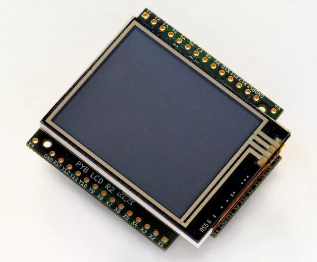

# lcd160cr（LCD160CR 显示屏的控制）

提供对 MicroPython LCD160CR 显示屏的控制功能。



可通过以下链接获取更多资源：  

- [LCD160CRv1.0 参考手册（100KiB PDF）](http://micropython.org/resources/LCD160CRv10-refmanual.pdf)  
- [LCD160CRv1.0 原理图（1.6MiB PDF）](http://micropython.org/resources/LCD160CRv10-schematics.pdf)  


## class LCD160CR

LCD160CR 类为显示屏提供接口。创建该类的实例后，可使用其方法在 LCD 上绘制内容并获取触摸面板的状态。  

例如：  

```python
import lcd160cr

lcd = lcd160cr.LCD160CR('X')
lcd.set_orient(lcd160cr.PORTRAIT)
lcd.set_pos(0, 0)
lcd.set_text_color(lcd.rgb(255, 0, 0), lcd.rgb(0, 0, 0))
lcd.set_font(1)
lcd.write('Hello MicroPython!')
print('touch:', lcd.get_touch())
```


## 构造函数  

- class lcd160cr.`LCD160CR`(connect=None, *, pwr=None, i2c=None, spi=None, i2c_addr=98)

  构造一个 LCD160CR 对象，参数说明：

  - `connect`：字符串，指定 LCD 显示屏与开发板的物理连接方式，有效值为 "X"、"Y"、"XY"、"YX"。当显示屏连接到 pyboard 的 X 扩展接口时使用 "X"，连接到 Y 扩展接口时使用 "Y"；"XY" 和 "YX" 分别用于显示屏连接到 pyboard 右侧或左侧的情况。
  - `pwr`：连接到 LCD 电源/使能引脚的 Pin 对象。
  - `i2c`：连接到 LCD I2C 接口的 I2C 对象。
  - `spi`：连接到 LCD SPI 接口的 SPI 对象。
  - `i2c_addr`：显示屏的 I2C 地址。  

  必须指定有效的 `connect` 参数，或同时指定 `pwr`、`i2c` 和 `spi`。如果提供了有效的 `connect`，则未作为参数传递的 `pwr`、`i2c` 或 `spi`（即 None）将基于 `connect` 的值自动创建，这允许在需要时覆盖默认接口。  

  默认值如下：  
  - "X"（适用于 X 扩展接口）：`pwr=Pin("X4")`, `i2c=I2C("X")`, `spi=SPI("X")`
  - "Y"（适用于 Y 扩展接口）：`pwr=Pin("Y4")`, `i2c=I2C("Y")`, `spi=SPI("Y")`
  - "XY"（适用于右侧连接）：`pwr=Pin("X4")`, `i2c=I2C("Y")`, `spi=SPI("X")`
  - "YX"（适用于左侧连接）：`pwr=Pin("Y4")`, `i2c=I2C("X")`, `spi=SPI("Y")`


## 静态方法  

- static LCD160CR.`rgb`(r, g, b)

  返回表示给定 RGB 颜色值的 16 位整数，该值可用于设置字体颜色（见 `LCD160CR.set_text_color()`）、画笔颜色（见 `LCD160CR.set_pen()`）和绘制单个像素。  

- LCD160CR.`clip_line`(data, w, h)

  裁剪给定的线条数据，仅供内部使用。


## 实例成员

以下实例成员可公开访问：  

- LCD160CR.w
- LCD160CR.h

  分别为显示屏的宽度和高度（单位：像素）。调用 LCD160CR.set_orient() 时会更新这些成员，应视为只读属性。  


## 配置命令

- LCD160CR.set_power(on)

  根据给定的 `on` 值打开或关闭显示屏：0 或 False 关闭，1 或 True 打开。
<br><br>

- LCD160CR.`set_orient`(orient)

  设置显示屏的方向，`orient` 参数可选值为 `PORTRAIT`、`LANDSCAPE`、`PORTRAIT_UPSIDEDOWN`、`LANDSCAPE_UPSIDEDOWN`。
<br><br>

- LCD160CR.`set_brightness`(value)

  设置显示屏亮度，范围为 0 至 31。
<br><br>

- LCD160CR.set_i2c_addr(addr)

  设置显示屏的 I2C 地址，`addr` 值的低 2 位必须为 0。
<br><br>

- LCD160CR.`set_uart_baudrate`(baudrate)

  设置 UART 接口的波特率。
<br><br>

- LCD160CR.`set_startup_deco`(value)

  设置显示屏的启动装饰，`value` 参数可为 `STARTUP_DECO_NONE`、`STARTUP_DECO_MLOGO`、`STARTUP_DECO_INFO` 的按位或。
<br><br>

- LCD160CR.`save_to_flash`()

  将以下参数保存到闪存，以便在重启和上电时保持：初始装饰、方向、亮度、UART 波特率、I2C 地址。
<br>

## 像素访问方法  

以下方法用于操作显示屏上的单个像素：  

- LCD160CR.`set_pixel`(x, y, c)

  将指定像素设置为给定颜色，颜色应为通过 `LCD160CR.rgb()` 创建的 16 位整数。
<br><br>

- LCD160CR.`get_pixel`(x, y)

  获取指定像素的 16 位值。
<br><br>

- LCD160CR.`get_line`(x, y, buf)

  底层方法，将一行像素读取到给定缓冲区。若要读取 n 个像素，`buf` 长度应为 $2*n+1$ 字节：第一个字节为哑元字节（忽略），后续字节表示从坐标 (x, y) 开始的行像素。
<br><br>

- LCD160CR.`screen_dump`(buf, x=0, y=0, w=None, h=None)

  将屏幕内容转储到给定缓冲区。`x` 和 `y` 参数指定起始坐标，`w` 和 `h` 指定区域大小；如果 `w` 或 `h` 为 None，则取最大值（由屏幕尺寸减去 `x` 和 `y` 确定）。`buf` 应足够大以容纳 $2*w*h$ 字节，过小则仅存储初始水平行。
<br><br>

- LCD160CR.`screen_load`(buf)

  从给定缓冲区加载整个屏幕内容。
<br>

## 绘制文本

绘制文本时需设置位置、颜色和字体，然后使用 `LCD160CR.write` 绘制。

- LCD160CR.`set_pos`(x, y)

  设置使用 `LCD160CR.write()` 输出文本的位置，即文本的左上角坐标。  
<br><br>

- LCD160CR.`set_text_color`(fg, bg)

  设置文本的前景色和背景色。
<br><br>

- LCD160CR.`set_font`(font, scale=0, bold=0, trans=0, scroll=0)

  设置文本字体，后续 `write` 调用将使用新配置的字体，参数说明：
  - `font`：字体族，有效值为 0、1、2、3。  
  - `scale`：每个字符像素的缩放值，像素绘制为边长为 scale + 1 的正方形，范围 0 至 63。  
  - `bold`：控制每个字符像素的重叠绘制次数（加粗效果），bold 的低 2 位为水平方向重叠像素数，接下来 2 位为垂直方向。例如，bold=5 表示水平和垂直方向各重叠 1 像素。  
  - `trans`：0 或 1，若为 1 则字符绘制为透明背景。  
  - `scroll`：0 或 1，若为 1 则文本换行时启用软滚动。  
<br><br>

- LCD160CR.`write`(s)

  使用当前位置、颜色和字体向显示屏写入文本。写入时位置自动递增，显示屏支持基本的 VT100 控制码（如换行、退格）。


## 绘制基本图形  

基本绘图命令使用由 `set_pen` 方法设置的前景色和背景色。  

- LCD160CR.`set_pen`(line, fill)

  设置基本图形的线条色和填充色。
<br><br>

- LCD160CR.`erase`()

  将整个显示屏擦除为画笔填充色。
<br><br>

- LCD160CR.`dot`(x, y)

  在给定位置使用画笔线条色绘制单个像素。
<br><br>

- LCD160CR.`rect`(x, y, w, h)
- LCD160CR.`rect_outline`(x, y, w, h)
- LCD160CR.`rect_interior`(x, y, w, h)

  在给定位置绘制指定大小的矩形：线条色用于轮廓，填充色用于内部。`rect` 方法绘制轮廓和内部，其他方法仅绘制其中一项。
<br><br>

- LCD160CR.`line`(x1, y1, x2, y2)

  使用画笔线条色在给定点之间绘制直线。
<br><br>

- LCD160CR.`dot_no_clip`(x, y)
- LCD160CR.`rect_no_clip`(x, y, w, h)
- LCD160CR.`rect_outline_no_clip`(x, y, w, h)
- LCD160CR.`rect_interior_no_clip`(x, y, w, h)
- LCD160CR.`line_no_clip`(x1, y1, x2, y2)

  功能同上，但不对输入坐标进行裁剪。这些方法比带裁剪的版本更快，适用于已知坐标在显示范围内的情况。
<br><br>

- LCD160CR.`poly_dot`(data)

  使用画笔线条色绘制一系列点，`data` 应为字节缓冲区，每对连续字节对应坐标对 (x, y)。
<br><br>

- LCD160CR.`poly_line`(data)

  类似 `LCD160CR.poly_dot()`，但在点之间绘制线条。


## 触摸屏方法

- LCD160CR.`touch_config`(calib=False, save=False, irq=None)

  配置触摸面板：
  - 如果 `calib` 为 True，将触发电阻式触摸传感器的校准，需用户触摸屏幕不同位置。
  - 如果 `save` 为 True，触摸参数将保存到 NVRAM，以便在重置/上电时保持。
  - 如果 `irq` 为 True，显示屏将配置为检测到触摸压力时拉低 IRQ 线；如果为 False 则禁用该功能；如果为 None（默认），则不更改此设置。
<br><br>

- LCD160CR.`is_touched`()

  返回布尔值：屏幕当前有触摸时为 True，否则为 False。
<br><br>

- LCD160CR.`get_touch`()

  返回三元组 `(active, x, y)`：若当前有触摸，`active` 为 1，否则为 0；`x` 和 `y` 表示当前或最近一次触摸的位置。


## 高级命令

- LCD160CR.`set_spi_win`(x, y, w, h)

  设置 SPI 数据写入的窗口区域。
<br><br>

- LCD160CR.`fast_spi`(flush=True)

  准备显示屏以通过 SPI 总线接收 RGB 像素数据，将第一个字节的位置重置为 `set_spi_win()` 设置窗口的左上角。该方法返回一个可用于写入像素数据的 SPI 对象。

  像素应按 5-6-5 格式的 16 位 RGB 值发送，目标计数器随数据发送递增，数据可按任意大小块发送。当目标计数器到达 `set_spi_win()` 指定窗口的末尾时，将回绕到该窗口的左上角。
<br><br>

- LCD160CR.`show_framebuf`(buf)

  在显示屏上显示给定缓冲区，`buf` 应为包含像素 16 位 RGB 值的字节数组，数据将从 `set_spi_win()` 指定区域的左上角开始写入。

  `framebuf` 模块可用于构造帧缓冲区并提供绘图原语，使用帧缓冲区比直接绘制到屏幕更能提升动画性能。
<br><br>

- LCD160CR.`set_scroll`(on)

  启用或禁用滚动，全局控制窗口区域是否滚动。
<br><br>

- LCD160CR.`set_scroll_win`(win, x=-1, y=0, w=0, h=0, vec=0, pat=0, fill=0x07e0, color=0)

  配置滚动窗口区域：
  - `win`：要配置的窗口 ID，0~7 为通用标准窗口，窗口 8 为文本滚动窗口（滚动条）。
  - `x`, `y`, `w`, `h`：指定窗口在显示屏中的位置。
  - `vec`：指定滚动方向和速度，16 位值格式为 `0bF.ddSSSSSSSSSSSS`。`dd` 为 0、1、2、3 分别表示 +x、+y、-x、-y 滚动；`F` 设置速度格式，0 表示每帧移动 S % 256 像素，1 表示每 S 帧移动 1 像素。
  - `pat`：背景的 16 位图案掩码。
  - `fill`：填充颜色。
  - `color`：额外颜色（文本或图案前景色）。
<br><br>

- LCD160CR.`set_scroll_win_param`(win, param, value)

  设置滚动窗口区域的单个参数：
  - `win`：窗口 ID，0~8。
  - `param`：要配置的参数编号，0~7，对应 set_scroll_win 方法中的参数。
  - `value`：要设置的值。
<br><br>

- LCD160CR.`set_scroll_buf`(s)

  设置窗口 8 中滚动的字符串，参数 `s` 必须为长度不超过 32 的字符串。
<br><br>

- LCD160CR.`jpeg`(buf)

  显示 JPEG 图像，`buf` 应包含完整的 JPEG 数据（不含 EXIF 信息）。支持的编码：基线 DCT、霍夫曼编码、每样本 8 位、3 个颜色分量、YCbCr4:2:2。JPEG 的原点由 LCD160CR.set_pos() 设置。
<br><br>

- LCD160CR.`jpeg_start`(total_len)
- LCD160CR.`jpeg_data`(buf)

  分多个缓冲区显示 JPEG 图像：必须先调用 `jpeg_start` 一次，指定 JPEG 总字节数；然后通过一次或多次 `jpeg_data` 调用传输这些字节。
<br><br>

- LCD160CR.feed_wdt()

  首次调用将启动显示屏的内部看门狗定时器，后续调用用于喂狗，超时时间约 30 秒。
<br><br>

- LCD160CR.reset()

  重置显示屏。


## 常量

- lcd160cr.`PORTRAIT`
- lcd160cr.`LANDSCAPE`
- lcd160cr.`PORTRAIT_UPSIDEDOWN`
- lcd160cr.`LANDSCAPE_UPSIDEDOWN`

  显示屏方向，用于 `LCD160CR.set_orient()`。
<br><br>

- lcd160cr.`STARTUP_DECO_NONE`
- lcd160cr.`STARTUP_DECO_MLOGO`
- lcd160cr.`STARTUP_DECO_INFO`

  启动装饰类型，可按位或组合，用于 `LCD160CR.set_startup_deco()`。
