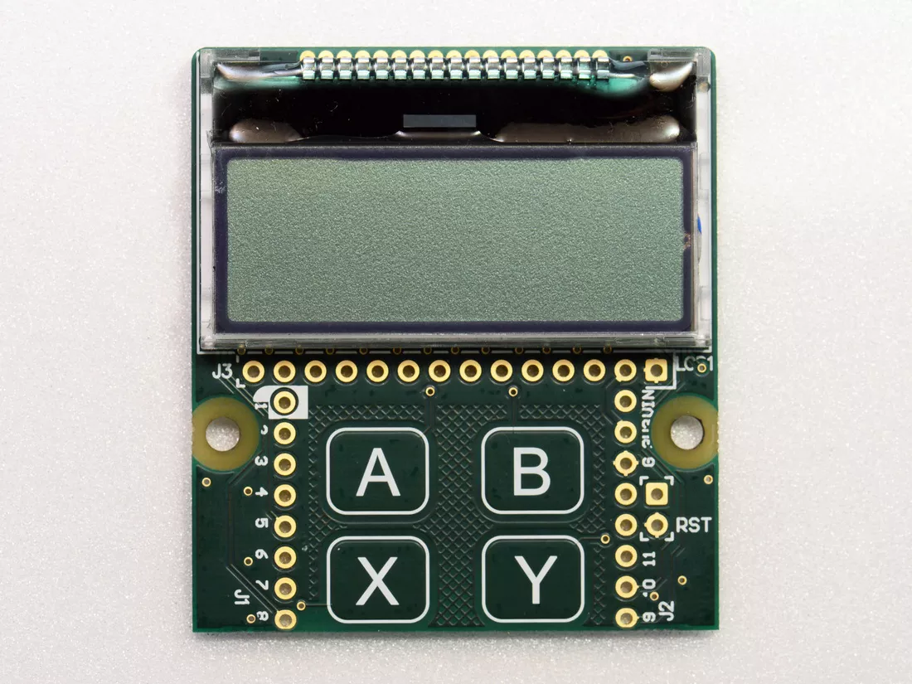

# pyb（与开发板相关的函数）

pyb模块包含与开发板相关的特定函数。

## 时间相关函数

- pyb.`delay`(ms)

  延迟指定的毫秒数。
<br><br>

- pyb.`udelay`(us)

  延迟指定的微秒数。
<br><br>

- pyb.`millis`()

  返回开发板自上次复位以来的毫秒数。
  
  结果始终是 MicroPython 的小整数（31位有符号数），因此在 $ 2^{30} $ 毫秒（约12.4天）后，该值会开始变为负数。
  
  注意：如果执行 `pyb.stop()`，支持此函数的硬件计数器会在"睡眠"状态期间暂停，这将影响 `pyb.elapsed_millis()` 的结果。
<br><br>

- pyb.`micros`()

  返回开发板自上次复位以来的微秒数。

  结果始终是 MicroPython 的小整数（31位有符号数），因此在 $ 2^{30} $ 微秒（约17.8分钟）后，该值会开始变为负数。
  
  注意：如果执行 `pyb.stop()`，支持此函数的硬件计数器会在"睡眠"状态期间暂停，这将影响 `pyb.elapsed_micros()` 的结果。
<br><br>

- pyb.`elapsed_millis`(start)

  返回从 `start` 开始经过的毫秒数。

  该函数会处理计数器溢出问题，始终返回正数，这意味着它可用于测量最长约 12.4 天的时间段。
  
  示例： 
  ```python
  start = pyb.millis()
  while pyb.elapsed_millis(start) < 1000:
      # 执行某些操作
  ```
<br>

- pyb.`elapsed_micros`(start)

  返回从 `start` 开始经过的微秒数。

  该函数会处理计数器溢出问题，始终返回正数，这意味着它可用于测量最长约17.8分钟的时间段。
  
  示例：
  ```python
  start = pyb.micros()
  while pyb.elapsed_micros(start) < 1000:
      # 执行某些操作
      pass
  ```
<br>

## 复位相关函数

- pyb.`hard_reset`()

  以类似于按下外部 RESET 按钮的方式复位 Pyboard。
<br><br>

- pyb.`bootloader`()

  无需通过 BOOT 引脚即可激活引导加载程序。
<br><br>

- pyb.`fault_debug`(value)

  启用或禁用硬件故障调试。硬件故障是指底层系统发生致命错误（如无效的内存访问）。
  
  如果 `value` 参数为 `False`，则发生硬件故障时开发板将自动复位。
  
  如果 `value` 为 `True`，则发生硬件故障时，开发板将打印寄存器值和堆栈跟踪信息，然后让LED无限循环闪烁。

  默认值为禁用（即自动复位）。
<br>


## 中断相关函数  

- pyb.`disable_irq`()  

  禁用中断请求。返回先前的中断状态：分别用 `False`/`True` 表示禁用/启用中断。

  该返回值可传递给 `enable_irq()` 以恢复中断的原始状态。
<br><br>

- pyb.`enable_irq`(state=True)  

  启用中断请求。如果 `state` 为 `True`（默认值），则启用中断；如果 `state` 为 `False`，则禁用中断。

  此函数最常见的用法是将 `disable_irq()` 返回的值传递给它，从而退出临界区。

  （注：临界区指的是一段不允许多线程或中断干扰的代码区域，需确保原子性执行。）
<br>


## 电源相关函数

- pyb.`freq`([ sysclk [ , hcl [ , pclk1 [ , pclk2 ]]]])

  若不传递参数，则返回一个包含时钟频率的元组：(sysclk, hclk, pclk1, pclk2)。这些参数对应于：
  - `sysclk`：CPU频率  
  - `hclk`：AHB总线、内核内存和DMA的频率  
  - `pclk1`：APB1总线的频率  
  - `pclk2`：APB2总线的频率

  若传递任何参数，则设置 CPU 频率，若提供额外参数，则同时设置总线频率。频率以 Hz 为单位。例如，`freq(120000000)` 将 `sysclk`（CPU频率）设置为 120MHz。请注意，并非所有值都被支持，系统将选择不大于给定值的最大支持频率。

  支持的 `sysclk` 频率（以 MHz为单位）为：8、16、24、30、32、36、40、42、48、54、56、60、64、72、84、96、108、120、144、168。

  `hclk` 的最大频率为 168MHz，pclk1 为 42MHz，pclk2 为 84MHz。请确保设置的频率不超过这些值。

  `hclk`、`pclk1` 和 `pclk2` 的频率通过预分频器（分频器）从 `sysclk` 频率派生而来。`hclk` 支持的预分频器为：1、2、4、8、16、64、128、256、512。`pclk1` 和 `pclk2` 支持的预分频器为：1、2、4、8。系统将选择最接近请求频率的预分频器。

  8MHz 的 `sysclk` 频率直接使用 HSE（外部晶振），16MHz直接使用 HSI（内部振荡器）。更高的频率使用 HSE 驱动 PLL（锁相环），然后使用 PLL 的输出。

  请注意，如果在启用 USB 时更改频率，USB 可能变得不可靠。最好在启动 USB 外设之前，在 `boot.py` 中更改频率。另请注意，sysclk 频率低于 36MHz 时，USB 无法正常工作。
<br><br>

- pyb.`wfi`()

  等待内部或外部中断。

  此函数执行 `wfi` 指令，降低 MCU 的功耗，直到发生任何中断（内部或外部），此时继续执行。请注意，系统滴答中断每毫秒发生一次（1000Hz），因此该函数最多阻塞 1ms。  
<br><br>

- pyb.`stop`()

  将开发板置于"睡眠"状态。

  这将功耗降至低于 500μA。要从此睡眠状态唤醒，需要外部中断或实时时钟事件。唤醒后，执行将从上次中断处继续。
<br><br>

- pyb.`standby`()

  将开发板置于“深度睡眠”状态。

  这将功耗降至低于5 0μA。要从此睡眠状态唤醒，需要实时时钟事件，或 X1（PA0=WKUP）或 X18（PC13=TAMP1）上的外部中断。唤醒后，系统将进行硬重置。
<br>


## 其它函数

- pyb.`have_cdc`()

  如果 USB 作为串口设备连接，则返回 `True`，否则返 `False`。

  **注意**
  
  此函数已弃用。请改用 `pyb.USB_VCP().isconnected()`。
<br><br>

- pyb.`hid`((buttons, x, y, z))

  接收一个四元组（或列表），并将其发送到 USB 主机（PC）以指示 HID 鼠标移动事件。

  **注意**

  此函数已弃用。请改用 `pyb.USB_HID.send()`。
<br><br>

- pyb.`info`([dump_alloc_table])

  打印出关于开发板的大量信息。
<br><br>

- pyb.`main`(filename)

  设置在 `boot.py` 执行完毕后运行的主脚本文件名。如果不调用此函数，则会执行默认文件 `main.py`。
  
  仅在 boot.py 内部调用此函数才有意义。
<br><br>

- pyb.`mount`(device, mountpoint, *, readonly=False, mkfs=False)

  **注意**

  此函数已弃用。设备的挂载和卸载应通过 `vfs.mount()` 和 `vfs.umount()` 执行。

  挂载一个块设备并使其作为文件系统的一部分可用。`device` 必须是提供块协议的对象。（以下内容也已弃用。有关创建块设备的正确方法，请参阅` vfs.AbstractBlockDev`。）
  - readblocks(self, blocknum, buf)
  - writeblocks(self, blocknum, buf)（可选）
  - count(self)
  - sync(self)（可选）

  `readblocks` 和 `writeblocks` 应在 buf 和块设备之间复制数据，从设备上的块号 blocknum 开始。buf 将是一个字节数组，长度为 512 的倍数。如果未定义 writeblocks，则设备以只读方式挂载。这两个函数的返回值将被忽略。

  `count` 应返回设备上可用的块数。`sync`（如果已实现）应同步设备上的数据。

  `mountpoint` 参数是文件系统根目录中挂载设备的位置，必须以正斜杠开头。

  如果 `readonly` 为 `True`，则设备以只读方式挂载，否则以读写方式挂载。

  如果 `mkfs` 为 `True`，则在不存在文件系统时创建新的文件系统。
<br><br>

- pyb.`repl_uart`(uart)

  获取或设置 REPL 的 UART 对象。
<br><br>

- pyb.`rng`()

  返回一个30位的硬件生成随机数。
<br><br>

- pyb.`sync`()

  同步所有文件系统。
<br><br>

- pyb.`unique_id`()

  返回一个12字节（96位）的字符串，即 MCU 的唯一ID。
<br><br>

- pyb.`usb_mode`([modestr, ] port=-1, vid=0xf055, pid=-1, msc=(), hid=pyb.hid_mouse, high_speed=False)

  如果不带参数调用，返回当前 USB 模式的字符串。

  如果提供 `modestr` 参数，则尝试配置 USB 模式。`modestr` 的有效值如下：
  - `None`：禁用USB
  - 'VCP'：启用 VCP（虚拟串口）接口
  - 'MSC'：启用 MSC（大容量存储设备类）接口
  - 'VCP+MSC'：同时启用 VCP 和 MSC
  - 'VCP+HID'：同时启用 VCP 和 HID（人机接口设备）
  - 'VCP+MSC+HID'：同时启用 VCP、MSC 和 HID（仅在PYBD开发板上可用）
  
  为了向后兼容，'CDC'表示'VCP'（类似地，'CDC+MSC'和'CDC+HID'也是如此）。
  
  `port` 参数为整数（0、1…），如果开发板支持多个端口，则用于选择使用哪个 USB 端口。`port `值为 -1 时使用默认或自动选择的端口。

  `vid` 和 `pid` 参数允许指定 VID（供应商ID）和 PID（产品ID）。`pid` 值为 -1 时，将根据 `modestr` 的值选择 PID。
  
  如果启用 MSC 模式，`msc` 参数可用于指定要在大容量存储接口上公开的 SCSI LUN 列表。例如 `msc=(pyb.Flash(), pyb.SDCard())`。
  
  如果启用 HID 模式，还可以通过传递 `hid` 关键字参数指定 HID 详细信息。它接受一个元组，包含（子类、协议、最大数据包长度、轮询间隔、报告描述符）。默认情况下，它将为 USB 鼠标设置适当的值。还有一个` pyb.hid_keyboard` 常量，是适用于 USB 键盘的元组。
  
  如果硬件支持，将 `high_speed` 参数设置为 `True` 可启用 USB 高速模式。

  
## 常量
- pyb.`hid_mouse`
- pyb.`hid_keyboard`

  用于为 USB 鼠标或键盘设置合适参数的元组（子类、协议、最大数据包长度、轮询间隔、报告描述符）。

## 类

### class Accel - 加速度计控制

Accel 是用于控制加速度计的对象。示例用法：

```python
accel = pyb.Accel()
for i in range(10):
    print(accel.x(), accel.y(), accel.z())
```
原始值范围在 -32 到 31 之间。
<br>

#### 构造函数

- class pyb.`Accel`

  创建并返回一个加速度计对象。
<br>

#### 方法
- Accel.`filtered_xyz`()
  
  获取经过滤波的 x、y、z 三轴值组成的三元组。
  
  **实现说明**：该方法当前的实现方式是对 4 次采样值求和，包括前 3 次调用该函数的采样值与当前调用的采样值。因此，返回值是原始 x()、y()、z() 调用结果的 4 倍。
<br><br>

- Accel.`tilt`()

  获取倾斜寄存器值。
<br><br>

- Accel.`x`()

  获取 x 轴数值。
<br><br>

- Accel.`y`()

  获取 y 轴数值。
<br><br>

- Accel.`z`()

  获取 z 轴数值。
<br>

#### 硬件说明

加速度计通过 I2C 总线 1 与处理器通信。因此，在读取数据时，引脚 X9 和 X10 应保持未使用状态（仅用于 I2C 通信）。其他使用这些引脚的设备（如 UART 1、定时器 4 的通道 1 和 2）无法与加速度计同时使用。


### class ADC - 模数转换

**使用方法**
```python
import pyb

adc = pyb.ADC(pin)                  # 从引脚创建模拟对象
val = adc.read()                    # 读取模拟值

adc = pyb.ADCAll(resolution)        # 创建ADCAll对象
adc = pyb.ADCAll(resolution, mask)  # 为选定模拟通道创建ADCAll对象
val = adc.read_channel(channel)     # 读取指定通道
val = adc.read_core_temp()          # 读取MCU温度
val = adc.read_core_vbat()          # 读取MCU VBAT电压
val = adc.read_core_vref()          # 读取MCU VREF电压
val = adc.read_vref()               # 读取MCU电源电压
```

#### 构造函数

- class pyb.`ADC`(pin)

  创建与指定引脚关联的ADC对象，用于读取该引脚上的模拟值。
<br>

#### 方法

- ADC.`read`()

  读取模拟引脚上的值并返回，返回值范围为0到4095。
<br><br>

- ADC.`read_timed`(buf, timer)

  按定时器设置的速率将模拟值读取到缓冲区`buf`中。

  `buf` 可以是 `bytearray` 或 `array.array` 等类型。ADC值为12位分辨率，若缓冲区元素大小≥16位则直接存储；若为8位元素（如`bytearray`），采样分辨率将降至8位。

  `timer` 是 `Timer` 对象，且已按目标采样频率初始化并运行。也可传入整数表示采样频率（Hz），此时会自动配置`Timer(6)`。

  使用Timer对象示例（推荐方式）：
  ```python
  adc = pyb.ADC(pyb.Pin.board.X19)  # 在X19引脚创建ADC
  tim = pyb.Timer(6, freq=10)       # 创建10Hz定时器
  buf = bytearray(100)              # 创建存储采样的缓冲区
  adc.read_timed(buf, tim)          # 采样100次，耗时10秒
  ```  

  使用频率整数示例：
  ```python
  adc = pyb.ADC(pyb.Pin.board.X19)  # 创建ADC
  buf = bytearray(100)              # 创建100字节缓冲区
  adc.read_timed(buf, 10)           # 以10Hz采样到缓冲区（耗时10秒）
  for val in buf:                   # 遍历所有值
      print(val)                    # 输出数值
  ```  
  **说明：** 该函数不分配堆内存，具有阻塞性，直到缓冲区填满才返回。
<br><br>

- ADC.`read_timed_multi`((adcx, adcy, ...), (bufx, bufy, ...), timer)

  这是一个**静态方法**，用于从多个ADC中提取相对时序或相位数据。

  按 `timer` （定时器）速率从多个ADC读取值到对应缓冲区，定时器触发时依次快速读取每个 ADC。
  
  ADC 和缓冲区以元组形式传入，每个 ADC 对应一个缓冲区，所有缓冲区类型和长度需一致，数量与 ADC 数量相同。

  缓冲区类型如 `bytearray` 或 `array.array`，ADC 值 12 位分辨率，存储规则与 `read_timed` 一致。  
  
  `timer` 必须为已初始化并按已设定频率运行的 `Timer` 对象。  

  读取3个ADC示例：
  ```python
  adc0 = pyb.ADC(pyb.Pin.board.X1)  # 创建ADC
  adc1 = pyb.ADC(pyb.Pin.board.X2)
  adc2 = pyb.ADC(pyb.Pin.board.X3)
  tim = pyb.Timer(8, freq=100)      # 创建100Hz定时器
  rx0 = array.array('H', (0 for i in range(100)))  # 100个16位缓冲区
  rx1 = array.array('H', (0 for i in range(100)))
  rx2 = array.array('H', (0 for i in range(100)))

  # 以100Hz采样到缓冲区（耗时1秒）
  pyb.ADC.read_timed_multi((adc0, adc1, adc2), (rx0, rx1, rx2), tim)
  for n in range(len(rx0)):
      print(rx0[n], rx1[n], rx2[n])
  ```  
  **说明：**  
  
  函数不分配堆内存，阻塞直到所有缓冲区填满。  
  
  若采样速率过高（如定时器周期内无法完成采样），返回`False`表示采样间隔精度丢失，极端情况会漏采。  
  
  最大采样率受数据宽度和 ADC 数量影响：测试中2个ADC在210kHz无溢出，215kHz漏采；3个ADC极限约140kHz，4个约110kHz。高采样率时禁用中断可降低偶发数据丢失风险。

#### ADCAll 对象

实例化该对象会将所有掩码的 ADC 引脚设为模拟输入。MCU温度、VREF 和 VBAT 数据可通过 ADC 通道 16、17、18 访问，根据参考电压（通常3.3V）自动缩放。芯片温度传感器经工厂校准，测温精度±1℃，虽然听起来精度不错，但是：
- MCU 内部温度受处理负载和活动的I/O子系统影响，可能比环境温度高数十度。  
- 长时间待机唤醒后的 Pyboard 可在上述精度内反映环境温度。  

**方法说明：**

- `read_core_vbat`()：读取备份电池电压，根据实际电源电压调整，通过分压电阻测量（仅ADC转换时激活，避免电池过载）。
- `read_vref`()：测量内部电压参考并根据工厂校准值反算，通常接近3.3V；Pyboard在电池供电且电压低于3.3V时，合理配置时钟、闪存访问速度和编程模式，最低可在2V下正常运行并获取有效ADC转换值。
- `read_core_vref`()：读取标称 1.21V 的参考电压，以实际电源为参考。

**返回值**均为浮点型电压值。  

`read_core_vbat()` 返回备用电池的电压。该电压也会根据实际电源电压进行调整。为避免模拟输入过载，电池电压通过分压器测量，并根据分压值进行缩放。为防止备用电池负载过大，分压器仅在ADC转换期间激活。

`read_vref()` 通过测量内部电压参考并使用内部电压参考的工厂校准值进行反缩放来求值。在大多数情况下，读数将接近 3.3V。如果 Pyboard 使用电池供电，电源电压可能会降至 3.3V 以下。只要满足工作条件，Pyboard 仍将正常工作。通过正确设置 MCU 时钟、闪存访问速度和编程模式，Pyboard 可以在低至 2V 的电压下运行，并且仍然获得有用的 ADC 转换结果。

确保模拟输入电压绝不超过实际电源电压是非常重要的。

**其他通道（0-15）** 返回未缩放的整数值（根据所选精度）。

为避免意外激活模拟输入，可通过第二个参数 `mask` 指定激活通道（二进制掩码，默认`0xffffffff`激活所有通道；若仅需内部通道 16-18，掩码设为`0x70000`）。  

**示例：**  
```python
adcall = pyb.ADCAll(12, 0x70000)  # 12位分辨率，仅内部通道
temp = adcall.read_core_temp()    # 读取核心温度
```

### class CAN - 控制器局域网通信总线

CAN 支持经典 CAN（F4、F7 系列 MCU 可用）和 CAN FD（H7 系列）控制器。物理层上，CAN 总线由两个信号组成：RX 和 TX。请注意，若要将 pyboard 连接到 CAN 总线，必须使用 CAN 收发器将 pyboard 的 CAN 逻辑信号转换为总线上的正确电压电平。

经典 CAN 控制器在环回模式（无需收发器）的示例用法：
```python
from pyb import CAN

can = CAN(1, CAN.LOOPBACK)
# 设置过滤器以接收 ID 为 123、124、125 和 126 的消息
can.setfilter(0, CAN.LIST16, 0, (123, 124, 125, 126))
can.send('message!', 123)  # 发送 ID 为 123 的消息
can.recv(0)                # 从 FIFO 0 接收消息
```

启用所有可选功能的 CAN FD 控制器示例用法：
```python
# FD 帧 + BRS 模式 + 扩展帧 ID。仲裁阶段 500 Kbit/s，数据阶段 1 Mbit/s
can = CAN(1, CAN.NORMAL, baudrate=500_000, brs_baudrate=1_000_000, sample_point=80)
can.setfilter(0, CAN.RANGE, 0, (0xFFF0, 0xFFFF))
# 发送 64 字节数据，ID 为 0xFFFF，启用 FDF、BRS 和扩展帧
can.send('a'*64, 0xFFFF, fdf=True, brs=True, extframe=True)
can.recv(0)
```

除非另有说明，以下 CAN 模块函数及其参数对经典 CAN 和 FD CAN 控制器均适用。


#### 构造函数

- class pyb.`CAN`(bus, ...)

  在指定总线上构造 CAN 对象。`bus` 可以是 1-2 或 'YA'、'YB'。若不提供额外参数，CAN 对象会被创建但不初始化（若总线之前初始化过，会沿用上次的设置）。若提供额外参数，则初始化总线。初始化参数详见 `CAN.init()`。

  CAN 总线的物理引脚如下：
  - `CAN(1)` 位于 YA 引脚：(RX, TX) = (Y3, Y4) = (PB8, PB9)
  - `CAN(2)` 位于 YB 引脚：(RX, TX) = (Y5, Y6) = (PB12, PB13)


#### 方法

- CAN.`init`(mode, prescaler=100, *, sjw=1, bs1=6, bs2=8, auto_restart=False, baudrate=0, sample_point=75, num_filter_banks=14, brs_sjw=1, brs_bs1=8, brs_bs2=3, brs_baudrate=0, brs_sample_point=75)

  使用以下参数初始化 CAN 总线：
  - `mode`：是这些模式之一，包括 NORMAL（正常）、LOOPBACK（环回）、SILENT（静默）、SILENT_LOOPBACK（静默环回）。
  - `prescaler`：CAN 输入时钟的分频值，用于生成标称位时间量子。经典 CAN 取值范围  为 1-1024，CAN FD 为 1-512。
  - `sjw`：标称位的重同步跳转宽度（时间量子单位）。经典 CAN 为 1-4，CAN FD 为   1-128。
  - `bs1`：标称位中采样点的位置（时间量子单位）。经典 CAN 为 1-16，CAN FD 为   2-256。
  - `bs2`：标称位中发送点的位置（时间量子单位）。经典 CAN 为 1-8，CAN FD 为 2-128。
  - `auto_restart`：控制器进入总线关闭状态后是否自动尝试重启通信。若禁用，可使用 `restart()` 退出总线关闭状态。
  - `baudrate`：若提供非 0 波特率，函数会自动计算满足波特率（误差≤0.1%）和目标采样点（精度至 1%）的 CAN 标称位时间（覆盖 `prescaler`、`bs1`、`bs2` 参数）。若需精确控制 CAN 时序，可直接设置 `prescaler`、`bs1`、`bs2`。
  - `sample_point`：采样点在整个标称位时间中的位置（整数百分比），默认 75%。仅当设 置 `baudrate` 时有效。
  - `num_filter_banks`：经典 CAN 中分配给 `CAN(1)` 的过滤器组数量，剩余 28 个分配给 `CAN(2)`。

  以下参数仅在支持 CAN FD 的开发板上存在，用于配置可选的 CAN FD 位速率切换（BRS）功  能：
  - `brs_prescaler`：CAN FD 输入时钟的分频值，用于生成数据位时间量子，取值 1-32。
  - `brs_sjw`：数据位的重同步跳转宽度（时间量子单位），取值 1-16。
  - `brs_bs1`：数据位中采样点的位置（时间量子单位），取值 1-32。
  - `brs_bs2`：数据位中发送点的位置（时间量子单位），取值 1-16。
  - `brs_baudrate`：若提供非 0 波特率，自动计算满足波特率和目标 `brs_sample_point` 的数据位时间（覆盖 `brs_prescaler`、`brs_bs1`、`brs_bs2`）。若需精确控制 BRS 时序，可直接设置相关参数。
  - `brs_sample_point`：数据位采样点位置（整数百分比），默认 75%。仅当设置 `brs_baudrate` 时有效。

  时间量子 **tq** 是 CAN 总线的基本时间单位，$tq = \frac{prescaler}{PCLK1}$（PCLK1 是内部外设总线 1 的频率，可通过 `pyb.freq()` 确定）。

  单个位由同步段（固定 1 个 tq）、位段 1、位段 2 组成。采样点在位段 1 结束后，发送点在位段 2 结束后。波特率 = 1 / 位时间，其中位时间 = (1 + BS1 + BS2) × tq。  

  例如：PCLK1=42MHz，prescaler=100，sjw=1，bs1=6，bs2=8 时，tq=2.38 微秒，位时间=35.7 微秒，波特率=28kHz。

  更多细节请参考 STM32F405 数据手册第 680 页。
<br><br>

- CAN.`deinit`()

  关闭 CAN 总线。
<br><br>

- CAN.`restart`()

  强制软件重启 CAN 控制器，不重置其配置。

  若控制器进入总线关闭状态，将不再参与总线活动。若未配置自动重启（见 `init()`），可使用此方法触发重启，控制器将遵循 CAN 协议退出总线关闭状态并进入错误激活状态。
<br><br>

- CAN.`state`()

  返回控制器状态，可能为：
  - CAN.`STOPPED`：控制器完全关闭并重置；
  - CAN.`ERROR_ACTIVE`：控制器开启且处于错误激活状态（TEC 和 REC 均小于 96）；
  - CAN.`ERROR_WARNING`：控制器开启且处于错误警告状态（TEC 或 REC 至少一个≥96）；
  - CAN.`ERROR_PASSIVE`：控制器开启且处于错误被动状态（TEC 或 REC 至少一个≥128）;
  - CAN.`BUS_OFF`：控制器开启但不参与总线活动（TEC 溢出超过 255）。
<br><br>

- CAN.`info`([list])

  获取控制器错误状态及收发缓冲区信息。若提供 `list` 参数（至少 8 个元素），会填充该列表；否则创建新列表填充。返回填充后的列表，内容包括：
  - TEC 值
  - REC 值
  - 进入错误警告状态的次数（超过 65535 后回零）
  - 进入错误被动状态的次数（超过 65535 后回零）
  - 进入总线关闭状态的次数（超过 65535 后回零）
  - 待发送消息数
  - FIFO0 待接收消息数
  - FIFO1 待接收消息数
<br><br>

- CAN.`setfilter`(bank, mode, fifo, params, *, rtr, extframe=False)

  配置过滤器组：
  - `bank`：经典 CAN 控制器的过滤器组，或 CAN FD 的过滤器索引
  - `mode`：过滤器工作模式（见下表）
  - `fifo`：消息若通过该过滤器，将存储到的 FIFO（0 或 1）
  - `params`：定义过滤器的数组，内容取决于 `mode` 参数  

    | **mode**       | 经典 CAN 控制器的 params 数组内容                                                                                                     |
    |----------------|---------------------------------------------------------------------------------------------------------------------------------|
    | **CAN.LIST16** | 四个 16 位 ID（接收这四个 ID 的消息）                                                                                                       |
    | **CAN.LIST32** | 两个 32 位 ID（接收这两个 ID 的消息）                                                                                                       |
    | **CAN.MASK16** | **两个 16 位 ID/掩码对（如 (1, 3, 4, 4)**：<br>第一对 1 和 3 接收所有第 0 位=1 且第 1 位=0 的 ID；<br>第二对 4 和 4 接收所有第 2 位=1 的 ID） |
    | **CAN.MASK32** | 一个 32 位 ID/掩码对（与 MASK16 逻辑相同）                                                                                                  |


    | **mode**      | **CAN FD 控制器的 params 数组内容    **                           |
    |---------------|-----------------------------------------------------------|
    | **CAN.RANGE** | 两个 ID 表示接收范围（接收介于两者之间的     ID）                   |
    | **CAN.DUAL**  | 两个具体 ID（接收这两个 ID 的消    息）                             |
    | **CAN.MASK**  | 一个过滤器 ID 和掩码（如 (0x111, 0x7FF)，ID 与掩码按位与匹配时接收） |

  - `rtr`：经典 CAN 控制器中，布尔数组表示过滤器是否接收远程传输请求（RTR）消息。若未提供，默认所有条目为 `False`，数组长度取决于 `mode`。CAN FD 控制器忽略此参数。

    | `mode`     | `rtr`数组长度 |
    |------------|------------|
    | CAN.LIST16 | 4 个元素      |
    | CAN.LIST32 | 2 个元素      |
    | CAN.MASK16 | 2 个元素      |
    | CAN.MASK32 | 1 个元素      |
  
  - `extframe`：若为 `True`，使用扩展标识符（29 位）；否则使用标准标识符（11 位）。
<br><br>

- CAN.`clearfilter`(bank, extframe=False)

  清除并禁用过滤器组：
  - `bank`：要清除的经典 CAN 过滤器组或 CAN FD 过滤器索引
  - `extframe`：CAN FD 中，若为 `True` 清除扩展过滤器（extframe=True 配置的），否则清除标准标识符过滤器。
<br><br>

- CAN.`any`(fifo)

  若 FIFO 中有待接收消息，返回 `True`，否则返回 `False`。
<br><br>

- CAN.`recv`(fifo, list=None, *, timeout=5000)

  在总线上接收数据：
  - `fifo`：接收数据的 FIFO 编号；
  - `list`：可选列表对象，用于存储返回值；
  - `timeout`：接收等待超时时间（毫秒）。

  返回值：包含五个值的元组
  - 消息 ID
  - 布尔值（True 为扩展 ID，False 为标准 ID）
  - 布尔值（True 为 RTR 消息）
  - 过滤器匹配索引（FMI）
  - 数据数组

  若 `list` 为 `None`，将分配新元组和 bytes 对象存储数据；若提供 `list`，需至少 5 个元素，第五个元素应为 `memoryview` 对象（基于 bytearray 或类型为 'B'/'b' 的数组，且至少 8 字节空间）。列表会被填充前四个值，`memoryview` 会按数据长度调整并填充数据，可重复使用以避免堆内存分配。  
  **示例：**  
  ```python
  buf = bytearray(8)
  lst = [0, 0, 0, 0, memoryview(buf)]
  can.recv(0, lst)  # 不分配堆内存
  ```
<br>

- CAN.`send`(data, id, *, timeout=0, rtr=False, extframe=False, fdf=False, brs=False)

  在总线上发送消息：
  - `data`：发送的数据（整数或缓冲区对象）
  - `id`：消息 ID
  - `timeout`：发送等待超时时间（毫秒）
  - `rtr`：若为 True，消息作为远程传输请求发送（此时仅用数据长度填充帧的 DLC 字段，数据内容被忽略）
  - `extframe`：若为 True，使用扩展标识符（29 位）
  - `fdf`：CAN FD 中若为 True，使用 FD 帧格式（支持最多 64 字节数据）
  - `brs`：CAN FD 中若为 True，启用位速率切换（数据阶段使用不同波特率，时序配置见 `CAN.init()`）

  如果 timeout=0，消息放入三个硬件缓冲区之一后立即返回；如果缓冲区全满，抛出异常。若 timeout≠0，等待消息发送完成，超时则抛出异常。  

  **返回值**：None。
<br><br>

- CAN.`rxcallback`(fifo, fun)

  注册 FIFO 接收消息时的回调函数：
  
  - `fifo`：接收数据的 FIFO 编号；
  - `fun`：FIFO 非空时调用的函数。
  
  回调函数接受两个参数，第一个是can对象本身，第二个是指示回调原因的整数。

  | 原因 |                       |
  |------|-----------------------|
  | 0    | 空 FIFO 接收到消息    |
  | 1    | FIFO 已满             |
  | 2    | FIFO 已满导致消息丢失 |

  **示例：**

  ```python
  def cb0(bus, reason):
      print('cb0')
      if reason == 0:
          print('pending')
      if reason == 1:
          print('full')
      if reason == 2:
          print('overflow')
  
  can = CAN(1, CAN.LOOPBACK)
  can.rxcallback(0, cb0)
  ```


#### 常量
- CAN.`NORMAL`
- CAN.`LOOPBACK`
- CAN.`SILENT`
- CAN.`SILENT_LOOPBACK`

  `init()` 中使用的 CAN 总线模式
<br><br>

- CAN.`STOPPED`
- CAN.`ERROR_ACTIVE`
- CAN.`ERROR_WARNING`
- CAN.`ERROR_PASSIVE`
- CAN.`BUS_OFF`

  `state()` 返回的控制器状态
<br><br>

- CAN.LIST16
- CAN.MASK16
- CAN.LIST32
- CAN.MASK32

  经典 CAN 中 `setfilter()` 使用的过滤器模式
<br><br>

- CAN.DUAL
- CAN.RANGE
- CAN.MASK

  CAN FD 中 `setfilter()` 使用的过滤器模式
<br>

### class DAC - 数模转换

DAC 用于在 X5 或 X6 引脚上输出模拟值（特定电压），电压范围为 0 至 3.3V。

**注意**：该模块的 API 未来可能会发生变化。

示例用法：
```python
from pyb import DAC

dac = DAC(1)           # 在 X5 引脚创建 DAC 1（8 位分辨率）
dac.write(128)         # 输出值 128（使 X5 引脚为 1.65V）

dac = DAC(1, bits=12)  # 使用 12 位分辨率
dac.write(4095)        # 输出最大值 3.3V
```

输出连续正弦波：
```python
import math
from pyb import DAC

# 创建包含正弦波的缓冲区（8 位）
buf = bytearray(100)
for i in range(len(buf)):
    buf[i] = 128 + int(127 * math.sin(2 * math.pi * i / len(buf)))

# 以 400Hz 输出正弦波
dac = DAC(1)
dac.write_timed(buf, 400 * len(buf), mode=DAC.CIRCULAR)
```

以 12 位分辨率输出连续正弦波：
```python
import math
from array import array
from pyb import DAC

# 创建包含正弦波的缓冲区（12 位，半字采样）
buf = array('H', 2048 + int(2047 * math.sin(2 * math.pi * i / 128)) for i in range(128))

# 以 400Hz 输出正弦波
dac = DAC(1, bits=12)
dac.write_timed(buf, 400 * len(buf), mode=DAC.CIRCULAR)
```

#### 构造函数
- class pyb.`DAC`(port, bits=8, *, buffering=None)

  创建新的 DAC 对象。

  - `port`：引脚对象或整数（1 或 2）。DAC(1) 对应 X5 引脚，DAC(2) 对应 X6 引脚。
  - `bits`：分辨率位数（8 或 12）。`write()` 和 `write_timed()` 方法的最大值为 $ 2^{bits}-1 $。
  - `buffering`：选择 DAC 运算放大器输出缓冲的行为（降低输出阻抗）,它可以是：
    - `None`（默认）：对 `noise()`、`triangle()`、`write_timed()` 启用缓冲，对 `write()` 禁用缓冲；
    - `False`：完全禁用缓冲；
    - `True`：启用输出缓冲。

  启用缓冲时，DAC 引脚可驱动低至 5KΩ 的负载；禁用时最大输出阻抗为 15KΩ，因此，要在没有缓冲的情况下达到 1% 的精度，所施加的负载必须于 1.5MΩ。使 用缓冲会牺牲精度，尤其在接近范围极值时。

#### 方法

- DAC.`init`(bits=8, *, buffering=None)

  重新初始化 DAC。`bits` 是 8 或 12，`buffering` 是 `None`、`False` 或 `True`，参数含义同构造函数。
<br><br>

- DAC.deinit()

  关闭 DAC，释放引脚供其他用途。
<br><br>

- DAC.noise(freq)

  生成伪随机噪声信号，以指定频率刷新 DAC 输出。
<br><br>

- DAC.`triangle`(freq)

  生成三角波。DAC 输出值以指定频率在 12 位全范围内线性变化（上升和下降），因此实际三角波频率为 `freq/8192`。
<br><br>

- DAC.`write`(value)

  直接设置 DAC 输出值。最小值为 0，最大值为 $2^{bits} - 1$（`bits` 由构造函数或 `init()` 设置的分辨率决定）。
<br><br>

- DAC.`write_timed`(data, freq, *, mode=DAC.NORMAL)

  使用 DMA 传输启动从 RAM 向 DAC 发起数据输出：
  - `data`：8 位模式下为字节数组，12 位模式下为无符号半字数组（`array('H')`）。
  - `freq`：输出频率（Hz），可指定为整数（使用 Timer(6)）或已初始化的定时器对象（支持定时器 2、4、5、6、7、8）。
  - `mode`：传输模式：
    - `DAC.NORMAL`：单次传输缓冲区数据后停止；
    - `DAC.CIRCULAR`：循环传输，到达缓冲区末尾时自动回到开头。

  双 DAC 同时输出示例：

  ```python
  dac1 = DAC(1)
  dac2 = DAC(2)
  dac1.write_timed(buf1, pyb.Timer(6, freq=100), mode=DAC.CIRCULAR)
  dac2.write_timed(buf2, pyb.Timer(7, freq=200), mode=DAC.CIRCULAR)
  ```

#### 常量
- DAC.`NORMAL`：正常模式，单次传输缓冲区波形后停止。
- DAC.`CIRCULAR`：循环模式，传输至缓冲区末尾时自动回绕到开头，实现连续输出。

### class ExtInt – 配置I/O引脚以响应外部中断事件

总共有22条中断线路。其中16条可来自 GPIO 引脚，其余 6 条来自内部源。对于 0 到 15 号线路，给定的线路可以映射到任意端口的对应线路。因此，线路 0 可以映射到 Px0（其中x为A、B、C等），线路 1 可以映射到 Px1（其中x为A、B、C等）。

```python
def callback(line):
    print("line =", line)
```

注意：ExtInt 会自动将 gpio 线路配置为输入。

```python
extint = pyb.ExtInt(pin, pyb.ExtInt.IRQ_FALLING, pyb.Pin.PULL_UP, callback)
```

现在，每当在 X1 引脚上检测到下降沿时，就会调用回调函数。注意：机械按钮存在“抖动”问题，按下或释放开关时通常会产生多个边沿。有关详细解释以及各种去抖动技术，请参阅：http://www.eng.utah.edu/~cs5780/debouncing.pdf。

尝试在同一引脚上注册两个回调函数会引发异常。

如果 pin 作为整数传入，则假定它映射到某个内部中断源，并且必须在 16 到 22 的范围内。
所有其他引脚对象都通过引脚映射器来确定对应的gpio引脚。

```python
extint = pyb.ExtInt(pin, mode, pull, callback)
```
有效的模式有 `pyb.ExtInt.IRQ_RISING`、`pyb.ExtInt.IRQ_FALLING`、`pyb.ExtInt.IRQ_RISING_FALLING`、`pyb.ExtInt.EVT_RISING`、`pyb.ExtInt.EVT_FALLING` 和 `pyb.ExtInt.EVT_RISING_FALLING`。

仅测试了 IRQ_xxx 模式。EVT_xxx 模式与睡眠模式和 WFE 指令有关。

有效的上拉/下拉值有 `pyb.Pin.PULL_UP`、`pyb.Pin.PULL_DOWN`、`pyb.Pin.PULL_NONE`。

还有一个 C API，因此需要 EXTI 中断线的驱动程序也可以使用此代码。有关可用函数，请参阅extint.h，有关使用示例，请参阅 usrsw.h。

#### 构造函数

- class pyb.`ExtInt`(pin, mode, pull, callback)

  创建一个ExtInt对象：

  - `pin`：启用中断的引脚（可以是引脚对象或任何有效的引脚名称）。
  - `mode`：可以是以下之一：
    - `ExtInt.IRQ_RISING` - 上升沿触发；
    - `ExtInt.IRQ_FALLING` - 下降沿触发；
    - `ExtInt.IRQ_RISING_FALLING` - 上升或下降沿触发。
  - `pull`：可以是以下之一：
    - `pyb.Pin.PULL_NONE` - 无上下拉电阻；
    - `pyb.Pin.PULL_UP` - 启用上拉电阻；
    - `pyb.Pin.PULL_DOWN` - 启用下拉电阻。
  - `callback`：中断触发时调用的函数。回调函数必须接受一个参数，即触发中断的线号。

#### 类方法

- classmethod ExtInt.`regs`()

  转储EXTI寄存器的值。
<br>

#### 方法

- ExtInt.`disable`()

  禁用与ExtInt对象关联的中断。这对于去抖动可能很有用。
<br><br>

- ExtInt.`enable`()

  启用已禁用的中断。
<br><br>

- ExtInt.`line`()

  返回引脚映射到的线号。
<br><br>

- ExtInt.`swint`()

  通过软件触发回调函数。
<br>

#### 常量

- ExtInt.`IRQ_FALLING`
  
  下降沿中断
<br><br>

- ExtInt.`IRQ_RISING`

  上升沿中断
<br><br>

- ExtInt.`IRQ_RISING_FALLING`

  上升或下降沿中断

### class Flash – 访问内部闪存存储

Flash 类允许直接访问 pyboard 上的主闪存设备。

在大多数情况下，若要在设备上存储持久数据，你可能希望使用更高级的抽象层，例如通过 Python 标准文件 API 使用文件系统。但此接口对于自定义文件系统配置或为应用程序实现低级存储系统很有用。

#### 构造函数

- class pyb.`Flash`

  创建并返回一个表示USB大容量存储接口所呈现的闪存设备的块设备。

  它在开头包含一个虚拟分区表，实际闪存从块0x100开始。
  
  此构造函数已弃用，将在未来版本的 MicroPython 中移除。
<br><br>

- class pyb.`Flash`(*, start=-1, len=-1)

  创建并返回一个访问指定偏移量处闪存的块设备。长度默认为设备的剩余大小。

  `start`(起始)和 `len`(长度)以字节为单位，且必须是块大小的倍数（内部闪存通常为512字节）。
<br>

#### 方法

- Flash.`readblocks`(block_num, buf)
- Flash.`readblocks`(block_num, buf, off set)
- Flash.`writeblocks`(block_num, buf)
- Flash.`writeblocks`(block_num, buf, off set)
- Flash.`ioctl`(cmd, arg)

  这些方法实现了 `vfs.AbstractBlockDev` 定义的基本和扩展块协议。
<br>

#### 硬件说明

在带有外部 SPI 闪存的开发板（如 Pyboard D）上，MicroPython 固件将配置为使用该外部闪存作为主存储。在所有其他开发板上，将使用MCU内部的闪存。

### class I2C – 两线串行协议

I2C是一种用于设备间通信的两线协议。在物理层面，它由两根信号线组成：SCL（时钟线）和SDA（数据线）。

I2C对象与特定总线关联创建。它们可以在创建时初始化，也可以稍后初始化。

示例：
```python
from pyb import I2C

i2c = I2C(1)                              # 在总线1上创建
i2c = I2C(1, I2C.CONTROLLER)              # 创建并初始化为控制器
i2c.init(I2C.CONTROLLER, baudrate=20000)  # 初始化为控制器
i2c.init(I2C.PERIPHERAL, addr=0x42)       # 初始化为具有给定地址的外设
i2c.deinit()                              # 关闭 I2C
```
打印i2c对象会显示其配置信息。

基本方法: send和recv
```python
i2c.send('abc')     # 发送3个字节
i2c.send(0x42)      # 发送单个字节（由数字指定）
data = i2c.recv(3)  # 接收3个字节
```

若要原地接收数据，需先创建一个字节数组：
```python
data = bytearray(3) # 创建一个缓冲区
i2c.recv(data)      # 接收3个字节并写入data
```

可以指定超时时间（以毫秒为单位）：
```python
i2c.send(b'123', timeout=2000)  # 2秒后超时
```

控制器必须指定接收方的地址：
```python
i2c.init(I2C.CONTROLLER)
i2c.send('123', 0x42)        # 发送3个字节到地址为0x42的外设
i2c.send(b'456', addr=0x42)  # 使用关键字指定地址
```
主机还有其他方法：
```python
i2c.is_ready(0x42)        # 检查地址为0x42的外设是否就绪
i2c.scan()                # 扫描总线上的外设，返回有效地址列表
i2c.mem_read(3, 0x42, 2)  # 从地址为0x42的外设的内存地址开始 2 读取3个字节
i2c.mem_write('abc', 0x42, 2, timeout=1000)  # 将'abc'（3个字节）写入地址为0x42的外设的内存地址2，1秒后超时
```

#### 构造函数

- class pyb.`I2C`(bus, ...)

  在给定总线上构造一个I2C对象。bus可以是 1 或 2，'X' 或 'Y'。如果没有额外参数，则创建I2C对象但不初始化（它将使用该总线最后一次初始化的设置，如果有的话）。如果提供了额外参数，则初始化总线。初始化参数见init方法。

  在 Pyboard V1.0 和 V1.1上I2C总线的物理引脚：
  - I2C(1) 在 X 位置：(SCL, SDA) = (X9, X10) = (PB6, PB7)
  - I2C(2) 在 Y 位置：(SCL, SDA) = (Y9, Y10) = (PB10, PB11)

  在 Pyboard Lite上：
  - I2C(1) 在 X 位置：(SCL, SDA) = (X9, X10) = (PB6, PB7)
  - I2C(3) 在 Y 位置：(SCL, SDA) = (Y9, Y10) = (PA8, PB8)

  使用 'X' 或 'Y' 调用构造函数可实现 Pyboard 类型间的可移植性。

#### 方法

- I2C.`deinit`()

  关闭I2C总线。
<br><br>

- I2C.init(mode, *, addr=0x12, baudrate=400000, gencall=False, dma=False)

  使用给定参数初始化I2C总线：
  - `mode` 必须是 `I2C.CONTROLLER` 或 `I2C.PERIPHERAL`
  - `addr` 是7位地址（仅对外设有意义）
  - `baudrate` 是 SCL 时钟速率（仅对控制器有意义）
  - `gencall` 是否支持通用调用模式
  - `dma` 是否允许在 I2C 传输中使用 DMA（注意，DMA传输具有更精确的时序，但目前不能正确处理总线错误）

  实际时钟频率可能低于请求的频率，这取决于平台硬件。实际速率可以通过打印I2C对象来确定。
<br><br>

- I2C.`is_ready`(addr)

  检查I2C设备是否响应给定地址。仅在控制器模式下有效。
<br><br>

- I2C.`mem_read`(data, addr, memaddr, *, timeout=5000, addr_size=8)

  从I2C设备的内存中读取数据：
  - `data` 可以是整数（要读取的字节数）或要读入的缓冲区
  - `addr` 是 I2C 设备地址
  - `memaddr` 是 I2C 设备内的内存位置
  - `timeout` 是读取等待的超时时间（毫秒）
  - `addr_size` 选择 `memaddr` 的宽度：8位或16位

  返回读取的数据。仅在控制器模式下有效。
<br><br>

- I2C.`mem_write`(data, addr, memaddr, *, timeout=5000, addr_size=8)

  向I2C设备的内存写入数据：
  - `data` 可以是整数或要写入的缓冲区
  - `addr` 是 I2C 设备地址
  - `memaddr` 是 I2C 设备内的内存位置
  - `timeout` 是写入等待的超时时间（毫秒）
  - `addr_size` 选择 `memaddr` 的宽度：8位或16位

  返回 `None`。仅在控制器模式下有效。
<br><br>

- I2C.`recv`(recv, addr=0x00, *, timeout=5000)

  在总线上接收数据：
  - `recv` 可以是整数（要接收的字节数）或可变缓冲区（将被接收的字节填充）
  - `addr` 是接收源地址（仅在控制器模式下需要）
  - `timeout` 是接收等待的超时时间（毫秒）

  返回值：如果recv是整数，则返回包含接收字节的新缓冲区；否则返回传入的同一缓冲区。
<br><br>

- I2C.`send`(send, addr=0x00, *, timeout=5000)

  在总线上发送数据：
  - `send` 是要发送的数据（要发送的整数或缓冲区对象）
  - `addr` 是发送目标地址（仅在控制器模式下需要）
  - `timeout` 是发送等待的超时时间（毫秒）

  返回值：None。
<br><br>

- I2C.`scan`()

  扫描从 0x01 到 0x7f 的所有 I2C 地址，并返回响应的地址列表。仅在控制器模式下有效。
<br>

#### 常量

- I2C.`CONTROLLER`

  用于将总线初始化为控制器模式
<br><br>

- I2C.`PERIPHERAL`

  用于将总线初始化为外设模式


### class LCD – 用于 LCD 触摸传感器 pyskin 的控制

LCD 类用于控制 LCD 触摸传感器 [pyskin（LCD32MKv1.0）](https://store.micropython.org/product/LCD32MKv1.0) 上的LCD。该 LCD 是一个 128×32 像素的单色屏幕，型号为 NHD - C12832A1Z。



pyskin 必须连接在 X 或 Y 位置，然后使用以下方式创建LCD对象：

```py
lcd = pyb.LCD('X')          # 如果pyskin连接在X位置
lcd = pyb.LCD('Y')          # 如果pyskin连接在Y位置
```

然后可以使用：
```py
lcd.light(True)             # 打开背光
lcd.write('Hello world!\n') # 在屏幕上打印文本
```

该驱动程序实现了用于设置/获取像素的双缓冲区。例如，要实现一个弹跳点，可以尝试：
```py
x = y = 0
dx = dy = 1
while True:
    # 更新点的位置
    x += dx
    y += dy

    # 使点在屏幕边缘反弹
    if x <= 0 or x >= 127: dx = -dx
    if y <= 0 or y >= 31: dy = -dy

    lcd.fill(0) # 清空缓冲区
    lcd.pixel(x, y, 1) # 绘制点
    lcd.show() # 显示缓冲区
    pyb.delay(50) # 暂停50毫秒
```

#### 构造函数

- class pyb.`LCD`(skin_position)

  在指定的位置构造一个LCD对象。`skin_position` 可以是 'X' 或 'Y'，并且应与 LCD pyskin 的插入位置匹配。

#### 方法

- LCD.`command`(instr_data, buf)

  向 LCD 发送任意命令。当 `instr_data` 为 0 时发送指令，否则发送数据。`buf` 是包含要发送的指令/数据的缓冲区。
<br><br>

- LCD.`contrast`(value)

  设置 LCD 的对比度。有效值范围为 0 到 47。
<br><br>

- LCD.`fill`(colour)

  用指定颜色（0表示白色，1表示黑色）填充屏幕。

  此方法写入到缓冲区。需要使用 `show()` 显示缓冲区内容。
<br><br>

- LCD.`get`(x, y)

  获取位置 (x, y) 处的像素值。返回 0 或 1。

  此方法从可见缓冲区读取。
<br><br>

- LCD.`light`(value)

  打开/关闭背光。True 或 1 打开，False 或 0 关闭。
<br><br>

- LCD.`pixel`(x, y, colour)

  将位置 (x, y) 处的像素设置为指定颜色（ 0 或 1 ）。

  此方法写入缓冲区。需要使用 `show()` 显示缓冲区。

- LCD.`show`()

  在屏幕上显示缓冲区内容 。
<br><br>

- LCD.`text`(str, x, y, colour)

  使用指定颜色（ 0 或 1 ）在位置 (x, y) 处绘制给定文本。
  
  此方法写入缓冲区。需要使用 `show()` 显示缓冲区。
<br><br>

- LCD.`write`(str)

  将字符串 `str` 写入屏幕。它将立即显示。
<br>

### class LED - LED 对象

LED 对象用于控制板载的发光二极管（LED）。

#### 构造函数

- class pyb.`LED`(id)

  创建与指定LED关联的LED对象：
  - `id` 为LED编号，范围 1-4。

#### 方法

- LED.`intensity`([value])

  获取或设置 LED 亮度。亮度范围为 0（熄灭）到 255（最亮）。
  - 若不传入参数，返回当前 LED 亮度；
  - 若传入参数，设置 LED 亮度并返回 `None`。

  **注意**：在官方的 pybv1.0/pybv1.1 等上仅 LED(3) 和 LED(4) 支持平滑调节亮度，它是通过定时器 PWM 实现：LED(3) 使用 Timer(2)，LED(4) 使用 Timer(3)。仅当相关 LED 亮度设置为 1-254 时，定时器才配置为 PWM 模式；否则定时器可作为通用用途。
<br><br>

- LED.`off`()

  关闭 LED。
<br><br>

- LED.`on`()

  开启 LED 并设置为最大亮度。
<br><br>

- LED.`toggle`()

  在开启（最大亮度）和关闭状态间切换。如果 LED 当前亮度非零，则视为"开启"状态，切换后将关闭。


### class Pin – 控制 I/O 引脚

Pin 是控制 I/O 引脚的基础对象。它提供了设置引脚模式（输入、输出等）的方法，以及获取和设置数字逻辑电平的方法。若需对引脚进行模拟控制，请参考 ADC 类。

#### 使用模式

所有板载引脚都已预定义为 `pyb.Pin.board.Name` 形式：

```python
x1_pin = pyb.Pin.board.X1
g = pyb.Pin(pyb.Pin.board.X1, pyb.Pin.IN)
```

对应于板载引脚的 CPU 引脚可通过 `pyb.Pin.cpu.Name` 访问。对于 CPU 引脚，其名称由端口字母后跟引脚编号组成。在 PYBv1.0 上，`pyb.Pin.board.X1` 和 `pyb.Pin.cpu.A0` 是同一引脚。

也可以使用字符串：

```python
g = pyb.Pin('X1', pyb.Pin.OUT_PP)
```

还可以添加自定义名称：

```python
MyMapperDict = { 'LeftMotorDir' : pyb.Pin.cpu.C12 }
pyb.Pin.dict(MyMapperDict)
g = pyb.Pin("LeftMotorDir", pyb.Pin.OUT_OD)
```

并查询映射关系：

```python
pin = pyb.Pin("LeftMotorDir")
```

还可以添加自定义映射函数：

```python
def MyMapper(pin_name):
    if pin_name == "LeftMotorDir":
        return pyb.Pin.cpu.A0

pyb.Pin.mapper(MyMapper)
```

因此，当调用 `pyb.Pin("LeftMotorDir", pyb.Pin.OUT_PP)` 时，"LeftMotorDir" 会直接传递给映射函数。

总结一下，引脚映射为序号的优先级顺序如下：
1. 直接指定引脚对象
2. 用户提供的映射函数
3. 用户提供的映射（对象必须可用作字典键）
4. 提供与板载引脚匹配的字符串
5. 提供与 CPU 端口/引脚匹配的字符串

可以设置 `pyb.Pin.debug(True)` 来获取特定对象如何映射到引脚的调试信息。所有引脚对象都通过引脚映射器转换为某个 GPIO 引脚。

#### 构造函数

- class pyb.`Pin`(id, ...)

  创建一个与 `id` 关联的新 Pin 对象。如果提供了额外参数，则用于初始化引脚。具体参考 `pin.init()`。

#### 类方法

- classmethod Pin.`debug`([state])

  获取或设置调试状态（True 开启，False 关闭）。
<br><br>

- classmethod Pin.`dict`([dict])

  获取或设置引脚映射字典。
<br><br>

- classmethod Pin.`mapper`([fun])

  获取或设置引脚映射函数。
<br>

#### 实例方法

- Pin.`init`(mode, pull=Pin.PULL_NONE, *, value=None, alt=-1)

  初始化引脚：
  - `mode` 可选值：
    - `Pin.IN` - 配置为输入模式
    - `Pin.OUT_PP` - 配置为推挽输出模式
    - `Pin.OUT_OD` - 配置为开漏输出模式
    - `Pin.ALT` - 配置为复用功能，可输入可输出
    - `Pin.AF_PP` - 配置为复用推挽模式
    - `Pin.AF_OD` - 配置为复用开漏模式
    - `Pin.ANALOG` - 配置为模拟模式
  - `pull` 可选值：
    - `Pin.PULL_NONE` - 不启用上下拉电阻
    - `Pin.PULL_UP` - 启用上拉电阻
    - `Pin.PULL_DOWN` - 启用下拉电阻
  
  当引脚启用 `Pin.PULL_UP` 或 `Pin.PULL_DOWN` 模式时，该引脚会通过一个约 40kΩ 的电阻连接到 3V3 或 GND（引脚 Y5 使用 11kΩ 电阻）。
  
  - `value` - 如果不为 None，则在启用引脚前设置端口输出值。
  - `alt` - 当 mode 为 `Pin.ALT`、`Pin.AF_PP` 或 `Pin.AF_OD` 时，用于设置与引脚关联的复用功能索引或名称。此参数以前称为 af，如有需要仍可使用。

  返回值：`None`。
<br><br>

- Pin.`value`([value])

  获取或设置引脚的数字逻辑电平：
  - 无参数时，根据引脚逻辑电平返回 0 或 1；
  - 有参数时，设置引脚的逻辑电平。`value` 可以是任何可转换为布尔值的对象。若转换为 `True`，则引脚置高，否则置低。
<br><br>

- Pin.`__str__`()

  返回描述引脚对象的字符串。
<br><br>

- Pin.`af`()

  返回引脚当前配置的复用功能。返回的整数值对应 init 函数中 af 参数允许的常量之一。
<br><br>

- Pin.`af_list`()

  返回该引脚可用的复用功能数组。
<br><br>

- Pin.`gpio`()

  返回与该引脚关联的 GPIO 的基地址。
<br><br>

- Pin.`mode`()

  返回引脚当前配置的模式。返回的整数值对应 init 函数中 mode 参数允许的常量之一。
<br><br>

- Pin.`name`()

  获取引脚名称。
<br><br>

- Pin.`names`()

  返回该引脚的 CPU 和板载名称。
<br><br>

- Pin.`pin`()

  获取引脚编号。
<br><br>

- Pin.`port`()

  获取引脚端口。
<br><br>

- Pin.`pull`()

  返回引脚当前配置的上拉/下拉模式。返回的整数值对应 init 函数中 pull 参数允许的常量之一。
<br>

#### 常量

- Pin.`ALT` - 将引脚初始化为复用功能模式（输入或输出）
- Pin.`AF_OD` - 将引脚初始化为复用开漏驱动模式
- Pin.`AF_PP` - 将引脚初始化为复用推挽驱动模式
- Pin.`ANALOG` - 将引脚初始化为模拟模式
- Pin.`IN` - 将引脚初始化为输入模式
- Pin.`OUT_OD` - 将引脚初始化为开漏输出模式
- Pin.`OUT_PP` - 将引脚初始化为推挽输出模式
- Pin.`PULL_DOWN` - 启用引脚下拉电阻
- Pin.`PULL_NONE` - 不启用引脚上拉或下拉电阻
- Pin.`PULL_UP` - 启用引脚上拉电阻


### class PinAF – 引脚复用功能

PinAF 对象表示微处理器上物理引脚的复用功能。每个物理引脚可以有多种功能（如 GPIO、I2C SDA 等），而每个 PinAF 对象代表其中一种特定功能。

使用方式

```python
x3 = pyb.Pin.board.X3
x3_af = x3.af_list()
```

执行后，x3_af 将包含一个 PinAF 对象数组，表示 X3 引脚可用的复用功能。

以 Pyboard 为例，x3_af 可能包含以下内容：
```python
[Pin.AF1_TIM2, Pin.AF2_TIM5, Pin.AF3_TIM9, Pin.AF7_USART2]
```

通常情况下，外设会自动配置复用功能，但有时同一功能可能在多个引脚上可用，此时就需要更精细的控制。

若要将 X3 引脚配置为 TIM2_CH3 功能，可以使用以下两种方式：

```python
pin = pyb.Pin(pyb.Pin.board.X3, mode=pyb.Pin.ALT, alt=pyb.Pin.AF1_TIM2)
```

或者：

```python
pin = pyb.Pin(pyb.Pin.board.X3, mode=pyb.Pin.ALT, alt=1)
```

#### 方法

- pinaf.`__str__`()

  返回描述该复用功能的字符串。
<br><br>

- pinaf.`index`()

  返回复用功能的索引值。
<br><br>

- pinaf.`name`()

  返回复用功能的名称。
<br><br>

- pinaf.`reg`()

  返回与该复用功能关联的外设基寄存器。例如，如果复用功能是 TIM2_CH3，则此方法返回 stm.TIM2。
<br>


### class RTC - 实时时钟

RTC 是一个独立的时钟，用于跟踪日期和时间。

**使用示例：**
```python
rtc = pyb.RTC()
rtc.datetime((2014, 5, 1, 4, 13, 0, 0, 0))
print(rtc.datetime())
```

#### 构造函数

- class pyb.`RTC`

  创建一个 RTC 对象。
<br>

#### 方法

- RTC.`datetime`([datetimetuple])

  获取或设置 RTC 的日期和时间。
  
  无参数时，该方法返回一个包含当前日期和时间的 8 元组。有 1 个参数（8 元组）时，用于设置日期和时间（亚秒值会重置为 255）。

  8 元组格式如下：
  
  `(year, month, day, weekday, hours, minutes, seconds, subseconds)`

  (年, 月, 日, 星期, 时, 分, 秒, 亚秒)
  
  `weekday` 范围是 1-7，分别对应周一至周日。
  `subseconds` 从 255 递减至 0。
<br><br>

- RTC.`wakeup`(timeout, callback=None)

  将 RTC 唤醒定时器设置为每隔 `timeout` 毫秒重复触发。该触发可使 pyboard 从以下两种睡眠状态唤醒：`pyb.stop()` 和 `pyb.standby()`。

  - 如果 `timeout` 为 `None`，则禁用唤醒定时器。
  - 如果提供 `callback`，则每次唤醒定时器触发时会执行该回调函数。回调函数必须仅接收一个参数。
<br><br>

- RTC.`info`()

  获取启动时间和复位源的信息：

  - 低 0xffff 位表示 RTC 启动所需的毫秒数。
  - 若发生上电复位，0x10000 位会被置位。
  - 若发生外部复位，0x20000 位会被置位。
<br><br>

- RTC.`calibration`(cal)

  获取或设置 RTC 校准值：

  无参数时，`calibration()` 返回当前校准值，该值为 [-511 : 512] 范围内的整数。有一个参数时，用于设置 RTC 校准值。

  RTC 平滑校准机制通过在 32 秒周期内（对应 $ 2^{20} $ 个时钟周期）对 32768 Hz 时钟添加或减去指定的时钟周期数来调整 RTC 时钟速率。每个添加的时钟周期会使时钟速度加快 $\frac{1}{2^{20}}$（约 0.954 ppm）；同理，负值会使 RTC 时钟变慢。可用的校准范围为：(-511 × 0.954) ≈ -487.5 ppm 至 (512 × 0.954) ≈ 488.5 ppm。


### class Servo - 三线伺服电机驱动器

Servo 对象用于控制标准三线伺服电机（地、电源、信号）。pyboard 上有 4 个可连接此类电机的位置：引脚 X1 至 X4 为信号引脚，其旁有 4 组电源和接地引脚。

**使用示例：**
```python
import pyb

s1 = pyb.Servo(1)  # 在 X1 位置创建伺服对象
s2 = pyb.Servo(2)  # 在 X2 位置创建伺服对象

s1.angle(45)       # 将伺服 1 转动至 45 度
s2.angle(0)        # 将伺服 2 转动至 0 度

# 同步移动伺服 1 和伺服 2，耗时 1500 毫秒
s1.angle(-60, 1500)
s2.angle(30, 1500)
```

**注意**，Servo 对象使用 Timer(5) 产生 PWM 输出信号。可以将 Timer(5) 用于伺服控制或其他用途，但不可同时用于两者。

#### 构造函数

- class pyb.`Servo`(id)

  创建伺服对象。`id` 为 1-4，对应引脚 X1 至 X4。
<br>

#### 方法

- Servo.`angle`([angle, time=0])

  无参数时，返回当前角度。

  有参数时，设置伺服角度：
  - `angle`：目标角度（单位：度）。
  - `time`：到达指定角度的耗时（毫秒）。若省略，则伺服以最快速度移动至新位置。
<br><br>

- Servo.`speed`([speed, time=0])

  无参数时，返回当前速度。

  有参数时，设置伺服速度：
  - `speed`：目标速度（范围：-100 至 100）。
  - `time`：到达指定速度的耗时（毫秒）。若省略，伺服将以最快速度加速。
<br><br>

- Servo.`pulse_width`([value])

  无参数时，返回当前原始脉冲宽度值。
 
  有参数时，设置原始脉冲宽度值。
<br><br>

- Servo.`calibration`([pulse_min, pulse_max, pulse_centre[, pulse_angle_90, pulse_speed_100]])

  无参数时，返回当前校准数据（5 元组）。

  有参数时，设置时序校准：
  - `pulse_min`：允许的最小脉冲宽度。
  - `pulse_max`：允许的最大脉冲宽度。
  - `pulse_centre`：对应中心/零位置的脉冲宽度。
  - `pulse_angle_90`：对应 90 度的脉冲宽度。
  - `pulse_speed_100`：对应速度 100 的脉冲宽度。

### class SPI – 控制器驱动的串行协议

SPI 是一种由控制器驱动的串行协议。在物理层上有 3 条信号线：SCK、MOSI、MISO。  参考 I2C 的使用模式；SPI 与之非常相似。主要区别在于初始化 SPI 总线的参数：  

```python
from pyb import SPI
spi = SPI(1, SPI.CONTROLLER, baudrate=600000, polarity=1, phase=0, crc=0x7)
```

唯一必需的参数是模式：`SPI.CONTROLLER` 或 `SPI.PERIPHERAL`。`polarity` 可为 0 或 1，表示空闲时钟线的电平。`phase` 可为 0 或 1，分别表示在第一个或第二个时钟边沿采样数据。`crc` 可为 `None`（无 CRC）或多项式标识符。  

SPI 的额外方法：  

```python
data = spi.send_recv(b'1234')  # 发送4字节并接收4字节
buf = bytearray(4)
spi.send_recv(b'1234', buf)    # 发送4字节并将接收数据存入buf
spi.send_recv(buf, buf)        # 从buf发送/接收4字节
```  

#### 构造函数

- class pyb.`SPI`(bus, ...)
  
  在指定总线上构造 SPI 对象。`bus` 可以是 1 或 2，或 'X' 或 'Y'。如果没有额外参数，SPI 对象会被创建但不初始化（如果总线之前初始化过，则沿用上次的设置）。如果提供额外参数，则初始化总线。初始化参数详见 `init` 方法。  

  SPI 总线的物理引脚：  
  - **SPI(1)** 位于 X 位置：(NSS, SCK, MISO, MOSI) = (X5, X6, X7, X8) = (PA4, PA5, PA6, PA7)
  - **SPI(2)** 位于 Y 位置：(NSS, SCK, MISO, MOSI) = (Y5, Y6, Y7, Y8) = (PB12, PB13, PB14, PB15)

  目前，SPI 驱动不使用 NSS 引脚，该引脚可自由用于其他用途。

#### 方法  

- SPI.`deinit`()

  关闭 SPI 总线。  
<br><br>

- SPI.`init`(mode, baudrate=328125, *, prescaler=-1, polarity=1, phase=0, bits=8, firstbit=SPI.MSB, ti=False, crc=None)

  使用以下参数初始化 SPI 总线：  
  - `mode` 必须为 `SPI.CONTROLLER` 或 `SPI.PERIPHERAL`。
  - `baudrate` 是 SCK 时钟速率（仅对控制器模式有意义）。
  - `prescaler` 是用于从 APB 总线频率推导 SCK 的预分频器；使用 `prescaler` 会覆盖 `baudrate`。
  - `polarity` 可为 0 或 1，表示空闲时钟线的电平。
  - `phase` 可为 0 或 1，分别表示在第一个或第二个时钟边沿采样数据。
  - `bits` 可为 8 或 16，表示每个传输字的位数。
  - `firstbit` 可为 `SPI.MSB` 或 `SPI.LSB`。
  - `ti` 为 `True` 表示德州仪器信号约定（而非摩托罗拉）。
  - `crc` 可为 `None`（无 CRC）或多项式标识符。

  **注意**：SPI 时钟频率不一定等于请求的 `baudrate`。硬件仅支持 `baudrate` 为 APB 总线频率（见 `pyb.freq()`）除以预分频器（2、4、8、16、32、64、128 或 256）。SPI(1) 在 AHB2 上，SPI(2) 在 AHB1 上。若需精确控制 SPI 时钟频率，建议指定 `prescaler` 而非 `baudrate`。

  打印 SPI 对象将显示计算出的波特率和选择的预分频器。
<br><br>

- SPI.`recv`(recv, *, timeout=5000)

  在总线上接收数据：

  - `recv` 可以是整数（表示接收字节数）或可变缓冲区（将填充接收的字节）。
  - `timeout` 是接收等待的超时时间（毫秒）。

  **返回值**：若 `recv` 是整数，返回新的接收字节缓冲区；否则返回传入的缓冲区。
<br><br>

- SPI.`send`(send, *, timeout=5000)

  在总线上发送数据：  
  - `send` 是要发送的数据（整数或缓冲区对象）。  
  - `timeout` 是发送等待的超时时间（毫秒）。  

  **返回值**：None。
<br><br>

- SPI.`send_recv`(send, recv=None, *, timeout=5000)

  在总线上同时发送和接收数据：

  - `send` 是要发送的数据（整数或缓冲区对象）。
  - `recv` 是可变缓冲区（将填充接收字节），可与 `send` 相同或省略。若省略，将创建新缓冲区。
  - `timeout` 是接收等待的超时时间（毫秒）。

  **返回值**：包含接收字节的缓冲区。
<br>

#### 常量  
- SPI.`CONTROLLER`
- SPI.`PERIPHERAL`

  用于将 SPI 总线初始化为控制器或外设模式。
<br><br>

- `SPI.LSB`
- `SPI.MSB`

  设置第一个传输位为最低有效位或最高有效位。
<br>

### class Switch - 开关对象

Switch 对象用于控制板载按键开关。  

基本用法：

```python
sw = pyb.Switch()  # 创建开关对象
sw.value()         # 获取状态（按下时返回True，否则返回False）
sw()               # 获取开关状态的简写形式
sw.callback(f)     # 注册按下开关时调用的回调函数
sw.callback(None)  # 移除回调函数
```  

回调函数示例：  

```python
pyb.Switch().callback(lambda: pyb.LED(1).toggle())
```  

#### 构造函数  

- class pyb.`Switch`

  创建并返回一个开关对象。
<br>

#### 方法  

- Switch.`__call__`()

  直接调用开关对象以获取其状态：按下时返回 `True`，否则返回 `False`。
<br><br>

- Switch.`value`()

  获取开关状态。按下时返回 `True`，否则返回 `False`。
<br><br>

- Switch.`callback`(fun)

  注册按下开关时调用的给定函数。若 fun 为 None，则禁用回调函数。
<br>

### class Timer - 控制内部定时器

定时器可用于多种任务。目前，仅实现了最简单的情况：周期性调用函数。

每个定时器包含一个以特定速率递增的计数器。其计数速率为外设时钟频率（Hz）除以定时器预分频器。当计数器达到定时器周期时，会触发一个事件，随后计数器重置为零。通过使用回调方法，定时器事件可调用Python函数。

以固定频率切换LED的示例用法：  

```python
tim = pyb.Timer(4)          # 使用定时器 4 创建定时器对象
tim.init(freq=2)            # 以 2Hz 频率触发
tim.callback(lambda t: pyb.LED(1).toggle())
```  

使用命名函数作为回调的示例：

```python
def tick(timer):            # 调用时将接收定时器对象
    print(timer.counter())  # 显示当前定时器的计数器值

tim = pyb.Timer(4, freq=1)  # 使用定时器4创建对象 - 以 1Hz 触发
tim.callback(tick)          # 将回调设置为tick函数
```  

更多示例：

```python
tim = pyb.Timer(4, freq=100)# 频率单位为 Hz
tim = pyb.Timer(4, prescaler=0, period=99)
tim.counter()               # 获取计数器（也可设置）
tim.prescaler(2)            # 设置预分频器（也可获取）
tim.period(199)             # 设置周期（也可获取）
tim.callback(lambda t: ...) # 为更新中断设置回调（t=tim实例）
tim.callback(None)          # 清除回调
```  

**注意**：
- Timer(2) 和 Timer(3) 分别用于 PWM 以设置 LED(3) 和 LED(4) 的亮度。但仅当相关 LED 的亮度设置为 1 到 254 之间的值时，这些定时器才会配置为 PWM。如果不使用 LED 的亮度功能，这些定时器可自由用于通用目的。类似地，Timer(5) 控制伺服驱动器，Timer(6) 用于定时 ADC/DAC 读写。建议在程序中使用其他定时器。
- 回调（中断）期间无法分配内存，因此回调内引发的异常不会提供太多信息。请参阅 micropython.alloc_emergency_exception_buf() 了解如何绕过此限制。  

#### 构造函数  

- class pyb.`Timer`(id, ...)

  构造给定 `id` 的新定时器对象。若提供额外参数，则通过 init(...) 初始化定时器。`id` 可为 1 到 14。  

#### 方法

- Timer.`init`(*, freq, prescaler, period, mode=Timer.UP, div=1, callback=None, deadtime=0, brk=Timer.BRK_OFF)

  初始化定时器。初始化必须通过频率（Hz）或预分频器和周期进行：
  ```python
  tim.init(freq=100)                  # 将定时器设置为100Hz触发
  tim.init(prescaler=83, period=999)  # 直接设置预分频器和周期
  ```

  **关键字参数**：  
  - `freq` - 指定定时器的周期频率，也可视为定时器完成一个完整周期的频率。
  - `prescaler` [0-0xffff] — 指定加载到定时器预分频器寄存器（PSC）的值。定时器时钟源除以（prescaler + 1）得到定时器时钟。定时器 2-7 和 12-14 的时钟源为 84 MHz（pyb.freq()[2] * 2），定时器 1 和 8-11 的时钟源为 168 MHz（pyb.freq()[3] * 2）。
  - `period` - 对于定时器 1、3、4 和 6-15，范围为 [0-0xffff]；对于定时器 2 和 5，范围为[0-0x3fffffff]。指定加载到定时器自动重装载寄存器（ARR）的值，决定定时器的周期（即计数器循环的时机）。定时器计数器将在（period + 1）个定时器时钟周期后溢出。  
  - `mode` 可设置为：  
    - `Timer.UP` - 配置定时器从 0 计数到 ARR（默认）。  
    - `Timer.DOWN` - 配置定时器从 ARR 倒计数到 0。  
    - `Timer.CENTER` - 配置定时器从 0 计数到 ARR，再倒计数到 0。  
  - `div` - 可选 1、2 或 4，用于对定时器时钟进行分频，以确定数字滤波器使用的采样时钟。  
  - `callback` - 同 Timer.callback()。  
  - `deadtime` - 指定互补通道转换之间的"死区"或非活动时间（此时两通道均为非活动状态）。`deadtime` 可为 0 到 1008 的整数，限制如下：0-128 以 1 为步长，128-256 以 2 为步长，256-512 以 8 为步长，512-1008 以 16 为步长。`deadtime` 以（source_freq / div）的时钟周期为单位计数，仅定时器 1 和 8 支持 `deadtime`。
  - `brk` - 指定当 BRK_IN 输入有效时，是否使用断路模式终止 PWM 输出。该参数的值决定是否启用断路及极性，可选值为 Timer.BRK_OFF、Timer.BRK_LOW 或 Timer.BRK_HIGH。若选择 BRK_IN 引脚，需构造 mode=Pin.ALT、alt=Pin.AFn_TIMx 的 Pin 对象。该引脚的 GPIO 输入功能在 alt 模式下可用（支持 pull=、value() 和 irq()）。  

  必须指定 `freq`，或同时指定 `period` 和 `prescaler`。
<br><br>

- Timer.`deinit`()

  关闭定时器。

  禁用回调（及相关中断）。禁用所有通道回调（及相关中断）。停止定时器，并禁用定时器外设。
<br><br>

- Timer.`callback`(fun)

  设置定时器触发时调用的函数。`fun` 接收 1 个参数（定时器对象）。若 `fun` 为 None，则禁用回调。
<br><br>

- Timer.`channel`(channel, mode, ...)

  如果仅传递通道号，则返回先前初始化的通道对象（若无则返回 None）。

  否则，初始化并返回 TimerChannel 对象。

  每个通道可配置为 PWM、输出比较或输入捕获。所有通道共享同一个底层定时器，即共享相同的定时器时钟。

  **关键字参数**：  
  - `mode` 可设置为：  
    - `Timer.PWM` - 配置定时器为 PWM 模式（高电平有效）。
    - `Timer.PWM_INVERTED` - 配置定时器为 PWM 模式（低电平有效）。
    - `Timer.OC_TIMING` - 表示不驱动引脚。
    - `Timer.OC_ACTIVE` - 比较匹配时引脚置为有效（有效状态由极性决定）。
    - `Timer.OC_INACTIVE` - 比较匹配时引脚置为无效。
    - `Timer.OC_TOGGLE` - 比较匹配时引脚翻转。
    - `Timer.OC_FORCED_ACTIVE` - 强制引脚为有效（忽略比较匹配）。
    - `Timer.OC_FORCED_INACTIVE` - 强制引脚为无效（忽略比较匹配）。
    - `Timer.IC` - 配置定时器为输入捕获模式。
    - `Timer.ENC_A` - 配置定时器为编码器模式，仅当 CH1 变化时计数器改变。
    - `Timer.ENC_B` - 配置定时器为编码器模式，仅当 CH2 变化时计数器改变。
    - `Timer.ENC_AB` - 配置定时器为编码器模式，当 CH1 或 CH2 变化时计数器改变。
  - `callback` - 同 TimerChannel.callback()。
  - `pin` 默认为None，或为Pin对象。若指定（非 None），将为该定时器通道配置引脚的复用功能。若引脚不支持该定时器通道的任何复用功能，将引发错误。

  **Timer.PWM模式的关键字参数**：
  - `pulse_width` - 初始脉冲宽度值。
  - `pulse_width_percent` - 初始脉冲宽度百分比。

  **Timer.OC模式的关键字参数**：
  - `compare` - 比较寄存器的初始值。
  - `polarity`：
    - `Timer.HIGH` - 输出高电平有效。
    - `Timer.LOW` - 输出低电平有效。

  **Timer.IC模式的可选关键字参数**：
  - `polarity`：
    - `Timer.RISING` — 上升沿捕获。
    - `Timer.FALLING` — 下降沿捕获。
    - `Timer.BOTH` — 双边沿捕获。

  **注意**：捕获仅在主通道生效，互补通道不支持。

  **Timer.ENC模式的说明**：
  - 需要 2 个引脚，因此需通过 Pin API 配置一个或两个引脚以使用适当的定时器 AF。
  - 使用 `timer.counter()` 方法读取编码器值。
  - 仅在 CH1 和 CH2 生效（ CH1N 或 CH2N 不支持）。
  - 设置编码器模式时忽略通道号。

  PWM示例：  
  ```python
  timer = pyb.Timer(2, freq=1000)
  ch2 = timer.channel(2, pyb.Timer.PWM, pin=pyb.Pin.board.X2, pulse_width=8000)
  ch3 = timer.channel(3, pyb.Timer.PWM, pin=pyb.Pin.board.X3, pulse_width=16000)
  ```  

  带互补输出、死区时间、断路输入和断路回调的 PWM 电机示例：  
  
  ```python
  from pyb import Timer
  from machine import Pin  # machine.Pin支持同一引脚的alt模式和irq

  pin_t8_1 = Pin(Pin.board.Y1, mode=Pin.ALT, af=Pin.AF3_TIM8)  # 引脚PC6，TIM8_CH1
  pin_t8_1n = Pin(Pin.board.X8, mode=Pin.ALT, af=Pin.AF3_TIM8) # 引脚PA7，TIM8_CH1N
  pin_bkin = Pin(Pin.board.X7, mode=Pin.ALT, af=Pin.AF3_TIM8)  # 引脚PA6，TIM8_BKIN
  pin_bkin.irq(handler=break_callabck, trigger=Pin.IRQ_FALLING)

  timer = pyb.Timer(8, freq=1000, deadtime=1008, brk=Timer.BRK_LOW)
  ch1 = timer.channel(1, pyb.Timer.PWM, pulse_width_percent=30)
  ```  
<br>

- Timer.`counter`([value])
 
  获取或设置定时器计数器。
<br><br>

- Timer.`freq`([value])

  获取或设置定时器频率（设置时将更改预分频器和周期）。
<br><br>

- Timer.`period`([value])

  获取或设置定时器周期。
<br><br>

- Timer.`prescaler`([value])

  获取或设置定时器预分频器。
<br><br>

- Timer.`source_freq`()

  获取定时器的时钟源频率。
<br>

### class TimerChannel - 设置定时器通道  

定时器通道用于通过定时器生成/捕获信号。

TimerChannel 对象通过 `Timer.channel()` 方法创建。  


#### 方法

- timerchannel.`callback`(fun)

  设置定时器通道触发时调用的函数。`fun` 接收 1 个参数（定时器对象）。若 `fun` 为 `None`，则禁用回调。
<br><br>

- timerchannel.`capture`([value])

  获取或设置与通道关联的捕获值。`capture`、`compare` 和 `pulse_width` 是同一函数的别名。当通道处于输入捕获模式时，使用 `capture` 作为逻辑名称。
<br><br>

- timerchannel.`compare`([value])

  获取或设置与通道关联的比较值。`capture`、`compare` 和 `pulse_width` 是同一函数的别名。当通道处于输入捕获模式时，使用 `compare` 作为逻辑名称。
<br><br>

- timerchannel.`pulse_width`([value])

  获取或设置与通道关联的脉冲宽度值。`capture`、`compare` 和 `pulse_width` 是同一函数的别名。当通道处于 PWM 模式时，使用 `pulse_width` 作为逻辑名称。

  **边缘对齐模式**下，pulse_width = period + 1 对应 100% 占空比；**中心对齐模式**下，pulse_width = period 对应 100% 占空比。
<br><br>

- timerchannel.`pulse_width_percent`([value])

  获取或设置与通道关联的脉冲宽度百分比。值的范围为 0 到 100，用于设置脉冲有效时间占定时器周期的百分比。为提高精度，值可以是整数或浮点数。例如，值为 25 时占空比为 25%。  
<br>

#### 常量  
- Timer.`UP`
- Timer.`DOWN`
- Timer.`CENTER`

  配置定时器向上计数、向下计数，或从 0 计数到 ARR 再倒计数到 0。
<br><br>

- Timer.`BRK_OFF`
- Timer.`BRK_LOW`
- Timer.`BRK_HIGH`
  
  当传递给 brk 关键字参数时，用于配置断路模式。
<br>

### class UART - 双工串行通信总线

UART 实现了标准的 UART/USART 双工串行通信协议。在物理层上，它由 2 条信号线组成：RX（接收）和 TX（发送）。通信单位是字符（不要与字符串中的字符混淆），数据位宽度可以是 8 位或 9 位。

UART 对象可以通过以下方式创建和初始化：

```python
from pyb import UART

uart = UART(1, 9600)                         # 使用给定波特率初始化
uart.init(9600, bits=8, parity=None, stop=1) # 使用给定参数初始化
```

`bits` 可以是 7、8 或 9；`parity` 可以是 None（无校验）、0（偶校验）或 1（奇校验）。`stop` 可以是 1 或 2（停止位数量）。

**注意**：当 `parity=None` 时，仅支持 8 位和 9 位；启用校验时，仅支持 7 位和 8 位。

UART 对象的行为类似于流对象，读写操作使用标准的流方法:

```python
uart.read(10)      # 读取10个字符，返回bytes对象
uart.read()        # 读取所有可用字符
uart.readline()    # 读取一行
uart.readinto(buf) # 读取并存储到给定缓冲区
uart.write('abc')  # 写入3个字符
```  

单个字符的读写可以使用：

```python
uart.readchar()    # 读取1个字符并作为整数返回
uart.writechar(42) # 写入1个字符
```  

检查是否有数据可读：

```python
uart.any()         # 返回等待读取的字符数
```  

**注意**：流函数 `read`、`write` 等是 MicroPython v1.3.4 新增的。早期版本使用 `uart.send` 和 `uart.recv`。


#### 构造函数

- class pyb.`UART`(bus, ...)

  在指定总线上构造 UART 对象：
  - **Pyboard**：`bus` 可以是 1-4、6、`'XA'`、`'XB'`、`'YA'` 或 `'YB'`。  
  - **Pyboard Lite**：`bus` 可以是 1、2、6、`'XB'` 或 `'YA'`。  
  - **Pyboard D**：`bus` 可以是 1-4、`'XA'`、`'YA'` 或 `'YB'`。  

  如果无额外参数，UART 对象会被创建但不初始化（如果总线之前初始化过，则沿用上次的设置）。如果提供额外参数，则初始化总线。初始化参数详见 `init` 方法。  

  Pyboard 上 UART 总线的物理引脚：
  - **UART(4)** 位于 XA：(TX, RX) = (X1, X2) = (PA0, PA1)
  - **UART(1)** 位于 XB：(TX, RX) = (X9, X10) = (PB6, PB7)
  - **UART(6)** 位于 YA：(TX, RX) = (Y1, Y2) = (PC6, PC7)
  - **UART(3)** 位于 YB：(TX, RX) = (Y9, Y10) = (PB10, PB11)
  - **UART(2)** 位于：(TX, RX) = (X3, X4) = (PA2, PA3)

  Pyboard Lite 仅支持 UART(1)、UART(2) 和 UART(6)，引脚如下：
  - **UART(1)** 位于 XB：(TX, RX) = (X9, X10) = (PB6, PB7)
  - **UART(6)** 位于 YA：(TX, RX) = (Y1, Y2) = (PC6, PC7)
  - **UART(2)** 位于：(TX, RX) = (X1, X2) = (PA2, PA3)

  Pyboard D 仅支持 UART(1)、UART(2)、UART(3) 和 UART(4)，引脚如下：
  - **UART(4)** 位于 XA：(TX, RX) = (X1, X2) = (PA0, PA1)
  - **UART(1)** 位于 YA：(TX, RX) = (Y1, Y2) = (PA9, PA10)
  - **UART(3)** 位于 YB：(TX, RX) = (Y9, Y10) = (PB10, PB11)
  - **UART(2)** 位于：(TX, RX) = (X3, X4) = (PA2, PA3)

  **注意**：Pyboard D 的 UART(1) 位于 YA，而 Pyboard 和 Pyboard Lite 的 UART(1) 位于 XB，UART(6) 位于 YA。


#### 方法

- UART.`init`(baudrate, bits=8, parity=None, stop=1, *, timeout=0, flow=0, timeout_char=0, read_buf_len=64)

  使用以下参数初始化 UART 总线：  
  - `baudrate`：波特率（时钟速率）。  
  - `bits`：每个字符的位数，7、8 或 9。  
  - `parity`：校验位，None（无校验）、0（偶校验）或 1（奇校验）。  
  - `stop`：停止位数量，1 或 2。  
  - `flow`：流控制类型，可选 0（无流控）、`UART.RTS`、`UART.CTS` 或 `UART.RTS | UART.CTS`。  
  - `timeout`：读写第一个字符的超时时间（毫秒）。  
  - `timeout_char`：读写字符之间的超时时间（毫秒）。  
  - `read_buf_len`：接收缓冲区的字符长度（0 表示禁用）。  

  **注意**：
  - 若波特率无法设置在目标值的 5% 范围内，此方法将引发异常。最小波特率由 UART 所在总线的频率决定：UART(1) 和 UART(6) 位于 APB2，其余位于 APB1。默认总线频率下，UART(1) 和 UART(6) 的最小波特率为 1300，其他为 650。可使用 `pyb.freq` 降低总线频率以获得更低的波特率。  
  - 当 `parity=None` 时，仅支持 8 位和 9 位；启用校验时，仅支持 7 位和 8 位。
<br><br>

- UART.`deinit`()

  关闭 UART 总线。
<br><br>

- UART.`any`()

  返回等待读取的字节数（可能为 0）。
<br><br>

- UART.`read`([nbytes])

  读取字符：  
  - 如果指定 `nbytes` 参数，则最多读取该数量的字节。若缓冲区中有足够字节，立即返回；否则在足够字符到达或超时后返回。
  - 如果未指定 `nbytes`，则读取尽可能多的数据，超时后返回。

  **注意**：对于 9 位字符，每个字符占两个字节，`nbytes` 必须为偶数，字符数为 `nbytes/2`。

  **返回值**：包含读取字节的 bytes 对象。超时返回 `None`。
<br><br>

- UART.`readchar`()

  接收总线上的单个字符。

  **返回值**：读取的字符（整数形式）。超时返回 -1。
<br><br>

- UART.`readinto`(buf [, nbytes])

  将字节读入 `buf`。如果指定 `nbytes`，则最多读取该数量的字节；否则最多读取 `len(buf)` 字节。

  **返回值**：读取并存储到 `buf` 的字节数，超时返回 None。
<br><br>

- UART.`readline`()

  读取一行（以换行符结尾）字符。如果行已存在，将立即返回；如果超时，无论是否有换行符，都返回所有可用数据。

  **返回值**：读取的行，若超时且无数据可用则返回 None。
<br><br>

- UART.`write`(buf)

  将字节缓冲区写入总线：  
  - 如果字符为 7 位或 8 位宽，则每个字节是一个字符。
  - 如果字符为 9 位宽，则每个字符使用两个字节（小端序），且 `buf` 必须包含偶数个字节。

  **返回值**：写入的字节数。若超时且未写入任何字节，返回 None。
<br><br>

- UART.`writechar`(char)

  在总线上写入单个字符，`char` 为整数。  

  **返回值**：None。若使用 CTS 流控制，请见下文注意事项。
<br><br>

- UART.`sendbreak`()

  在总线上发送中断条件（将总线持续拉低 13 位的时间）。

  **返回值**：None。
<br>

#### 常量  
- UART.`RTS`
- UART.`CTS`

  用于选择流控制类型。  
<br>

#### 流控制

在 Pyboard V1 和 V1.1 上，UART(2) 和 UART(3) 支持使用以下引脚的 RTS/CTS 硬件流控制：  
- **UART(2)**：(TX, RX, nRTS, nCTS) = (X3, X4, X2, X1) = (PA2, PA3, PA1, PA0)
- **UART(3)**：(TX, RX, nRTS, nCTS) = (Y9, Y10, Y7, Y6) = (PB10, PB11, PB14, PB13)

在 Pyboard Lite 上，仅 UART(2) 支持流控制，引脚为：  
- (TX, RX, nRTS, nCTS) = (X1, X2, X4, X3) = (PA2, PA3, PA1, PA0)  

**流控制说明**

以下 "目标设备" 指连接到 UART 的设备。  

当调用 `UART.init()` 并将 `flow` 设置为 `UART.RTS` 和/或 `UART.CTS` 时，会配置相应的流控制引脚：
- `nRTS` 是低电平有效输出。
- `nCTS` 是启用上拉的低电平有效输入。

要实现流控制，需将 Pyboard 的 `nCTS` 信号连接到目标设备的 `nRTS`，Pyboard 的 `nRTS` 连接到目标设备的 `nCTS`。

##### CTS：目标设备控制 Pyboard 发送器

如果启用 CTS 流控制，写入行为如下：
- 调用 `UART.write(buf)` 时，若 `nCTS` 为 False，传输将暂停。若在超时时间内未传输完整个缓冲区，将导致超时。方法返回已写入的字节数，用户可据此写入剩余数据。
- 调用 `UART.writechar()` 时 `nCTS` 为 False，除非目标设备及时置位 `nCTS`，否则方法将超时并引发 OSError 116。一旦目标设备置位 `nCTS`，字符将立即发送。

##### RTS：Pyboard 控制目标设备的发送器

如果启用 RTS 流控制，行为如下：  
- 使用缓冲区输入（`read_buf_len > 0`）：传入的字符会被缓冲。若缓冲区已满，下一个到达的字符会使 `nRTS` 变为 False，提示目标设备停止发送。当从缓冲区读取字符时，`nRTS` 会变回 True。

  **注意**：`any()` 方法返回缓冲区中的字节数。假设缓冲区长度为 N 字节：当缓冲区满且又有一个字符到达时，`nRTS` 会置为 False，`any()` 返回 N；当读取字符时，这个额外的字符会被放入缓冲区，并在后续的 `any()` 调用中被计入。

- 不使用缓冲区输入（`read_buf_len == 0`）：字符到达时，`nRTS` 会变为 False，直到该字符被读取。


### class USB_HID – USB 人机接口设备（HID）

USB_HID 类允许创建表示 USB 人机接口设备（HID）接口的对象，可用于模拟鼠标或键盘等外设。

在使用该类之前，需要通过 `pyb.usb_mode()` 将 USB 模式设置为包含 HID 接口。

#### 构造函数

- class pyb.`USB_HID`

创建新的 USB_HID 对象。


#### 方法

- USB_HID.`recv`(data, *, timeout=5000)

  在总线上接收数据：
  - `data` 可以是整数（表示接收字节数）或可变缓冲区（将填充接收的字节）。
  - `timeout` 是接收等待的超时时间（毫秒）。

  **返回值**：若 `data` 是整数，返回新的接收字节缓冲区；否则返回读入 `data` 的字节数。
<br><br>

- USB_HID.`send`(data)

  通过 USB HID 接口发送数据：
  - `data` 是要发送的数据（整数元组/列表或字节数组）。
<br>

### class USB_VCP – USB 虚拟通信端口

USB_VCP 类允许创建一个类似流的对象，用于表示 USB 虚拟通信端口。它可用于通过 USB 与连接的主机进行数据读写。

#### 构造函数

- class pyb.USB_VCP(id=0)

  创建新的 USB_VCP 对象。`id` 参数指定要使用的 USB VCP 端口。


#### 方法  

- USB_VCP.`init`(*, flow=-1)

  配置 USB VCP 端口。如果 `flow` 参数不为 -1，则该值用于设置流控制，可通过按位或操作组合 `USB_VCP.RTS` 和 `USB_VCP.CTS`。其中 RTS 用于控制读取行为，CTS 用于控制写入行为。
<br><br>

- USB_VCP.`setinterrupt`(chr)

  设置用于中断运行中 Python 代码的字符。默认设置为 3（即 CTRL-C），当通过 USB VCP 端口接收到 CTRL-C 字符时，会引发 `KeyboardInterrupt` 异常。

  将其设置为 -1 可禁用此中断功能，这在需要通过 USB VCP 端口发送原始字节时非常有用。
<br><br>

- USB_VCP.`isconnected`()

  如果 USB 作为串行设备连接，返回 True；否则返回 False。
<br><br>

- USB_VCP.`any`()

  如果有等待的字符，返回 True；否则返回 False。
<br><br>

- USB_VCP.`close`()

  此方法不执行任何操作，仅用于使 USB_VCP 对象具备文件的行为特性。
<br><br>

- USB_VCP.`read`([nbytes])

  从串行设备读取最多 `nbytes` 字节，并以 bytes 对象形式返回。如果未指定 `nbytes`，则读取串行设备中所有可用字节。USB_VCP 流默认工作在非阻塞模式下，因此如果没有待处理数据，该方法会立即返回 None。
<br><br>

- USB_VCP.`readinto`(buf [, maxlen])

  从串行设备读取字节并存储到 `buf` 中（`buf` 应为类似缓冲区的对象），最多读取 `len(buf)` 字节。如果指定了 `maxlen`，则最多读取 `min(maxlen, len(buf))` 字节。

  返回读取并存储到 `buf` 中的字节数；如果没有待处理数据，返回 None。
<br><br>

- USB_VCP.`readline`()

  从串行设备读取一整行。

  返回包含数据的 bytes 对象（包括末尾的换行符）；如果没有待处理数据，返回 None。
<br><br>

- USB_VCP.`readlines`()

  从串行设备读取尽可能多的数据，并按行分割。

  返回 bytes 对象列表，每个对象表示一行数据，每行均包含换行符。
<br><br>

- USB_VCP.`write`(buf)

  将 `buf` 中的字节写入串行设备。

  返回写入的字节数。
<br><br>

- USB_VCP.`recv`(data, *, timeout=5000)

  在总线上接收数据：
  - `data` 可以是整数（表示接收字节数）或可变缓冲区（将填充接收的字节）。
  - `timeout` 是接收等待的超时时间（毫秒）。

  **返回值**：如果 `data` 是整数，返回新的接收字节缓冲区；否则返回读入 `data` 的字节数。
<br><br>

- USB_VCP.`send`(data, *, timeout=5000)

  通过 USB VCP 发送数据：
  - `data` 是要发送的数据（整数或缓冲区对象）。
  - `timeout` 是发送等待的超时时间（毫秒）。

  **返回值**：发送的字节数。
<br><br>

- USB_VCP.`irq`(handler=None, trigger=IRQ_RX, hard=False)

  注册在 `trigger` 指定事件发生时调用的处理函数。处理函数必须仅接收一个参数（即 USB VCP 对象）。传入 None 可禁用回调。  

  `trigger` 的有效值：  
  - `USB_VCP.IRQ_RX`：USB VCP 对象有新数据可供读取。


#### 常量

- USB_VCP.`RTS`
- USB_VCP.`CTS`

  用于选择流控制类型。
<br><br>

- USB_VCP.`IRQ_RX`

  USB_VCP.irq() 的中断触发值。

