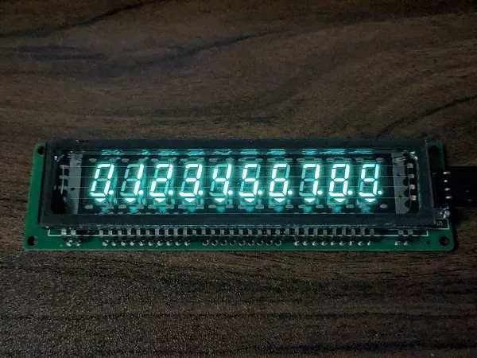

# LGL 10位串口 VFD 模块驱动

适用于树莓派 Pico 的 LGL 10位串口 VFD 模块驱动。

支持显示的字符：
* 0123456789-
* A C EFGHIJ L OP S U Z
* bcdefghij l opqrstu yz

内部函数：
* clear()
* set_brightness(level: int)
* set_text(text: str | int)
* set_decimal_points(positions: list[int])
* set_decimal_triangles(positions: list[int])
* scroll_text(text: str | int, delay: float, direction: str)

https://github.com/slabua/micropython-lgl-10digits-vfd-driver
