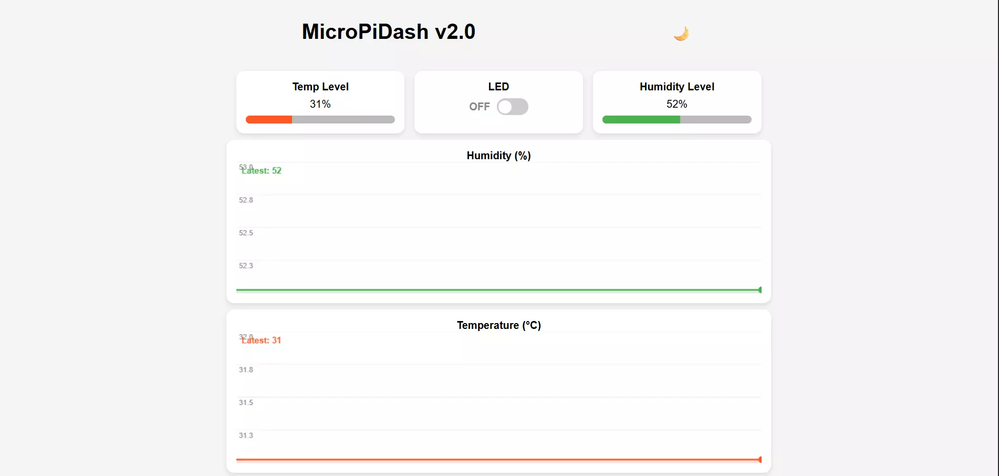

# 轻量级MicroPython物联网仪表盘：micropidash

micropidash 是一个用于 MicroPython 的非阻塞 web 界面库。具有实时同步、独立暗模式和通过 asyncio 轻松集成等特点。



## 主要特点

- **异步引擎**：基于uasyncio构建，具有无阻塞、多任务的性能。
- **实时同步**：基于AJAX的轮询确保所有连接的设备（移动设备和笔记本电脑）保持同步，而无需刷新页面。
- **客户端主题**：每个连接的用户都可以在黑暗和明亮模式之间独立切换。
- **保存顺序**：对小部件ID使用字母排序，以确保布局完全符合预期。
- **内存效率**：针对RAM有限的设备进行了优化，具有分块数据传输和频繁垃圾收集的特点。
- **实时传感器图**：基于画布的曲线图，带有滚动数据缓冲区、填充、网格线和y轴标签 —— 不需要外部库。

## 示例

基本用法
```py
from micropidash import Dashboard
import network 

# 1. WiFi Setup
wlan = network.WLAN(network.STA_IF)
wlan.active(True)

wlan.connect('YOUR_SSID', 'YOUR_PASSWORD')

print("Connecting...")
while not wlan.isconnected(): pass
print("Connected! IP:", wlan.ifconfig()[0])

# 2. Dashboard Initialization
dash = Dashboard("MicroPiDash v1.0")

# 3. Adding Basic Widgets
dash.add_toggle("led", "Test Switch")      # A binary toggle
dash.add_label("status", "System Status")  # A text display
dash.add_level("level", "Signal Strength") # A progress bar (0-100)

# 4. Start the Web Server
# Access the dashboard via the IP address printed above
dash.run()
```

ESP32 控制 LED
```py
import machine, network, uasyncio as asyncio
from micropidash import Dashboard

# 1. ESP32 Pin Setup (Most boards use GPIO 2 for built-in LED)
led = machine.Pin(2, machine.Pin.OUT)

# 2. WiFi Connectivity
wlan = network.WLAN(network.STA_IF)
wlan.active(True)
wlan.connect('YOUR_SSID', 'YOUR_PASSWORD')

print("Connecting...")
while not wlan.isconnected(): pass
print("Server Live at IP:", wlan.ifconfig()[0])

# 3. Dashboard Configuration
dash = Dashboard("ESP32 Control Hub")
dash.add_toggle("1_led", "Built-in LED")
dash.add_label("2_status", "Live Status")

# 4. Hardware & Web UI Sync Task
async def sync_task():
    while True:
        
        led.value(dash.elements["1_led"]["value"])
        
    
        state = "GLOWING" if led.value() else "OFF"
        dash.update_value("2_status", f"LED is {state}")
        
        await asyncio.sleep(0.5)

# 5. Execution
async def main():
    asyncio.create_task(sync_task())
    dash.run()

asyncio.run(main())
```

rpi pico 2w
```py
import machine, network, uasyncio as asyncio
import dht
from micropidash import Dashboard

# 1. Pin Setup
led = machine.Pin('LED', machine.Pin.OUT)
sensor = dht.DHT11(machine.Pin(28))  # GP28

# 2. WiFi Connectivity
wlan = network.WLAN(network.STA_IF)
wlan.active(True)
wlan.connect('YOUR_SSID', 'YOUR_PASSWORD')  
print("Connecting...")
while not wlan.isconnected(): pass
print("Server Live at IP:", wlan.ifconfig()[0])

# 3. Dashboard Configuration
dash = Dashboard("Pico Control Hub")
dash.add_toggle("1_led", "Built-in LED")
dash.add_label("2_status", "LED Status")
dash.add_label("3_temp", "Temperature (°C)")
dash.add_label("4_humidity", "Humidity (%)")
dash.add_level("5_hum_bar", "Humidity Level", "#2196F3")

# 4. Sync Task
async def sync_task():
    while True:
        # LED control
        led.value(dash.elements["1_led"]["value"])
        state = "GLOWING" if led.value() else "OFF"
        dash.update_value("2_status", f"LED is {state}")

        # DHT11 reading
        try:
            sensor.measure()
            temp = sensor.temperature()
            hum = sensor.humidity()
            dash.update_value("3_temp", f"{temp} °C")
            dash.update_value("4_humidity", f"{hum} %")
            dash.update_value("5_hum_bar", hum)
        except Exception as e:
            print("Sensor error:", e)

        await asyncio.sleep(2)  # DHT11 needs ~2s between readings

# 5. Execution
async def main():
    asyncio.create_task(sync_task())
    dash.run()

asyncio.run(main())
```


## 相关链接

- [github 仓库](https://github.com/kritishmohapatra/micropidash)
