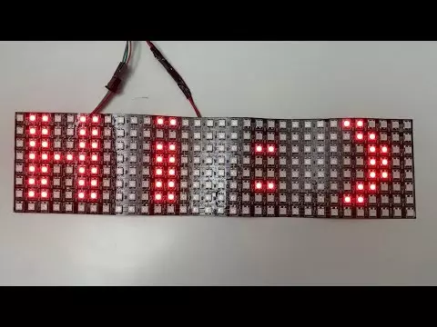

# NeoPixel Matrix for MicroPython

NeoPixelMatrix 模块是一个使用 MicroPython 在 NeoPixel LED 矩阵上显示文本和图形的简单库。该模块提供了一种简单的方法来控制 LED 矩阵，包括滚动文本、设置颜色和调整亮度。该库是专门为 8x32 WS2812b 矩阵编写的，并已在 ESP32 上进行了测试。

https://github.com/leosok/micropython_neopixel_matrix
