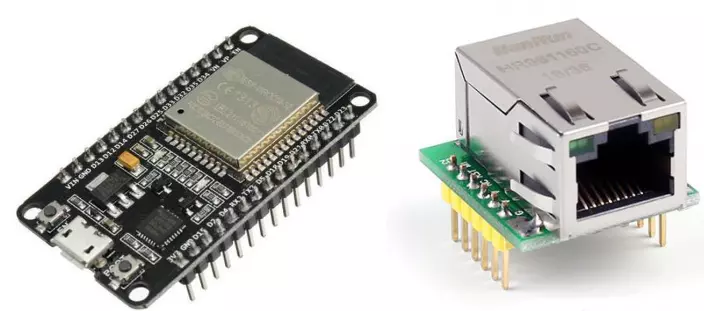

# W5500 (Wiznet) 以太网模块驱动

W5500 模块的 micropython 驱动，使用标准 spi 接口。



使用方法
```py
from wiznet5k import WIZNET5K
from machine import Pin, SPI
import wiznet5k_socket as socket
import time
import struct
import sma_esp32_w5500_requests as requests

# Initialize SPI and W5500
spi = SPI(2)
cs = Pin(5, Pin.OUT)
rst = Pin(34)
nic = WIZNET5K(spi, cs, rst)

# Define the URL to fetch data from
TEXT_URL = "http://quietlushbrightverse.neverssl.com/online/"

# Display chip info and network status
print("Chip Version:", nic.chip)
print("MAC Address:", [hex(i) for i in nic.mac_address])
print("My IP address is:", nic.pretty_ip(nic.ip_address))
print("IP lookup google.com: %s" % nic.pretty_ip(nic.get_host_by_name("google.com")))

# Initialize requests object with socket and Ethernet interface
requests.set_socket(socket, nic)

# Fetch and print content from the URL
print("Fetching text from", TEXT_URL)
r = requests.get(TEXT_URL)
print('-' * 40)
print(r.text)
print('-' * 40)
r.close()

print("Done!")
```

- [github 仓库 (ESP32-Wiznet-W5500-Micropython)](https://github.com/Ayyoubzadeh/ESP32-Wiznet-W5500-Micropython)
- [SSL 版本 (ESP32-Wiznet-W5500-SSL-Micropython)](https://github.com/Ayyoubzadeh/ESP32-Wiznet-W5500-SSL-Micropython)
