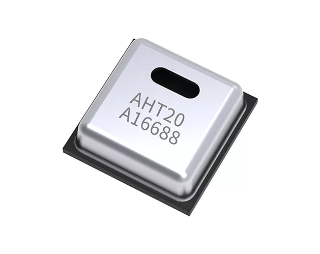

# AHT20

AHT20 是奥松公司的低成本温湿度传感器芯片。

## 相关链接

- [芯片网址](https://www.aosong.com/Products/info.aspx?lcid=26&proid=69)
	- [数据手册（立创）](https://atta.szlcsc.com/upload/public/pdf/source/20200407/C503357_487829B2F97386053400E2E73B0ABB4D.pdf?Expires=4070880000&OSSAccessKeyId=LTAIJDIkh7KmGS1H&Signature=s8wigmdpLooaWNsJX4I%2Fj3qusZw%3D&response-content-disposition=attachment%3Bfilename%3DC503357_%25E6%25B8%25A9%25E6%25B9%25BF%25E5%25BA%25A6%25E4%25BC%25A0%25E6%2584%259F%25E5%2599%25A8_AHT20_%25E8%25A7%2584%25E6%25A0%25BC%25E4%25B9%25A6_%25E5%25B9%25BF%25E5%25B7%259E%25E5%25A5%25A5%25E6%259D%25BE%25E6%25B8%25A9%25E6%25B9%25BF%25E5%25BA%25A6%25E4%25BC%25A0%25E6%2584%259F%25E5%2599%25A8%25E8%25A7%2584%25E6%25A0%25BC%25E4%25B9%25A6.PDF)
- 社区驱动
	- [github](https://github.com/shaoziyang/mpy-lib/tree/master/sensor/AHT20)
	- [gitee](https://gitee.com/shaoziyang/mpy-lib/tree/master/sensor/AHT20)
