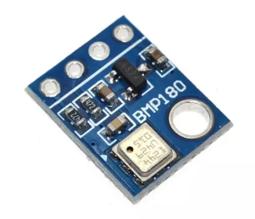
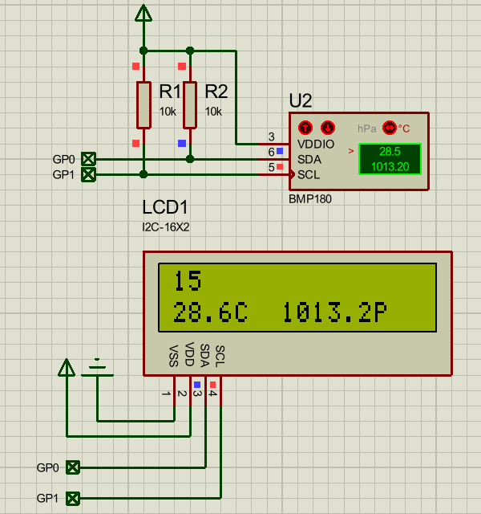

# bmp180

bmp180是一个高精度、小体积、低功耗的气压传感器。虽然它已停产，但是因为价格低，使用简单，在一些场合仍有不少应用。



主要参数：
* 工作电压：1.8~3.6V
* 工作电流：0.1~1000uA
* 温度精度：±1℃
* 温度范围：0~65℃
* 气压范围：300~1100 hPa
* 气压精度：1 hPa
* 输出方式：I2C

使用方法 (需要先将 [bmp180 驱动](https://gitee.com/shaoziyang/mpy-lib/tree/master/sensor/bmp180) 复制到开发板中)：

```python
from machine import I2C
import time

import bmp180

b = bmp180.BMP180(I2C(1))

while True:
    time.sleep_ms(500)
    b.get()
```


## proteus 模拟效果




## 相关链接

- [数据手册（digkey）](https://media.digikey.com/pdf/Data%20Sheets/Bosch/BMP180.pdf)
- 社区驱动
  - [github](https://github.com/shaoziyang/mpy-lib/tree/master/sensor/bmp180)
  - [githee](https://gitee.com/shaoziyang/mpy-lib/tree/master/sensor/bmp180)
