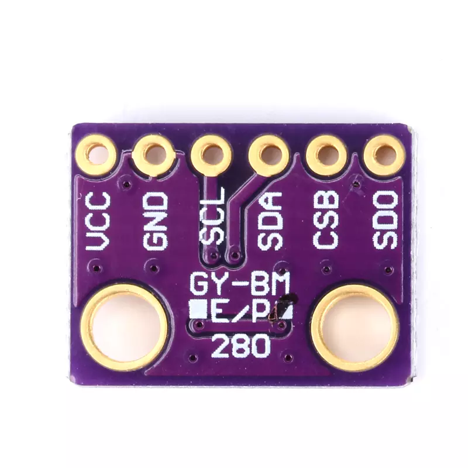

# bmp280

bmp280 是 bmp180 的升级型号，它在提升性能、增加 spi 接口、缩小体积、扩大温度范围等同时，降低了功耗。bmp280 目前也已经停产，但是同样因为高性价比仍然有一定应用，也比 bmp180 更容易寻找。



**主要参数**
- 工作电压 (VDD): 1.71 V ~ 3.6 V
- 接口电压 (VDDIO): 1.2 V ~ 3.6 V
- 数字接口: I²C（最高 3.4 MHz）
- SPI（3‑线/4‑线，最高 10 MHz）
- 测量范围: 气压：300 hPa ~ 1100 hPa（对应海拔约 ‑500 m ~ +9000 m）
- 温度：‑40 °C ~ +85 °C
- 相对精度: ±0.12 hPa（约 ±1 m 海拔）
- 绝对精度: ±1 hPa（约 ±8.33 m 海拔）
- 分辨率: 气压 0.16 Pa（≈0.0016 hPa）
- 温度 0.01 °C
- 噪声水平: 最大 RMS 噪声 1.3 Pa
- 功耗: 典型 2.7 µA @ 1 Hz（超低功耗模式）
- 睡眠模式 0.1 µA
- 测量时间: 平均 5.5 ms（单次测量）
- 封装尺寸: 2.0 mm × 2.5 mm × 0.95 mm（8‑pin LGA 金属盖）
- 工作温度范围: 同上（‑40 °C ~ +85 °C）
- 支持的采样率: 可配置至 157 Hz（最高）

## 使用方法

需要先将 [bmp280 驱动](https://gitee.com/microbit/mpy-lib/tree/master/sensor/bmp280) 复制到开发板中

```py
from machine import I2C
import time

import bmp280

b = bmp280.BMP280(I2C(1))

while True:
    time.sleep_ms(500)
    b.get()

```

## proteus 模拟效果


