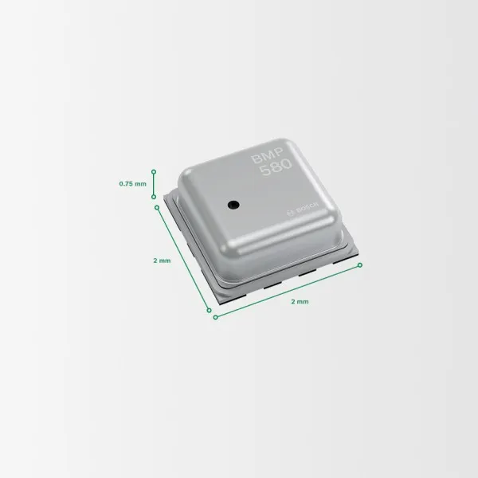

# bmp580

BMP580是气压传感器领域的全新标杆，以其卓越的精度令人瞩目。这为健身追踪等需要精确高度变化的应用场景提供了无限可能。

## 相关链接

- [产品介绍](https://www.bosch-sensortec.com/en/products/environmental-sensors/pressure-sensors/bmp580)
	- [数据手册（来自立创商城）](https://item.szlcsc.com/datasheet/BMP580/23966612.html)
- 社区驱动
	- [github](https://github.com/shaoziyang/mpy-lib/tree/master/sensor/bmp580)
	- [gitee](https://gitee.com/shaoziyang/mpy-lib/tree/master/sensor/bmp580)
