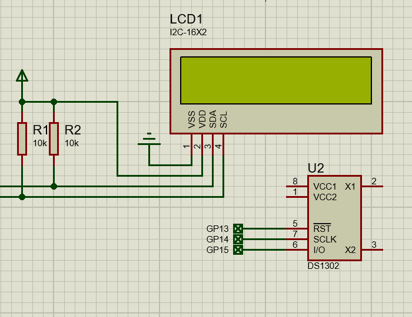

# DS1302 实时时钟

DS1302涓流充电计时芯片包含实时时钟/日历和31字节静态RAM。它通过简单的串行接口与微处理器通信。实时时钟/日历提供秒、分、时、星期、日期、月和年信息。对于少于31天的月份，月底的日期会自动调整，包括针对闰年的更正。时钟以24小时制或带AM/PM指示器的12小时制运行。

通过使用同步串行通信，简化了DS1302与微处理器的接口。只需三根线即可与时钟/RAM通信：CE、I/O（数据线）和SCLK（串行时钟）。在与时钟/RAM之间进行数据传输时，可以一次1个字节，也可以在一次突发中包含多达31个字节。DS1302工作时的功耗非常低，并以低于1µW的功耗保留数据和时钟信息。

## 使用方法

先将[驱动文件](https://gitee.com/microbit/mpy-lib/tree/master/misc/DS1302)复制到开发板或设备。

```py
from machine import Pin, I2C
from i2c_lcd1602 import I2C_LCD1602
from time import sleep_ms
import DS1302

led = Pin(25, Pin.OUT)
i2c = I2C(0, scl=Pin(1), sda=Pin(0))

print(i2c.scan())

lcd = I2C_LCD1602(i2c, 63)

ds = DS1302.DS1302(clk=Pin(14), dio=Pin(15), cs=Pin(13))
ds.DateTime([2025, 1, 16, 4, 12, 34, 56, 0])

while 1:

    lcd.puts(f"{ds.Hour():02d}:{ds.Minute():02d}:{ds.Second():02d}", 0, 0)
    
    sleep_ms(1000)      
```


## proteus 模拟效果



## 相关链接

- [芯片网站](https://www.analog.com/cn/products/ds1302.html)
  - [数据手册](https://www.analog.com/media/en/technical-documentation/data-sheets/DS1302.pdf)
- [社区驱动](https://gitee.com/microbit/mpy-lib/tree/master/misc/DS1302)
