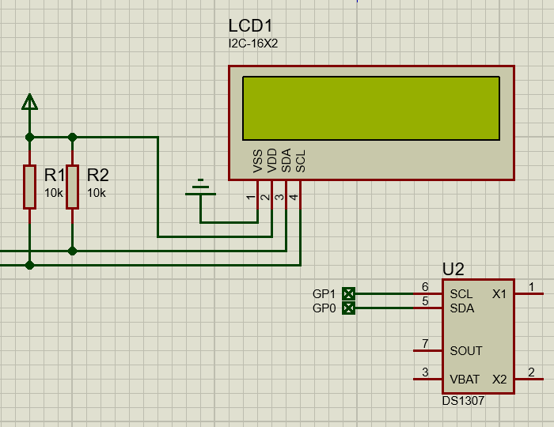

# DS1307 实时时钟

DS1307串行实时时钟(RTC)是一款低功耗、二-十进制编码(BCD)的时钟/日历，外加56字节NV RAM。地址与数据通过I²C接口串行传输。时钟/日历提供秒、分、时、星期、日、月和年信息。对于少于31天的月份，将自动调整月末日期，包括闰年修正。时钟格式可以是24小时或带AM/PM指示的12小时格式。DS1307内置电源检测电路，检测主电源失效时自动切换到备用电源，以保持时间、日期信息和计时。

## 使用方法

先将[驱动文件](https://gitee.com/microbit/mpy-lib/tree/master/misc/DS1307)复制到开发板或设备。

```py
from machine import Pin, I2C
from i2c_lcd1602 import I2C_LCD1602
from time import sleep_ms
import ds1307

led = Pin(25, Pin.OUT)
i2c = I2C(0, scl=Pin(1), sda=Pin(0))

print(i2c.scan())

lcd = I2C_LCD1602(i2c, 63)

ds = ds1307.DS1307(i2c)
ds.datetime([2025, 1, 16, 4, 10, 10, 10, 0])

while 1:

    lcd.puts(f"{ds.hour():02d}:{ds.minute():02d}:{ds.second():02d}", 0, 0)
    
    sleep_ms(1000)     
```


## proteus 模拟效果



## 相关链接

- [芯片网站](https://www.analog.com/cn/products/ds1307.html)
  - [数据手册](https://www.analog.com/media/en/technical-documentation/data-sheets/DS1307.pdf)
- [社区驱动](https://gitee.com/microbit/mpy-lib/tree/master/misc/DS1307)
