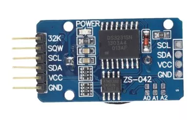

# DS3231 高精度时钟

DS3231 是低成本、高精度 I²C 实时时钟(RTC)，具有集成的温补晶振(TCXO)和晶体。该器件包含电池输入端，断开主电源时仍可保持精确的计时。内部集成的晶振提高了器件的长期精确度，-40°C 至 +85°C 范围内精度为 ±3.5ppm，数字温度传感器精度为 ±3°C 。RTC 保存秒、分、时、星期、日期、月和年信息。少于31天的月份，将自动调整月末的日期，包括闰年的修正。时钟的工作格式可以是24小时或带/AM/PM指示的12小时格式。提供两个可设置的日历闹钟和一个可设置的方波输出。地址与数据通过I²C双向总线串行传输。

常见的 DS3231 模块包含了 DS3231、AT24C32、电池：



## 使用方法

先将 [DS3231 驱动](https://gitee.com/microbit/mpy-lib/tree/master/misc/DS3231) 复制到开发板中，然后就可以 import 后使用。

```py
from machine import I2C, Pin
import DS3231

i2c = I2C(1, sda = Pin(5), scl=Pin(4))
ds = DS3231.DS3231(i2c)

ds.Hour(12)

ds.Time()
ds.Time([12,10,0])

ds.DateTime([2018,3,12,1,22,10,0])

ds.ALARM(12, 20, 10, ds.PER_DISABLE)
ds.ALARM(12, 20, 10, ds.PER_DAY)
ds.ClearALARM()

ds.Temperature()
```

## proteus 模拟效果


## 芯片相关

- [DS3231网站3](https://www.analog.com/cn/products/ds3231.html)
- [中文数据手册](https://www.analog.com/media/cn/technical-documentation/data-sheets/DS3231_cn.pdf)
- [英文数据手册](https://www.analog.com/media/en/technical-documentation/data-sheets/DS3231.pdf)
- [micropython驱动](https://gitee.com/microbit/mpy-lib/tree/master/misc/DS3231)

