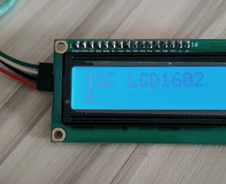

# I2C LCD1602

I2C 接口的 LCD1602 液晶模块驱动，只需要两个IO就能使用，支持硬件I2C和软件I2C。

```py
from machine import I2C, Pin
from i2c_lcd1602 import I2C_LCD1602
from time import sleep_ms

i2c = I2C(1, sda=Pin(9), scl=Pin(10))

LCD = I2C_LCD1602(i2c)

LCD.puts("I2C LCD1602")
n = 0
while 1:
    LCD.puts(n, 0, 1)
    n += 1
    sleep_ms(1000)     
```

**注意**
- 大部分 I2C LCD1602是5V供电的，电源电压低于4V显示效果会变差。
- 很多MCU电压是3.3V，需要注意电平转换问题。

---

运行效果（拍摄角度造成不够清晰，实际没有问题）




proteus仿真效果


