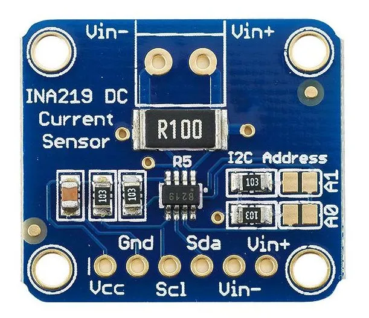

# INA219 电流传感器

INA219 是 TI 公司的具有 I2C 接口的零漂移双向电流/功率监测计，它监测分流器电压降和总线电源电压，转换次数和滤波选项可通过编程设定。可编程校准值与内部乘法器相结合，支持直接读取电流值，通过附加乘法寄存器可计算功率。INA219 提供两种级别：A 级和 B 级，B 级型号的精度更高且精密规范更加严格。



## 使用方法

先将 [ina219 驱动](https://gitee.com/microbit/mpy-lib/tree/master/sensor/INA219) 复制到开发板中，然后就可以 import 后使用。获取系统电压、电流、功率前，需要先通过 calreg() 函数进行系统校正，校正值与设备相关，校正后可以得到精确的数值。通过对功率进行积分计算，可以得出电量。

**内部函数**

- INA219.volt()
  获取输入电压。
- INA219.current()
  获取当前电流。
- INA219.power()
  获取当前功率。
- INA19.calreg()
  获取或设置校正寄存器

**参考程序**

```py
from machine import Pin, SoftI2C
import ina219

# please modify scl/sda to the actual pins.
i2c = SoftI2C(scl=Pin(pins.pin_SCL), sda=Pin(pins.pin_SDA))

ina = ina219.INA219(i2c)
ina.calreg(3450)

v = ina.volt()
c = ina.current()
p = ina.power()
```

## 相关链接

- [芯片网站](https://www.ti.com.cn/product/cn/INA219)
- 中文数据手册 [PDF](https://www.ti.com.cn/cn/lit/gpn/ina219) | [HTML](https://www.ti.com.cn/document-viewer/cn/ina219/datasheet)
- 英文数据手册 [PDF](https://www.ti.com/lit/gpn/ina219) | [HTML](https://www.ti.com/document-viewer/ina219/datasheet)
- [中文社区驱动](https://gitee.com/microbit/mpy-lib/tree/master/sensor/INA219)
