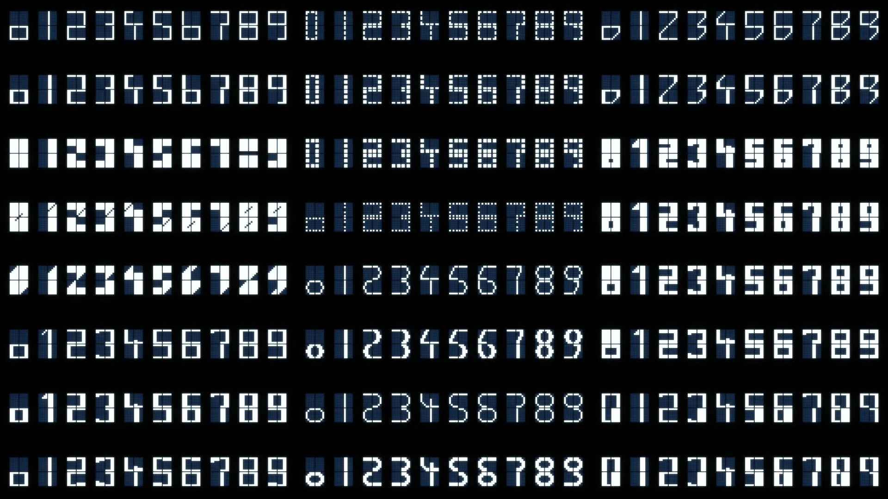

# LCD1602 大数字

**LCD1602_BIG_DIGITS** 是一个移植至[arduino大数字](https://github.com/upiir/character_display_big_digits)的库，它在LCD1602上用 2x2 的字符方式显示出更大体积的数字（0 - 9）。它利用了 LCD1602 液晶可以自定义8个字符的特性，利用这8个自定义字符和原有的特定字符，组合显示出大数字（注意只能显示数字而不能显示字符）。

支持多种不同的字体，可以随时切换不同的字体。




使用方法：

```python
from lcd1602_bigdigit import LCD1602_BIGDIGIT
from machine import I2C, Pin
from time import sleep_ms

#i2c = I2C(1, sda=Pin(27), scl=Pin(26))
i2c = I2C(1, sda = Pin(18), scl = Pin(16))

lcd = LCD1602_BIGDIGIT(i2c, 39)
lcd.font('square_three')

n = 0
while 1:
    n+=1
    lcd.number(n,4)
    sleep_ms(1000)
                    
```

proteus仿真效果


