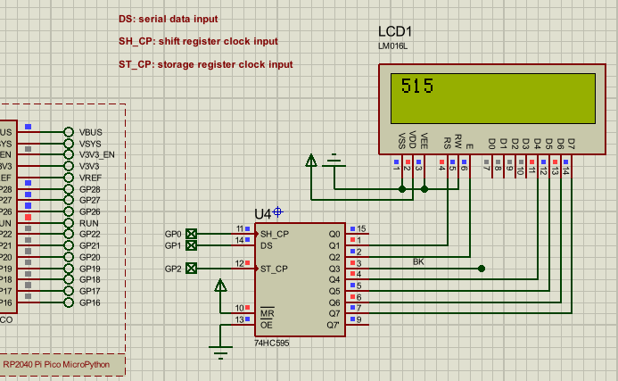
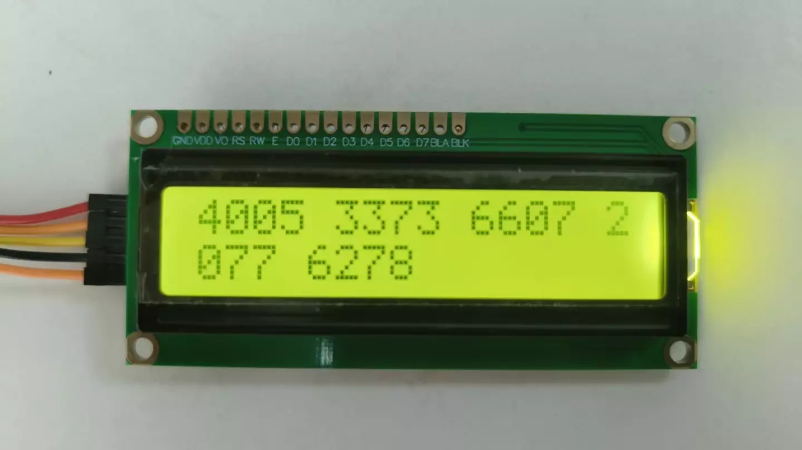
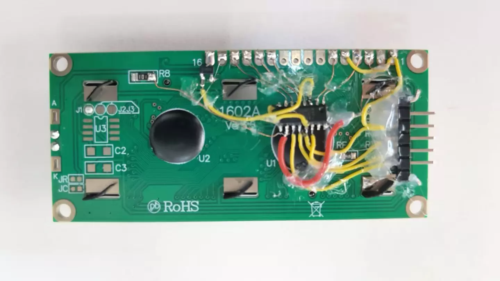

# LCD1602 595 驱动

LCD1602 的 74HC595 驱动，速度比 I2C 接口的 LCD1602 速度快很多，支持 GPIO 和 SPI 两种方式。通过外接 NPN 三极管（如9014）或 N沟道MOS（如AO3400）控制背光。

引脚

- `ST_CP`: 寄存器输出更新, 或 SPI cs 信号。
- `SH_CP`: 寄存器移位时钟输入, 或 SPI sck 信号。
- `DS`: 串行数据输入, 或 SPI mosi 信号。
- `Q1`: 连接到 LCD1602 的 RS。
- `Q2`: 连接到 LCD1602 的 E。
- `Q3`: 连接到 NPN 三极管 (9014) 或 N沟道 MOS (AO3401), 控制 LCD1602 的背光。

使用方法

```python
from machine import Pin, SoftSPI
from time import sleep_ms
from lcd1602_595 import LCD1602_595

#lcd = LCD1602_595(ST_CP=Pin(27), SH_CP=Pin(28), DS=Pin(26))
lcd = LCD1602_595(spi=SoftSPI(sck=Pin(28),mosi=Pin(26),miso=Pin(25)), ST_CP=Pin(27))     

n = 0
while 1:
    lcd.print(f"{n}", end=' ')
    n += 1

    sleep_ms(200)

```

原理图和 proteus 仿真



实物图




