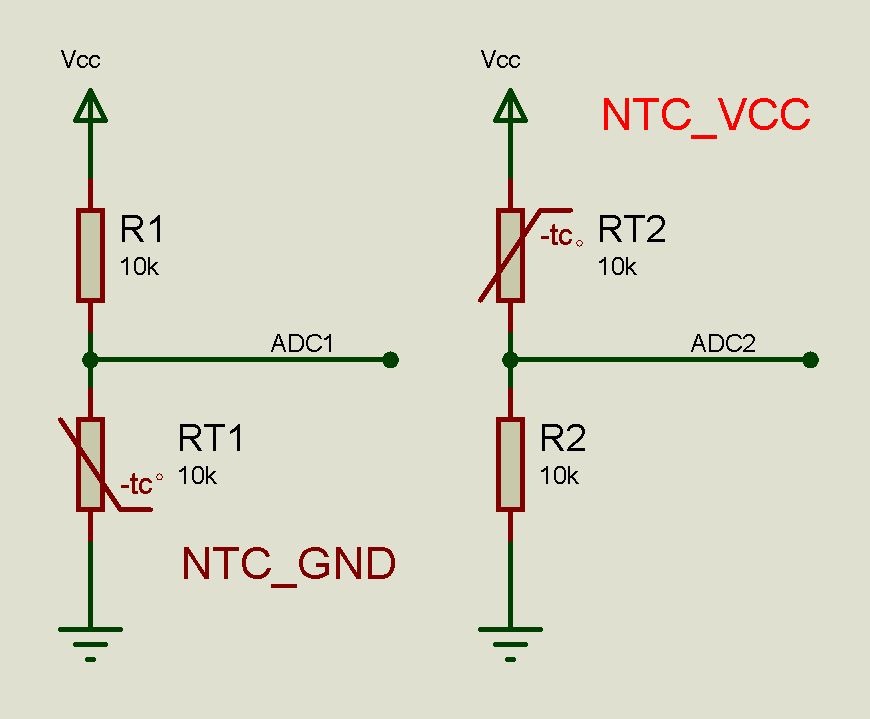

# NTC 热敏电阻

NTC 热敏电阻测量温度。

热敏电阻有两种连接方式，分别连接到VCC或GND，利用电阻分压的变化测量温度，对应两种公式：`NTC_VCC(adc, max, B=3780)`和`NTC_GND(adc, max, B=3780)`。这里假定热敏电阻在25℃的标称电阻值和分压电阻值相等，从而简化了计算。



**参数说明**：

- adc：连接到 NTC 的 ADC 对象，如 `ADC(Pin(34), atten=ADC.ATTN_11DB)`、`ADC(Pin('PA0'))`等。
- max：adc 对象读取到的最大值（毫伏）。
- B：NTC 热敏电阻的温度系数，默认是 3780。

**使用方法**：

```python
from machine import ADC, Pin

ADC_T1 = ADC(Pin(34), atten=ADC.ATTN_11DB)
ADC_T2 = ADC(Pin(33), atten=ADC.ATTN_11DB)

T1 = NTC_VCC(ADC_T1.read_uv()/1000, 3300)
T2 = NTC_GND(ADC_T2.read_uv()/1000, 3300, B=3950)
```
