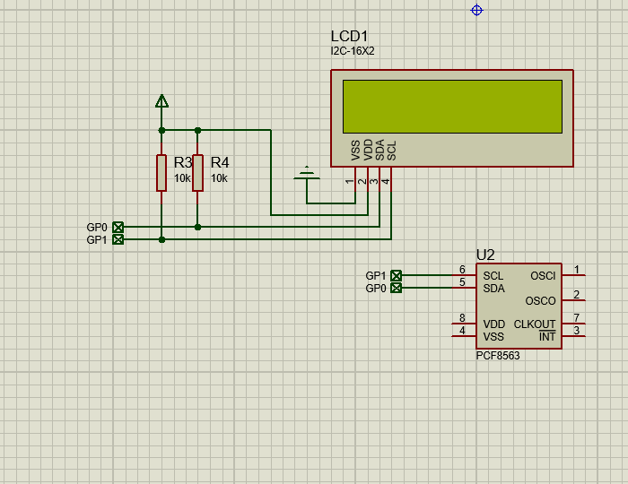

# PCF8563 实时时钟

PCF8563是一款CMOS实时时钟(RTC)和日历，最适合低功耗应用。还提供可编程时钟输出、中断输出和电压过低检测器。通过两线双向I²C总线串行传送所有地址和数据。最大总线速度为400 kbit/s。寄存器地址会在每次写入或读取数据字节后自动递增。

## 特征

- 基于32.768 kHz石英晶体提供年、月、日、周、时、分和秒
- 世纪标志
- 时钟工作电压：室温下为1.0 V至5.5 V
- 低备用电流；VDD = 3.0 V和Tamb = 25 °C时典型值为0.25 μA
- 400 kHz双线I²C总线接口(VDD = 1.8 V至5.5 V时)
- 面向外围器件的可编程时钟输出(32.768 kHz、1.024 kHz、32 Hz和1 Hz)
- 告警和定时器功能
- 内置振荡器电容
- 内部电源上电复位(POR)
- I²C总线从地址：读取A3h和写入A2h
- 开漏中断引脚


## 使用方法

```py
from machine import Pin, I2C
from time import sleep_ms
from i2c_lcd1602 import I2C_LCD1602

import pcf8563

led = Pin(25, Pin.OUT)
i2c = I2C(0, scl=Pin(1), sda=Pin(0))

print(i2c.scan())

lcd = I2C_LCD1602(i2c, 63)
ds = pcf8563.PCF8563(i2c)

ds.datetime([2025, 1, 16, 4, 0, 0, 0, 0])

while 1:

    lcd.puts(f"{ds.hour():02d}:{ds.minute():02d}:{ds.second():02d}", 0, 0)
    
    sleep_ms(1000)    
```

## proteus 模拟效果




## 相关链接

- [芯片网站](https://www.nxp.com.cn/products/analog-and-mixed-signal/real-time-clocks/real-time-clock-calendar:PCF8563)
	- [数据手册 (pdf)](https://www.nxp.com.cn/docs/zh/data-sheet/PCF8563.pdf)
- [社区驱动](https://gitee.com/microbit/mpy-lib/tree/master/misc/pcf8563)

