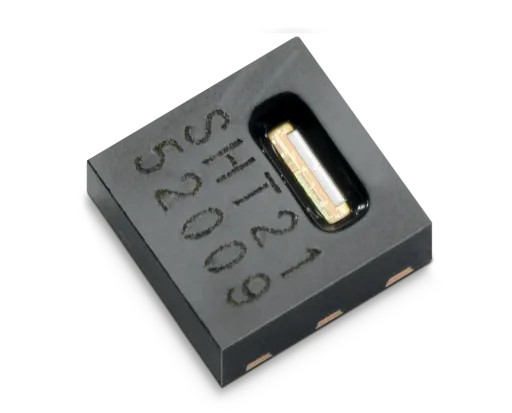
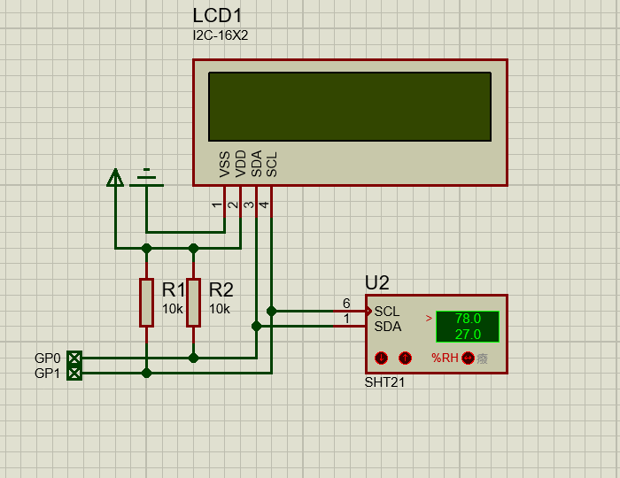

# SHT2x 数字温湿度传感器

SHT2x  数字温湿度传感器系列包括低成本版本SHT20、标准版本SHT21，以及高端版本SHT25。除需与空气接触的湿度敏感区域之外,整个芯片完全包覆成型——可使电容式湿度传感器免受外界影响，具有良好的长期稳定性，适合各类应用。



## 使用方法

先将[驱动文件](https://gitee.com/shaoziyang/mpy-lib/tree/master/sensor/sht20)复制到开发板或设备。

```py
from machine import Pin, I2C
from sht2x import SHT20
from i2c_lcd1602 import I2C_LCD1602
from time import sleep_ms

led = Pin(25, Pin.OUT)
i2c = I2C(0, scl=Pin(1), sda=Pin(0))

print(i2c.scan())

lcd = I2C_LCD1602(i2c, 63)
s = SHT20(i2c)

n = 0

while 1:
   led(not led())
   n+=1
   lcd.puts(n, 0, 0)
   lcd.puts(f"{s.humi():.1f}%", 0, 1)
   lcd.puts(f"{s.temperature():.1f}C", 7, 1)
   
   sleep_ms(500)      
```

## proteus 仿真效果



## 相关链接

- [芯片网址](https://sensirion.com/cn/products/catalog/SHT21)
	- [数据手册](https://sensirion.com/media/documents/120BBE4C/63500094/Sensirion_Datasheet_Humidity_Sensor_SHT21.pdf)
- 社区驱动
	- [github](https://github.com/shaoziyang/mpy-lib/tree/master/sensor/sht20)
	- [gitee](https://gitee.com/shaoziyang/mpy-lib/tree/master/sensor/sht20)
