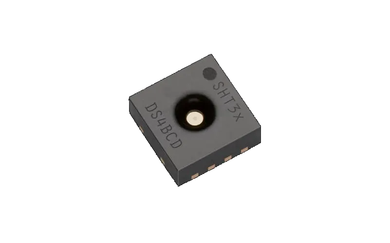

# SHT3X 数字温湿度传感器

SHT3x系列将传感器技术提升到了一个新水平。作为SHT2x系列的继承者，它将定义湿度传感的下一个行业标准。SHT3x湿度传感器系列包括低成本版本SHT30、标准版本SHT31，以及高端版本SHT35。SHT3x湿度传感器系列结合了多种功能和各种接口（I²C、模拟电压输出）。



## 使用方法
```python
from machine import I2C, Pin
from time import sleep_ms
from sht3x import SHT3x

i2c = I2C(0, sda=Pin(21), scl = Pin(22))

sht30 = SHT3x(i2c)

while True:
    sht30.measure()
    print(sht30.ht())
    sleep_ms(1000)

```

## 相关链接

- [产品网址](https://sensirion.com/cn/products/catalog/SHT30-DIS-B)
	- [数据手册](https://sensirion.com/media/documents/213E6A3B/63A5A569/Datasheet_SHT3x_DIS.pdf)
- 社区驱动
	- github
		- [16位模式](https://github.com/shaoziyang/mpy-lib/tree/master/sensor/SHT3x/I2C_16bit)
		- [8位模式](https://github.com/shaoziyang/mpy-lib/tree/master/sensor/SHT3x/I2C_8bit)
	- gitee
		- [16位模式](https://gitee.com/shaoziyang/mpy-lib/tree/master/sensor/SHT3x/I2C_16bit)
		- [8位模式](https://gitee.com/shaoziyang/mpy-lib/tree/master/sensor/SHT3x/I2C_8bit)
