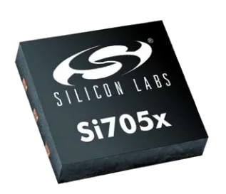

# Si7051 高精度温度传感器

Si7051 是芯科公司（silicon labs）的高精度温度传感器，它提供业界领先的低功耗，可在 35.8°C 至 41°C 人体温度范围内提供 ±0.1°C 的最高精度，在整个工作电压和 -40 和 +125°C 温度范围内提供 ±0.25°C 最高精度。

## 相关链接

- [芯片网址](https://cn.silabs.com/sensors/temperature/si705x/device.si7051)
	- [数据手册（立创）](https://atta.szlcsc.com/upload/public/pdf/source/20170919/C129804_1505787174947976867.pdf)
- 社区驱动
	- [github](https://github.com/shaoziyang/mpy-lib/tree/master/sensor/si7051)
 	- [gitee](https://gitee.com/shaoziyang/mpy-lib/tree/master/sensor/si7051)
