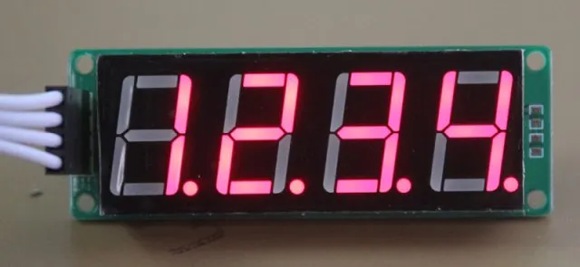

# TM1650 数码管驱动

TM1650 是一个带键盘扫描接口的 LED 驱动控制专用芯片，常用于数码管的驱动。TM1650 使用标准的 I2C 接口，可以非常容易驱动1-6位数码管，并控制显示亮度。



社区的 micropython 驱动专门针对 4 位数码管做了优化（这也是最常见的应用方式，可以非常容易修改为支持不同位数的数码管），可以非常简单的显示0-9数字、hex字符、小数点、亮度等功能。

使用方法(需要先将 [TM1650 驱动](https://gitee.com/microbit/mpy-lib/tree/master/LED/TM1650) 复制到开发板中)：

```py
import machine
import time
import FourDigitDisplay

i2c = machine.I2C(1)
fdd = FourDigitDisplay.FourDigitDisplay(i2c)

n = 0
while 1:
    fdd.shownum(n)
    n += 1
    time.sleep_ms(1000)
```
