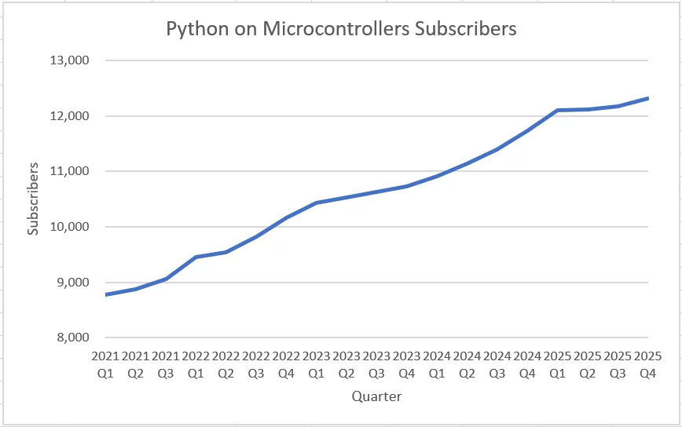

# 订阅数据统计

| 季度    | 订阅数 | 订阅增长数 | 订阅用户年增长率 |
|---------|:------:|:----------:|:----------------:|
| 2021 Q1 |  8770  |    381     |       1106       |
| 2021 Q2 |  8874  |    104     |       952        |
| 2021 Q3 |  9062  |    188     |       938        |
| 2022 Q1 |  9456  |    394     |       686        |
| 2022 Q2 |  9541  |     85     |       667        |
| 2022 Q3 |  9824  |    283     |       762        |
| 2022 Q4 | 10169  |    345     |       713        |
| 2023 Q1 | 10430  |    261     |       889        |
| 2023 Q2 | 10527  |     97     |       703        |
| 2023 Q3 | 10625  |     98     |       801        |
| 2023 Q4 | 10735  |    110     |       556        |
| 2024 Q1 | 10912  |    177     |       482        |
| 2024 Q2 | 11134  |    222     |       607        |
| 2024 Q3 | 11397  |    263     |       772        |
| 2024 Q4 | 11742  |    345     |       1007       |
| 2025 Q1 | 12104  |    362     |       1192       |
| 2025 Q2 | 12111  |     7      |       997        |
| 2025 Q3 | 12175  |     64     |       778        |
| 2025 Q4 | 12321  |    146     |       579        |

