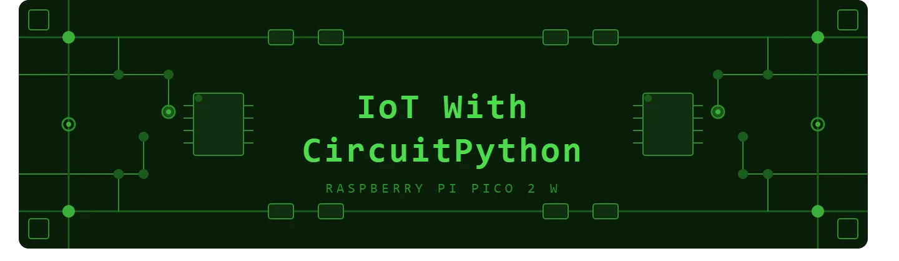

# IoT With CircuitPython

一系列基于树莓派 Pico 2 W 的 CircuitPython 实用物联网项目，探索传感器、显示屏、无线通信等，项目将逐步不定时增加。

## 已有项目

| #   | 项目 | 分类 | 状态 |
| --- | --- | --- | --- |
| 01  | [Blink — Onboard LED](https://github.com/kritishmohapatra/IoT_With_CircuitPython/blob/main/Project_1%5CREADME.md) | GPIO | ✅   |
| 02  | External LED + Button | GPIO | 🔜  |
| 03  | PWM LED Breathing | GPIO | 🔜  |
| 04  | DHT11 Temperature & Humidity | Sensors | 🔜  |
| 05  | BMP280 Pressure Sensor | Sensors | 🔜  |
| 06  | Ultrasonic Distance Sensor | Sensors | 🔜  |
| 07  | LDR Light Sensor | Sensors | 🔜  |
| 08  | PIR Motion Detector | Sensors | 🔜  |
| 09  | SSD1306 OLED Hello World | Display | 🔜  |
| 10  | OLED Sensor Dashboard | Display | 🔜  |
| 11  | ST7735 TFT Display | Display | 🔜  |
| 12  | TFT Animated Graphics | Display | 🔜  |
| 13  | Wi-Fi Connect + IP Display | Wi-Fi | 🔜  |
| 14  | HTTP GET — Fetch Weather API | Wi-Fi | 🔜  |
| 15  | HTTP POST — ThingSpeak | Wi-Fi | 🔜  |
| 16  | MQTT — Adafruit IO | MQTT | 🔜  |
| 17  | MQTT — Node-RED Dashboard | MQTT | 🔜  |
| 18  | BLE Advertise | BLE | 🔜  |
| 19  | BLE LED Control from Phone | BLE | 🔜  |
| 20  | BLE Sensor Data Stream | BLE | 🔜  |
| 21  | Servo Motor Control | Motors | 🔜  |
| 22  | DC Motor with L298N | Motors | 🔜  |
| 23  | Stepper Motor | Motors | 🔜  |
| 24  | Mini Weather Station | Mini Project | 🔜  |
| 25  | IoT Relay Control via MQTT | Mini Project | 🔜  |

https://github.com/kritishmohapatra/IoT_With_CircuitPython
