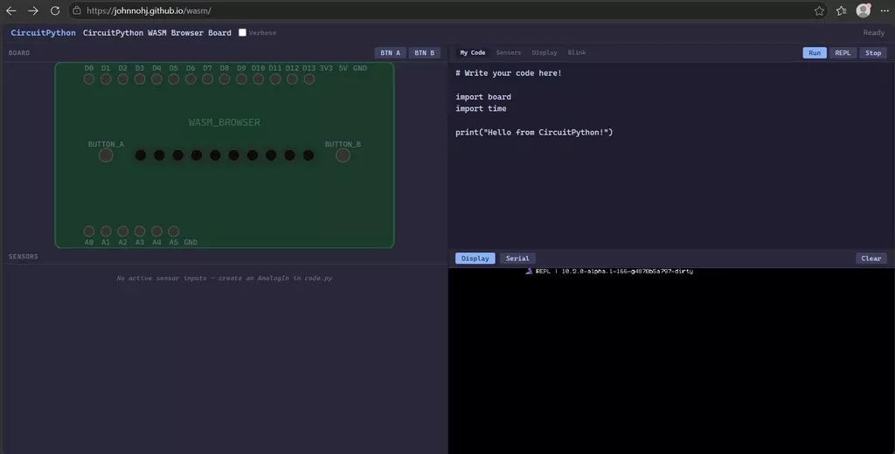

# WASM 的 circuitpython 非官方移植

WASM 的 circuitpython 非官方移植，可以在没有实际硬件情况下，通过浏览器模拟运行 circuitpython。

## 相关链接

- [项目说明](https://adafruit-playground.com/u/JohnnohJ/pages/circuitpython-wasm-port)
- [github仓库](https://github.com/johnnohj/circuitpython/tree/browser-board/ports/wasm)
- [在线使用](https://johnnohj.github.io/wasm/)
