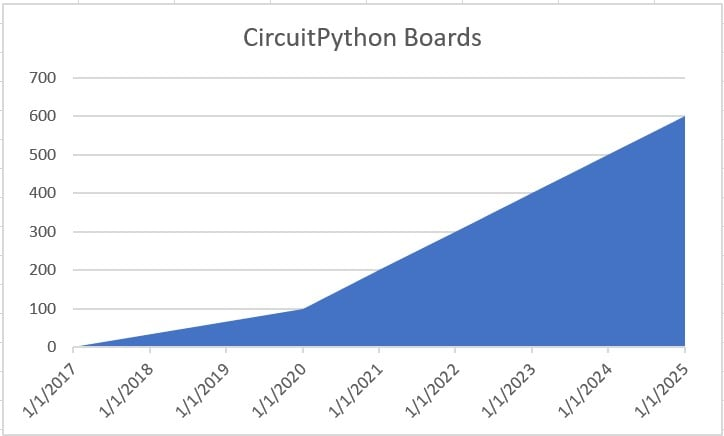

# 已有超过600个兼容circuitpython的开发板   
[https://blog.adafruit.com/2025/03/21/626918-600-circuitpython-boards/](https://blog.adafruit.com/2025/03/21/626918-600-circuitpython-boards/)    
   
时间线:   
- 400 Boards – [MAY 12, 2023](https://blog.adafruit.com/2023/05/12/there-are-now-over-400-circuitpython-compatible-microcontroller-boards-circuitpython-python-adafruit/?__cf_chl_tk=42Mx0Vw2adDRfuX9Sg5vXH_sXhQ35Kx9yg5MUyqhRYc-1742520858-1.0.1.1-8tGIIGzeQiCoWGocWMMEXkFL3QzPXmIstPVAKIvdoe4)   
- 300 Boards – [MAY 17, 2022](https://blog.adafruit.com/2022/05/17/there-are-now-over-300-circuitpython-compatible-microcontroller-boards-circuitpython-python-adafruit/)   
- 200 Boards – [APRIL 16, 2021](https://blog.adafruit.com/2021/04/16/there-are-now-over-200-boards-that-support-circuitpython/)   
- 100 Boards – [JANUARY 18, 2020](https://blog.adafruit.com/2020/01/18/the-open-hardware-summit-2020-badge-is-circuitpython-powered-and-its-the-100th-board-ohsummit-circuitpython-ohsummit20/)   
- Start – the Adafruit Circuit Playground Express – [OCTOBER 12, 2017](https://blog.adafruit.com/2017/10/12/getting-started-with-adafruit-circuit-playground-express-msmakecode-arduino-circuitpython/)   
    
