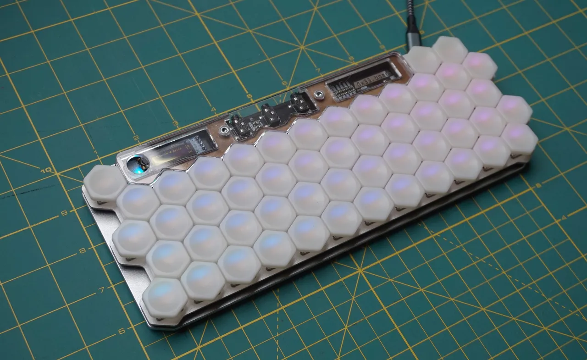

# 0x33.board RGB MIDI 键盘

0x33.board 是一个 48 键同构 MIDI 控制器。它支持 USB-MIDI、TRS-MIDI（仅限输出）和 I2C。它还有一个用于 1 位耳机输出的插孔。主音符表面的 48 个键排列成四行交错排列，每排 12 个键。每个键都有独立的 RGB 背光，可用于突出音阶、旋律或和弦。

使用小型 OLED 显示屏和三个专用菜单/导航键在设备上更改所有设置。固件是开源的，可以在 CircuitPython 中进行扩展。

**相关链接**

- [项目网站](https://hw.s-ol.nu/0x33.board/)
- [开源硬件认证](https://certification.oshwa.org/it000010.html)
- 硬件设计 （CERN-OHL-S 2.0）：  
  `git clone https://git.s-ol.nu/hw/0x33.board/hardware.git`
- 固件源码 （MIT）：  
  `git clone https://git.s-ol.nu/hw/0x33.board/firmware.git`
- 文档 （CC BY 4.0）：  
  `git clone https://git.s-ol.nu/hw/hw.s-ol.nu.git`
