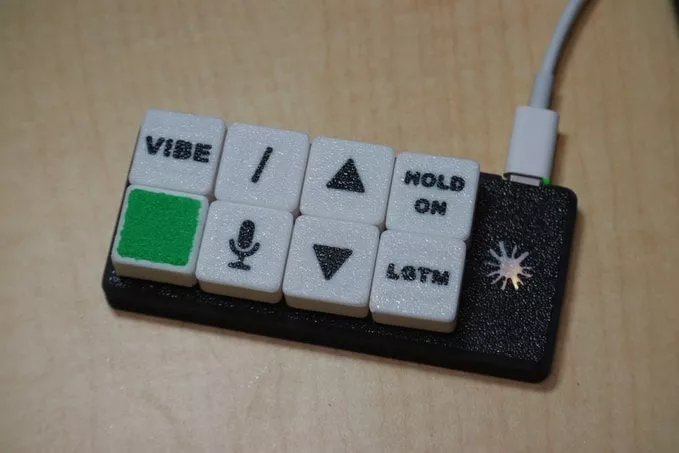

# 8键氛围编码键盘

这款键盘不仅能运行 Claude（人工智能工具）、控制鼠标，还带有 “接触现实（touch grass）” 功能键 —— 按下该键可以让你 “回归正常生活”，同时使电脑进入休眠状态。

这款键盘采用了定制外壳，搭载 [Adafruit KB2040 键盘驱动板](https://www.adafruit.com/product/5302)，运行 CircuitPython（开源编程语言）和 KMK（键盘固件框架）。

[8 Key Vibe Coding Keyboard](https://blog.adafruit.com/2025/08/30/8-key-vibe-coding-keyboard/)
