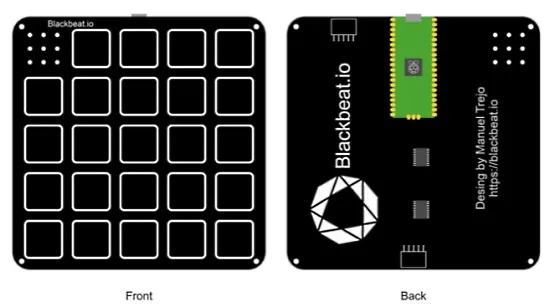
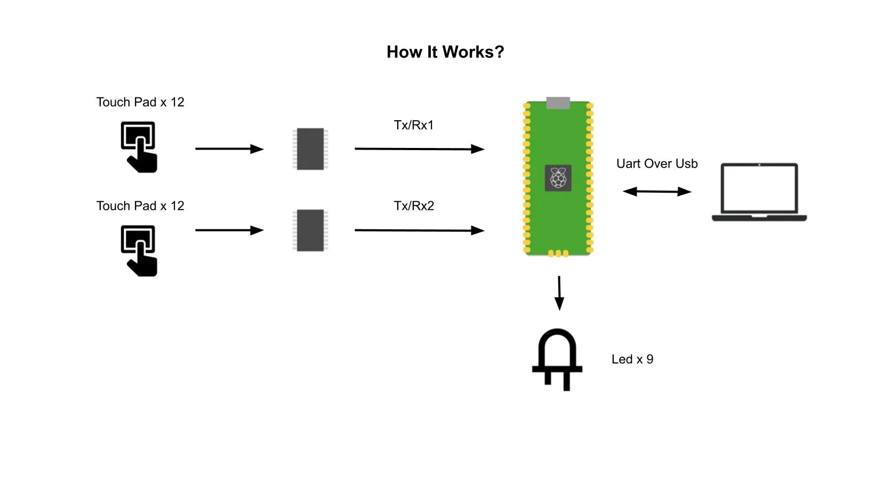
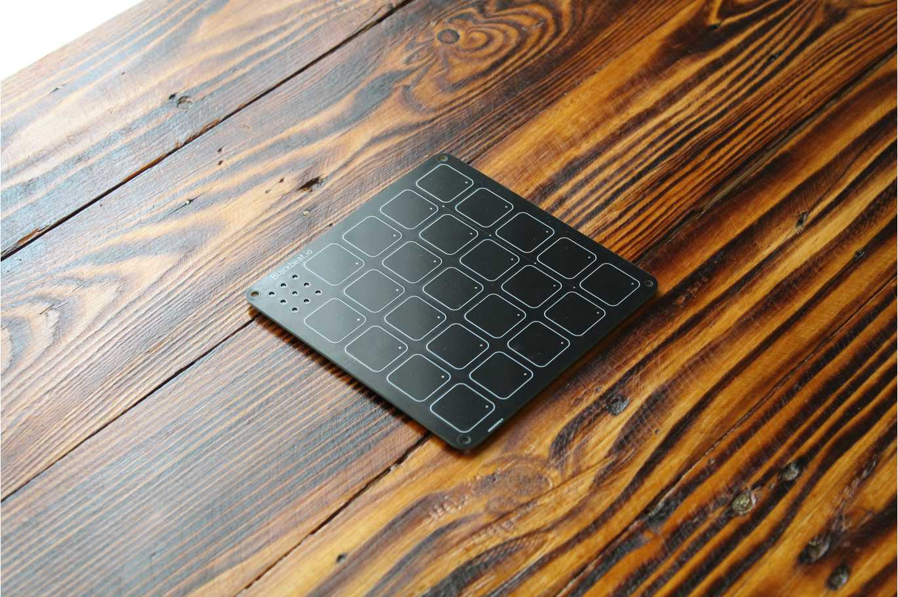
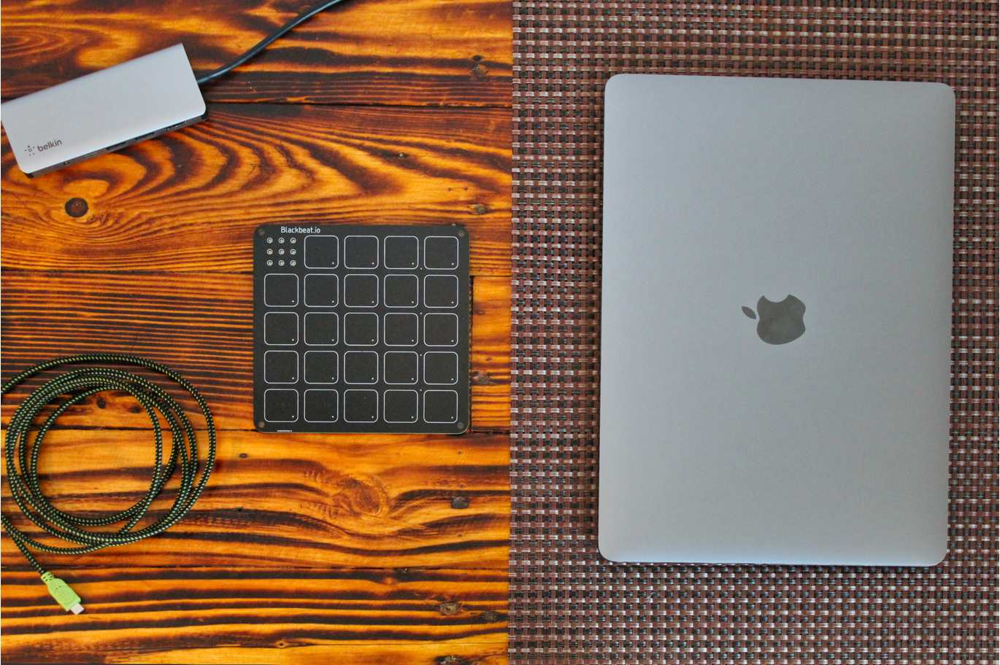

# 具有24个触摸键、9个可定制LED的Blackboard

黑板（Blackboard）是一个带有 24 个电容式触摸板、9 个可自定义 LED 和 Raspberry Pi Pico 的电路板。

新的HID功能完全可定制，可以同时使用24个按键和9个LED，核心是raspberry pi pico，而microchip的attiny芯片负责检测触摸按键。

**用途**

- HID接口、自定义键盘、音乐创作……

**特点**

- 24个触摸键
- 9个LED
- 紧凑的设计
- 5个额外的焊盘和GPIO

**编程**

- C/C++
- Micropython
- CircuitPython
- Arduino IDE

**网址**

- https://blackbeat.io/

---

