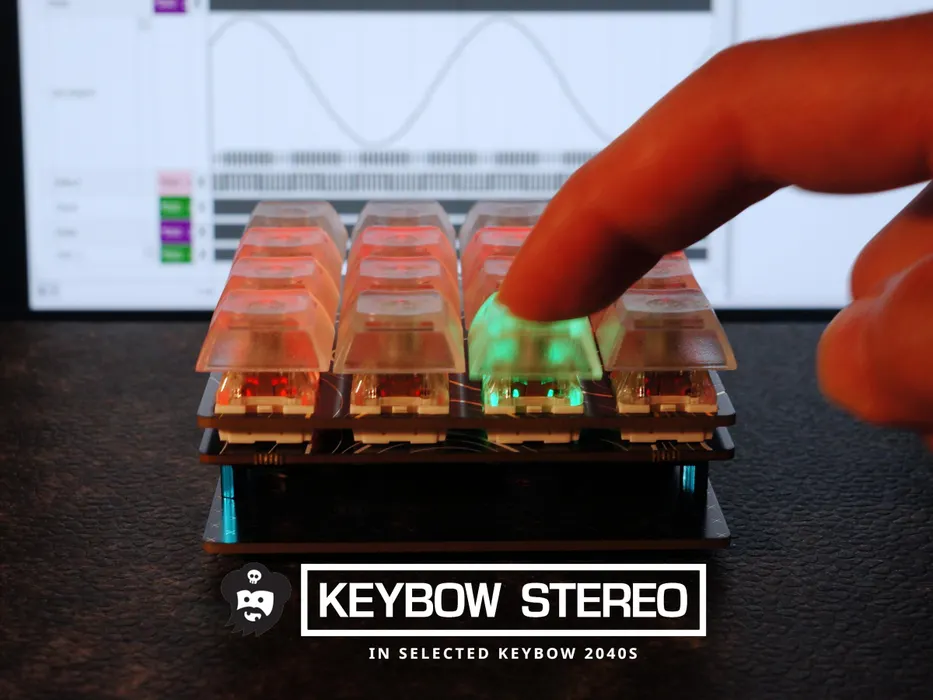

# Keybow Stereo

介绍如何为Pimoroni Keybow 2040开发板添加音频。这是一款4x4键盘开发板，采用Kailh（兼容Cherry MX）按键，带有清晰的键帽和 RGB LED 照明。然后添加数字音频 - CircuitPython 方便地支持 I2S 协议进行音频输出。在CircuitPython中，很容易对音频使用不同的输出协议/信号，PWMAudioOut不同，I2SOut可以与MAX98357A一起使用，以各种速率播放样本。。此外还添加了一些小功能：可选背景和音量控制、可变速率播放和音频样本的立体声定位。

https://www.instructables.com/Keybow-2040-I2S-Stereo-Speakers-Macropad-Addition/
