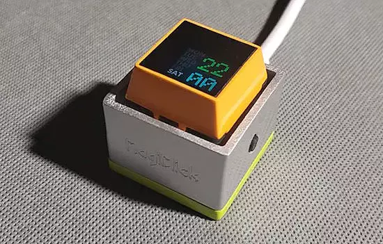

# MagiClick S3 单键键盘

MagiClick S3是一款带彩色显示屏的单键键盘，基于Espressif ESP32-S3微控制器。显示器采用0.85英寸彩色屏幕，分辨率为128×128。主控板目前采用ESP32-S3设计，支持WiFi、闪存和RAM，其大小足以容纳CircuitPython中的功能脚本 —— [hackster.io](https://www.hackster.io/news/modular-s-magiclick-s3-is-a-circuitpython-powered-single-button-keyboard-with-tricks-up-its-sleeve-7aa3eec95aff)、[GitHub](https://github.com/MakerM0/MagiClick-esp32s3) 和[Adafruit博客](https://blog.adafruit.com/2023/09/19/magiclick-s3-is-a-circuitpython-powered-single-button-keyboard-with-display-circuitpython-hacksterio/)。

