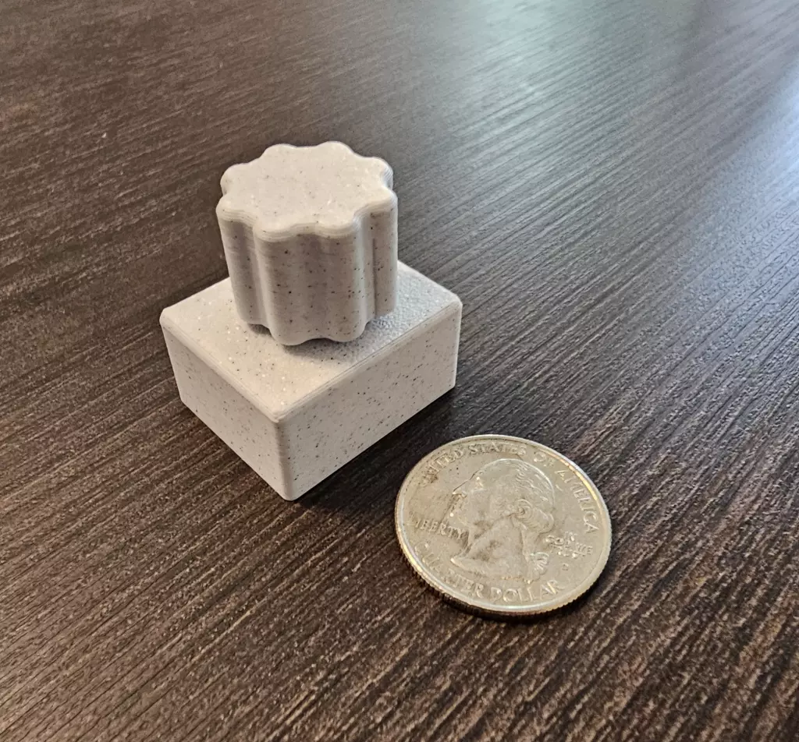

# Mighty 迷你媒体控制器

由 RP2040 和旋转编码器制作的 CircuitPython USB HID 控制器。将其插入任何计算机，就能作为媒体键盘，无需驱动程序。

旋转编码器用来提高或降低音量，按压控制播放/暂停。所有引脚和定时常量均可在 `code.py` 中进行配置。

适用于 Windows、macOS、Linux 和 ChromeOS。该固件是开源的，使用 CC BY-NC 4.0 许可。

- [网站](https://keepeverythingyours.com/projects/mighty%20mini%20media%20controller/)
