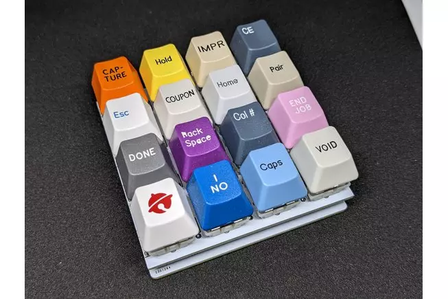

# 树莓派 Pico 4x4 Macropad

一个适用于 CircuitPython 或 MicroPython 的简单 Raspberry Pi Pico 宏键盘。

这是一个 4x4 键盘/键盘/宏键盘套件，可让您使用 Raspberry Pi Pico 构建 16 键宏键盘。您只需要 16 个 MX 机械开关和键帽，组装大约需要一个小时。该套件包括：

- 4X4 背包 RPI Pico PCB，预焊如下：
- 1个复位按钮
- 1 个 WS2812B RGB LED
- 1个电容
- 1 个红色 LED
- 1 个蓝色 LED
- 2 个 1k 电阻
- 4x4开关板PCB

https://www.tindie.com/products/jpconstantineau/raspberry-pi-pico-4x4-macropad/
