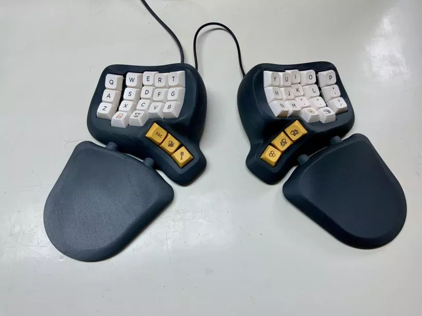

# picosplit 分体键盘

PicoSplit 是一款 3D 打印的分体式键盘,采用 CircuitPython 编写的定制固件。

**特性/功能**
- 其形状灵感源自[Dactyl键盘](https://github.com/adereth/dactyl-keyboard)。 
- 即使连续打字数小时，也能让双手保持自然放松的状态。 
- 可更换的腕托，可通过磁性方式吸附在键盘上。 
- 键盘与腕托之间的距离可调节。 
- 键盘和腕托可以通过磁性方式吸附在表面上。 
- 键盘的两半可以扣合在一起，便于携带。 
- 开关和键帽是可以互换的。 
- PicoSplit键盘固件是开源的，基于CircuitPython。 
- 可读的配置文件格式。 
- 一种省时的开关接线系统，无需使用二极管。 
- 无需在您的计算机上安装任何其他软件。 
- 你只需要一个简单的文本编辑器就可以修改键盘布局。 
- 已经包含了一种能大幅减少手指移动距离的布局。该布局的灵感来源于[Miryoku布局](https://github.com/manna-harbour/miryoku/tree/master/docs/reference)。 
- Raspberry Pi Pico可以用其他产品替代。

**相关链接**

- [项目说明](https://www.kaenner.de/picosplit)
- [KBD杂志](https://kbd.news/PicoSplit-1119.html)
- [固件下载](https://github.com/akaenner/picosplit)
