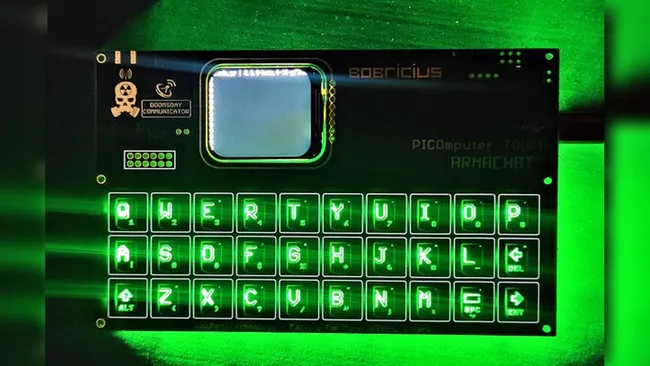
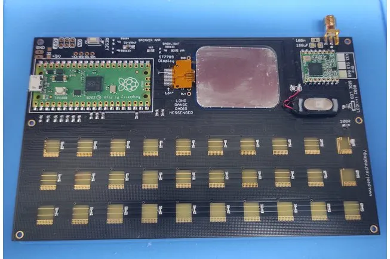

# 触摸矩阵板 PICOmputer TOUCH ARMACHAT

独特的触摸矩阵板，没有特殊的芯片，只使用了 Adafruit 的 CircuitPython touchio 库，仅使用 13 个 GPIO 来实现 30 个按键。

* [hackday](https://hackaday.io/project/188746-picomputerarmachat-touch)
* [Tom's Hardware](https://www.tomshardware.com/news/raspberry-pi-armachat-touch-picomputer)
