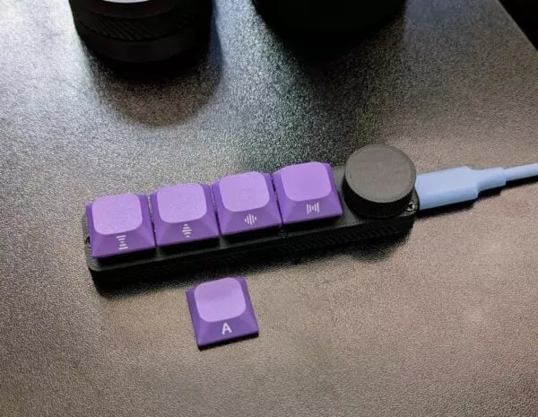

# BLE 媒体控制宏键盘

- 4 个按键 + 1 个旋转编码器旋钮
- 作为带有 WiFi 连接（ESP32-C3 超级迷你版）的 BLE 键盘
- 通过 ESPHome 实现无缝 Home Assistant 集成
- 可定制的 3D 打印外壳（使用 OpenSCAD 设计）
- 仓库（OpenSCAD 文件、KiCAD 原理图等）： https://github.com/likeablob/mini-media-control-bar
- Instructables（构建指南）： https://www.instructables.com/3D-Printed-BLE-Media-Control-Keyboard-ESPHome-Open/
