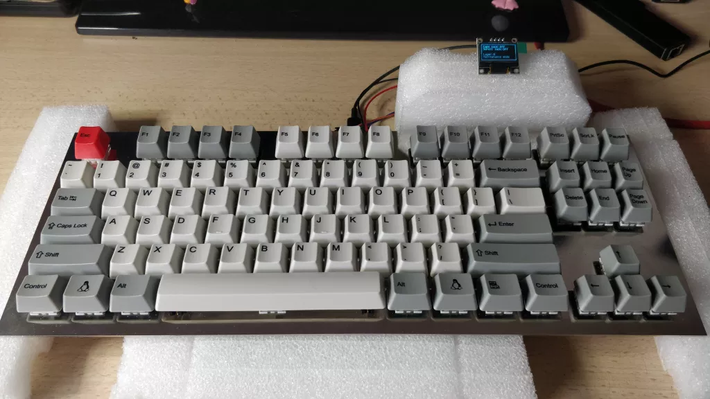

# 由CircuitPython和KMK驱动的树莓派pico键盘: JMS Pico TKL

https://codeberg.org/JustineSmithies/JMS-Pico-TKL

**需要的材料**

| 名称  | 数量  |
| --- | :---: |
| Micro 5Pin Male to USB 2.0 A Female With Screw Panel Mount Cable | 1   |
| Raspberry Pi Pico | 1   |
| 0.96" SSD1306 128x64 Blue | 1   |
| 1N4148 Diodes | 100 |
| Kailh Box Thick Click Jade or your own preference | 90  |
| MX Keycaps of your choice but I recommend WASD --> | 87  |
| Custom made stainless steel plate | 1   |
| Everglide Panda GH60 stablizers | 1 pack |

