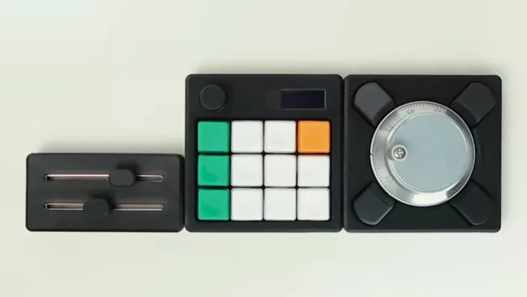
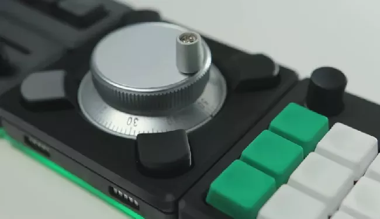
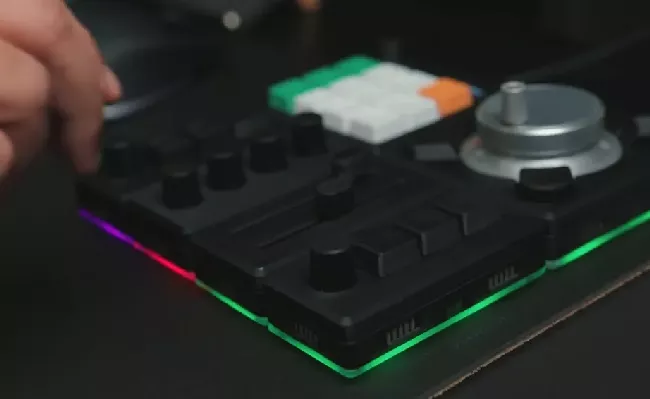

# 磁吸组合宏键盘 Ocreeb MK2

由 Raspberry Pi RP2040 驱动的宏键盘，可以通过磁吸组合模块。Ocreeb MK2项目是对去年推出的另一款名为Ocreeb的升级。

https://www.tomshardware.com/raspberry-pi/raspberry-pi-rp2040-macropad-supports-magnetic-modules-for-expansion

