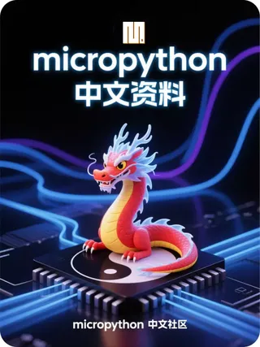

# micropython 中文资料

- [教程](教程/readme.md)
- [主要链接](主要链接/readme.md)
- [开发软件](开发软件/readme.md)
- [开发板](开发板/readme.md)
- [MicroPython 库](MicroPython库/readme.md)
- [内部机制](内部机制/readme.md)
- [MicroPython语言及实现](micropython语言及实现/readme.md)
- [MicroPython 与 CPython 的差异](micropython与cpython的差异/readme.md)
- [技巧](技巧/readme.md)
- [创意和应用](创意和应用/readme.md)
- [图书](图书/readme.md)
- [固件](固件/readme.md)
- [版本](版本/readme.md)
- [circuitpython](circuitpython/readme.md)
- [其它](其它)
---

- [MicroPython 许可信息](许可信息/readme.md)
---

## 链接
- [gitee 版](https://gitee.com/shaoziyang/micropython-chinese-resources)
- [github 版](https://github.com/shaoziyang/micropython-chinese-resources)，更新可能滞后于 gitee
- [飞书文档版](https://fewt527yl3.feishu.cn/wiki/wikcnthAXg2xVZvVtUZ7aR8n8Ob)

由 **micropython 中文社区**收集整理编写

