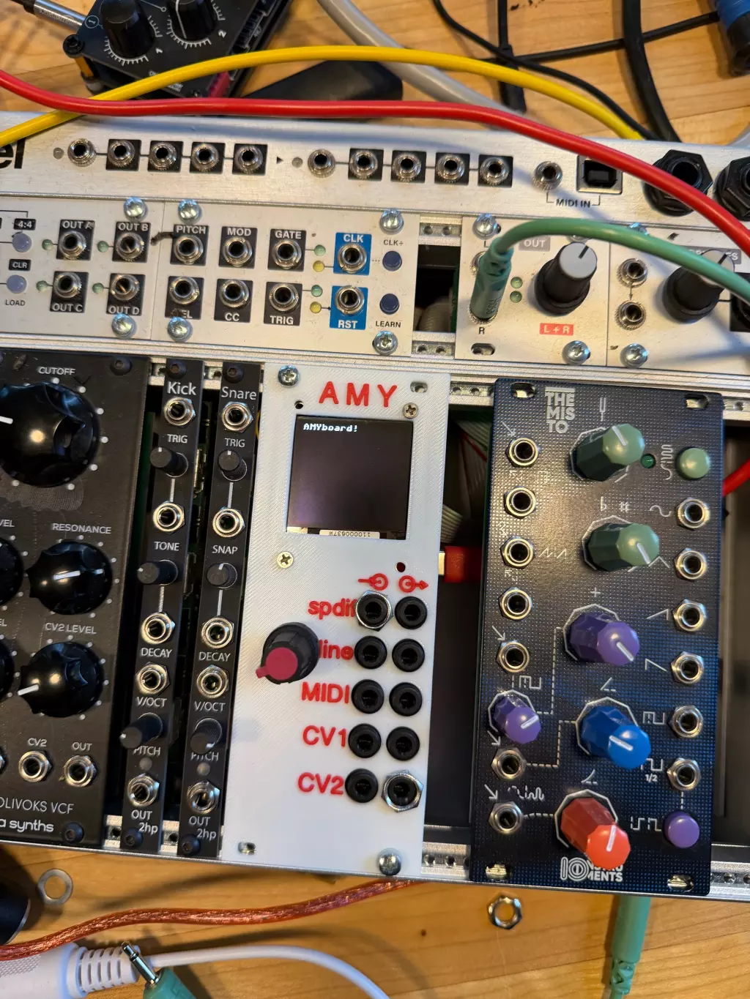
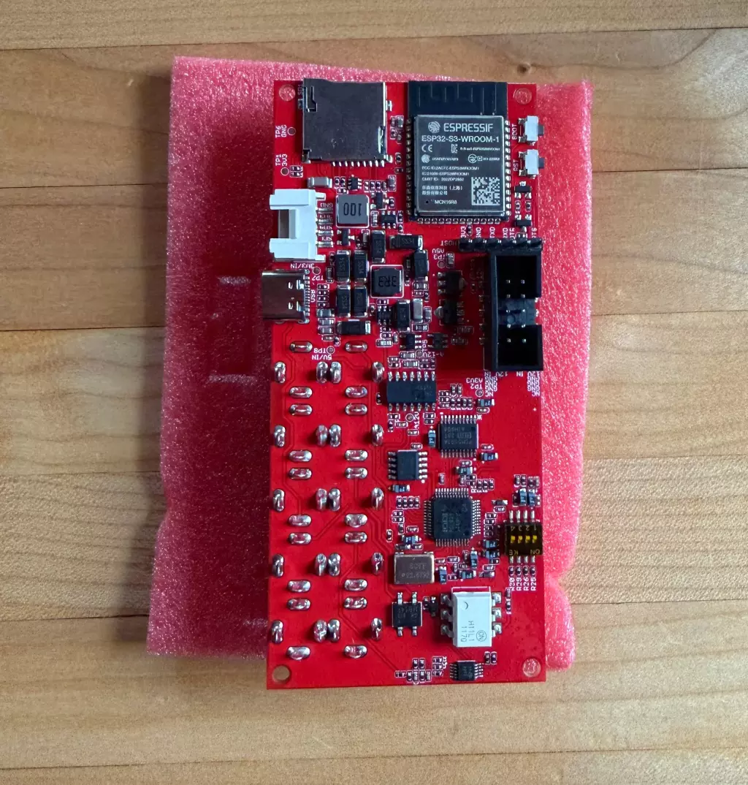

# AMYboard

AMYboard 是什么？它是售价为29.90美元的完整的音频合成器，至少包含三样东西：

- 🎹 合成器：一个功能齐全的合成器模块，采用华丽的80年代复音合成器仿真功能。在线加载共享补丁和预设效果，并调整合成效果。
- 🛠️ 设计板：配备全模拟和数字IO的超大音频开发板，支持Arduino和原生开发工具，以及开箱即用的Micropython shell。
- 🎛️ Eurorack：一个10HP的Eurorack模块，可重新编程，可从振荡器和过滤器中实现几乎任何可想象的模块化合成函数，以及非线性效应和CV变换。价格只有类似模块的十分之一。

- [网站](https://www.amyboard.com/)
- [在线编辑器](https://www.amyboard.com/editor/)
- [github 文档](https://github.com/shorepine/tulipcc/blob/main/docs/amyboard/README.md)
