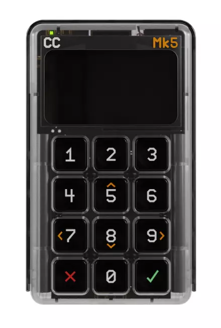

# ColdCard

ColdCard 是加拿大 Coinkite 公司开发的比特币硬件自托管钱包，它主要用于离线安全地存储比特币的私钥，以保护用户的数字资产免受黑客攻击。

硬件上，它使用了 STM32L496RGT6/STM32L4S5VIT6 微控制器，并使用定制的 micropython 固件。

## 相关链接

- [主页](https://coinkite.com/)
- [github](https://github.com/Coldcard/firmware)
