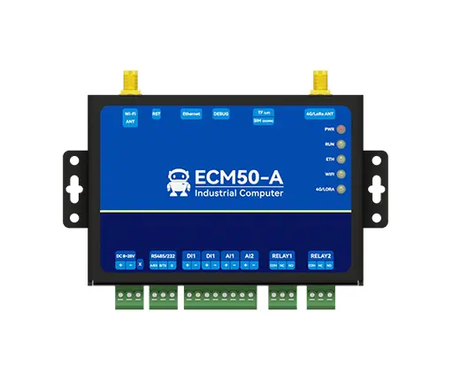

# ECM50-A系列可编程工控机

ECM50-A是基于ESP32-S3芯片设计的全场景通信工业级可编程工控机，支持Wi-Fi、蓝牙、以太网、4G或LoRa 4种通信方式，支持TCP、HTTP、MQTT等多种网络协议，用户可以通过MicroPython语言编程，在工控机端执行定制化的业务逻辑与数据处理；适用于各种物联网数据采集、传输、控制等场景，使用官方提供的丰富案例源码快速开发自己的业务功能。大大降低开发周期，节省项目开发成本。

## 相关链接

- [产品网址](https://www.ebyte.com/product/2719.html)
