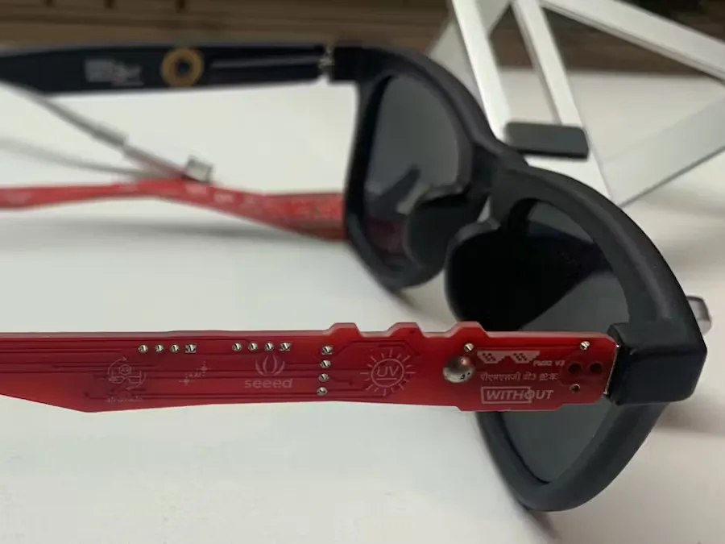
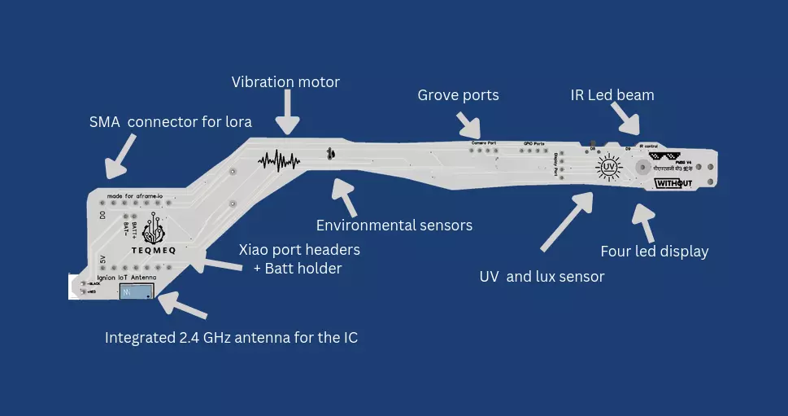

# PMSG 模块化智能眼镜

## 介绍
无论将 PMSG 称之为穷人智能眼镜还是模块化智能眼镜/便携式网状连接智能眼镜，有了PMSG，你可以把你的普通眼镜变成可定制的智能眼镜，集成传感器和连接以实现个性化功能。这是一种DIY/开放技术方法，将先进技术带给每个人。项目目标是以超低的价格轻松添加硬件平台，并以极低的价格实现所有需求，同时保持低成本。

## 相关链接

- [网站](https://pmsg.online/)
- [hackster.io 介绍](https://www.hackster.io/psmooij/pmsg-prototype-modular-smart-glasses-8bd4e6?f=1)
- [github 例程](https://github.com/Control-C/PMSG/tree/main/Adafruit%20QT%20Py)
