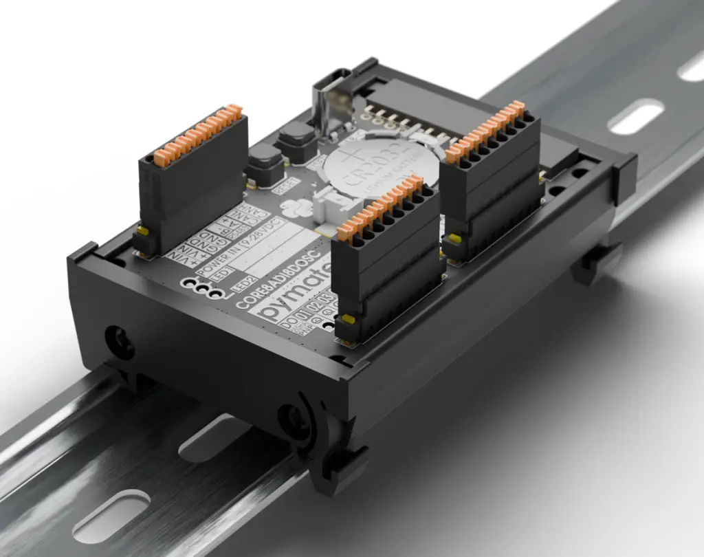

# PyMateIO

PyMateIO 是一个来自法国的由 MicroPython 驱动的工业控制器，简单、智能、价格实惠、可扩展。PyMateIO 为了工业可靠性设计，面向未来的模块化，基于 STM32 核心构建。

* 开放与现代环境：一个开放平台，能够无缝集成现代工具、API、MQTT、HTTP、JSON 及互联系统，同时支持标准工业协议。
* 清晰且易于维护的逻辑：文本化、结构化且显式的代码，随着应用的增长仍可读，简化了长期维护和团队交接。
* 为复杂应用设计：状态机、事件驱动逻辑和高级数据处理比传统的 PLC 扫描编程更易于设计。
* IT 和 OT 的融合：Python 在软件、数据、云和嵌入式团队中广为人知，促进了跨学科的更顺畅协作。
* 从原型到量产的质量：同一语言支持原型设计、测试和部署，实现自动化测试、硬件无关验证以及更好的整体软件质量。

## 技术规格概述

* 为工业做好准备：标准的 12/24V / 0-10V / 4-20mA 输入输出确保你与现有环境无缝集成，而专用状态 LED 则为每个 I/O 提供即时可见和诊断。
* 安装简便：DIN 导轨安装和面向前的可插拔弹簧连接器提供更快的安装速度、更简洁的布线和易于维护。
* 为未来而建：用即将推出的 LTE-M、WiFi、以太网、继电器、模拟 I/O、PT100、Zigbee 等模块扩展你的系统,..
* 灵活且可定制：享受新扩展的快速开发，并自由打造符合您需求的定制解决方案。
* 开发者友好：使用 MicroPython 编程，实现清晰高效的编码、强大的社区支持和简化的维护，使工业应用更快部署，更易于演进。
* 联通性：通过 RS485 和 USB 的原生 Modbus，使连接我们的工业 HMI 或您的工业设备生态系统变得简单。
* 灵活的 I/O：PyMateIO 扩展 16ADI/16DO 旨在提供更强大的性能以及对工业和边缘自动化项目的灵活性。
	* 灵活输入：选择数字或模拟信号，以完美匹配你的传感器和现场设备
	* 可靠输出：16 个 PNP 数字输出为您的执行器提供稳健且安全的控制
	* 工业级电源：9–28伏直流供电范围确保在高强度环境中的稳定性
	* 安装简便：DIN 导轨安装和可插拔弹簧连接器使安装和维护变得简单、干净且快速
	* 一目了然的监控：每个 I/O 都有专用状态指示灯，能让你即时查看和诊断
	* 无缝扩展：设计用来扩展您的 PyMateIO 核心，并连接更多扩展模块，赋予无限扩展空间。

## 相关链接

- [网站](https://www.pymate.io/)
