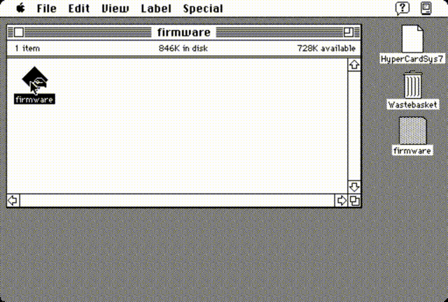

# MicroPython 移植到基于摩托罗拉 68000 芯片的 Mac

Jeff Epler 将 MicroPython 1.26.0 预览版移植到运行摩托罗拉 68000 微处理器(1994 年之前)的旧 Macintosh 计算机 – [Mastodon](https://social.afront.org/@stylus/114745494736982809) 和 [GitHub](https://github.com/jepler/circuitpython/pull/new/ports-m68kmac)。

https://social.afront.org/@stylus/114745494736982809 
