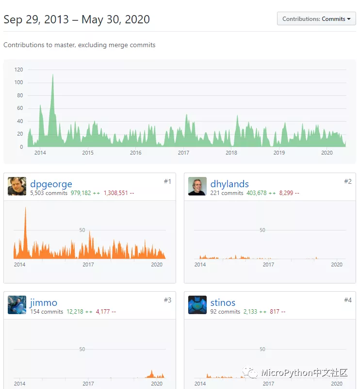

# Micropython分叉之战

在 2017 年，因为对一个 PR （https://github.com/micropython/micropython/pull/4217） 产生了严重分歧，micropython 的主要贡献者之一 Paul Sokolovsky（github 账号名 pfalcon）被从核心团队中移除。在这之后 Paul Sokolovsky 重新创建了一个新的 micropython 分叉 [pycopy](https://github.com/pfalcon/pycopy)。Pycopy的目标是实现一个极简且内存高效的Python，适用于台式机、云计算、受限系统、微控制器以及所有其他设备。

分歧主要来自对 uasyncio 的移植。与之带来的结果是，如果您使用旧版本的 micropython 并通过 upip 安装 uasyncio，则会遇到参数错误的提示。

`TypeError: function takes 2 positional arguments but 3 were given`

这是因为 PyPi 上的软件包是由 Pfalcon 编写的，并且只与 pycopy 兼容，与来自 http://micropython.org 的 Micropython 不兼容，也没有明显的警告或提示，这对很多使用者带来了困扰（注：micropython v1.12 后的每日构建版中已经加入新的 uasyncio）。

对于新的 pycopy 分叉，Paul Sokolovsky 在 github 上是这样解释的：

问：为什么要分叉？  
答：从2013年12月29日到2017年12月27日，我是MicroPython的共同维护者，在那段时间里我撰写了2779次提交，超过了该时间段内提交的30%（prooflink）。我设计和实现了许多MicroPython的模块和子系统。在失去对主存储库的提交访问权限后，我将在这里继续工作（pycopy）。

问：与上游的关系？  
答：我会定期根据上游情况进行调整。但是，我还原/跳过了与Pycopy方向不一致或者实现不够彻底的提交（请参见pycopy的 "Zen"）。由于上游未能承认我是主要贡献者，并相应地维护我的版权，因此我不再直接为上游做出贡献。

问：项目重点？  
答：
- 代码优化。
- 继续开发本地、缓冲和流操作，允许编写具有高效率内存利用的应用程序。
- 垃圾收集实验。
- 反射功能（最终允许使用Python开发优化的编译器等）。
- 实现了更多的CPython功能（可配置）。
- 具有改进的程序分析功能的“开发/测试”版本。
- 更多

在 GitHub 上 micropython 的官方贡献者中，已经没有Paul Sokolovsky（pfalcon）的名字了。

pycopy 中主要开发者的贡献度。

在2020年2月10日 pydev 的专访中，Paul Sokolovsky是这样解释的：
我目前最大的项目是Pycopy，它是Python的轻量级和极简实现，并带有库和软件生态系统。虽然我一直很喜欢Python，但这是我遇到的问题之一

- 它太大了，所以我无法在想要的任何地方使用它，例如像路由器或WiFi接入点这样的小型嵌入式设备（如今已经是这种情况了。称为“IoT设备”）。我不得不离开Python并尝试使用较小的语言，例如Lua，但是我没有为他们获得斯德哥尔摩综合症，而总是回到Python，因此在一些需要小型且便宜的设备（例如智能家居）的有趣项目中取得进展。

这就是为什么当我听说MicroPython Kickstarter活动并阅读了一些非常详实的技术说明后，我很快就迷上了它，它的作者保证在这场非常成功的活动结束后不久就开放源码，而不是在发布这些设备的时候——所有这些都是为了允许开源合作。

从那以后，我已经为MicroPython贡献了大约4年的时间，编写了大约30％的代码。可悲的是，向前迈进时，我感到我们开始的极简主义观念被背叛了，贡献者在自己的空闲时间做一件基于信念和理想的工作，与一个需要满足其客户以维持运营并产生利润的小企业之间的利益冲突正在加剧。因此我们分道扬镳了。

这就是Pycopy的发展历程。与开始专注于“微控制器”的MicroPython不同（这是重复犯了另一个微型Python项目PyMite的错误，我认为这是它失败的原因），Pycopy希望成为“一切”的全栈语言。理想的做法是只使用一种语言，可以在台式机/笔记本电脑上运行，如果需要也可以在云端使用，还可以在移动设备上运行，一直到微控制器，虽然很酷，但仍然是一种语言。相对而言，使用小型但基于Linux的设备通常更易于访问且更具成本效益。

因此，除了核心解释器（带有最少的模块集）之外，Pycopy项目还提供标准库，该库力求与CPython兼容，同时仍保持很小的体积，Web微框架，数据库驱动程序，SDL（图形库）绑定，FFMPEG（视频/音频库）绑定，最近正在开发用于LLVM的绑定，这是编译器后端，可以轻松开发加速器JIT引擎（这是Python社区迫切需要的东西），以应对那些“Python慢”的说法 –以及许多其他事情。真的很棒，您应该检查一下。这绝对是我一生想要发展的东西，我很高兴当我长大后会满足于此；-)。

重要的一件事是，以上所有内容都没有在某种正式计划中完成，也没有重新实现“大型”Python拥有的一切。所有这些都是根据我自己和贡献者的需求/兴趣来完成的。例如我对玩视频监控很感兴趣，这就是为什么我实现FFMPEG绑定以从摄像机访问视频的原因（而不是将其传输到未知的云中）。我认为这是最近的，也许是一个小众市场，但绝对是一种趋势，提出了人类规模的计算，而不是公司规模或行业规模的东西，仅仅是人类可以整体理解的东西，可以自己修改，需要并扩展。这正是Pycopy项目背后的想法！不要误会我的意思-我们也需要公司规模或行业规模的项目，这就是我日常工作。但是，在我自己的业余时间（我通常属于我的家人和同伴，与我有共同的兴趣），我宁愿做一些像人一样的事情。

对于这次分叉事件，因为没有太多报道，所以暂时无从得知更多详细的情况，但是看起来对 micropython 的发展没有带来太大影响，github上仍然在不断更新，社区中也活跃着各种讨论，对大家的使用也没有什么影响。不过 micropython 在嵌入式方面缺少标准化、没有明确的发展方向、没有非营利性的管理机构、去年的国内商标事件等等，也提醒大家开源世界也并不是那么 free 的。希望micropython 最终不要变成像 java、mysql、github 那样被某个公司左右。

除了pycopy，目前micropython还有以下一些主要分叉（参见  https://github.com/adafruit/awesome-micropythons）。与 pycopy 相比，它们和micropython 在功能、完成度、使用习惯上的差异相对较大：
- circuitpython
- TI-Python
- Loboris ESP32 fork
- ArduPy
- Casio
- RT-Thread port
- Silcon Labs EFM32 port
- xbee port
- Fomu
- LEGO
- pycom
- Raspberry Pi
- openmv
- micro:bit