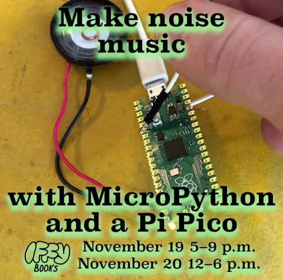

# 使用 MicroPython 和 Pi Pico 制作噪音音乐

如何使用 Raspberry Pi Pico 和 MicroPython 制作噪音。

相关链接
* [网站](https://iffybooks.net/noisemusic/)
* [代码](https://iffybooks.net/wp-content/uploads/2021/11/Iffy_Books_Noise_Music_Example_Code.zip)
* PDF
	* [screen reading](https://iffybooks.net/wp-content/uploads/zines/Iffy_Books_Noise_Music_with_a_Pi_Pico_Zine_screen.pdf)
	* [print-imposed](https://iffybooks.net/wp-content/uploads/zines/Iffy_Books_Noise_Music_with_a_Pi_Pico_Zine_print.pdf)
