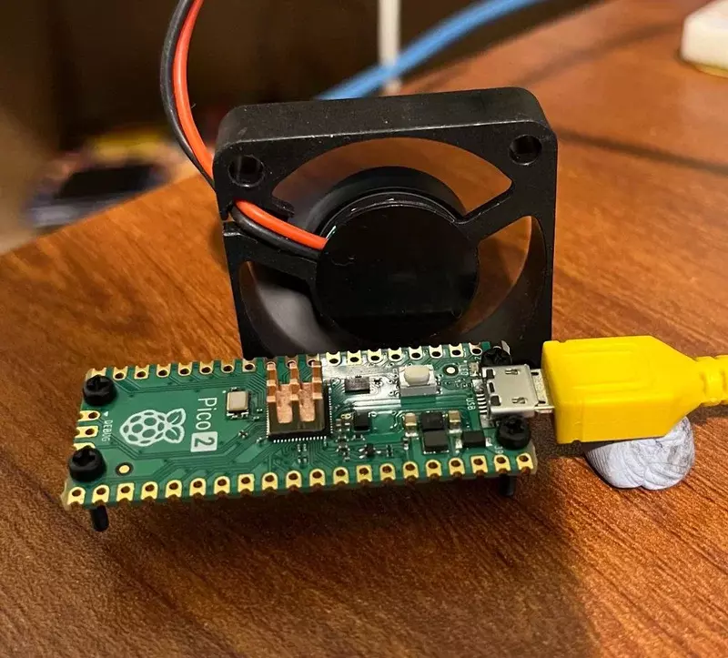
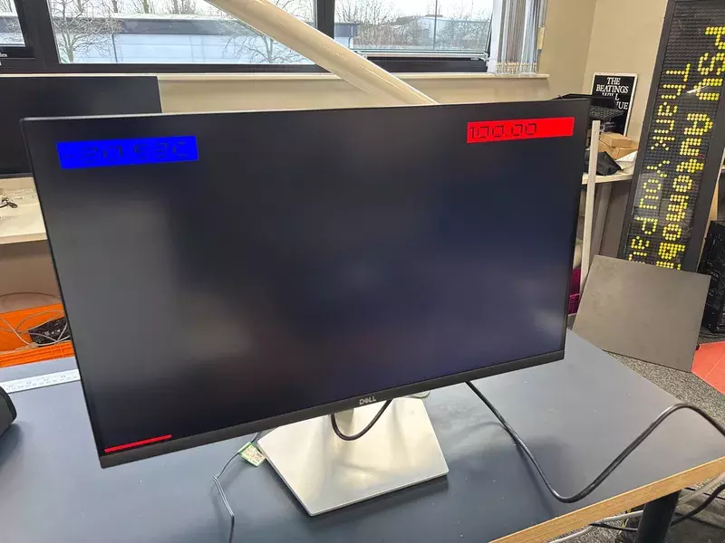
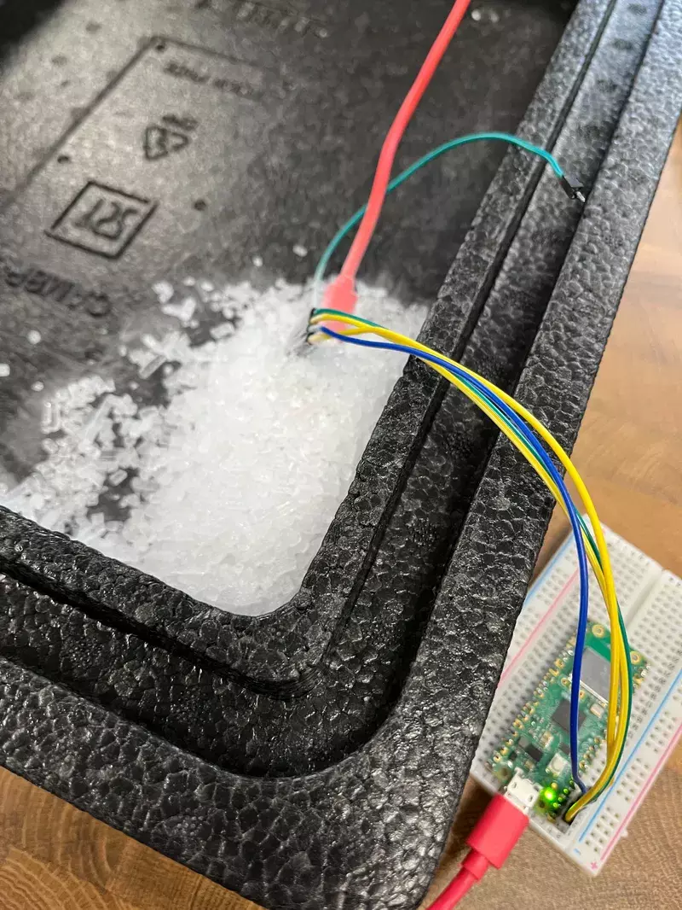
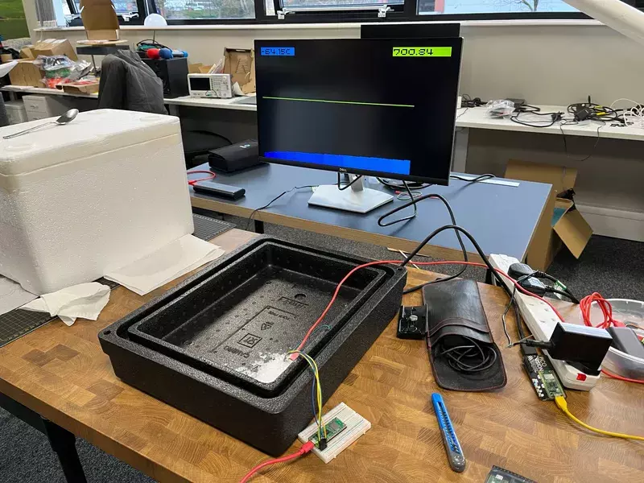
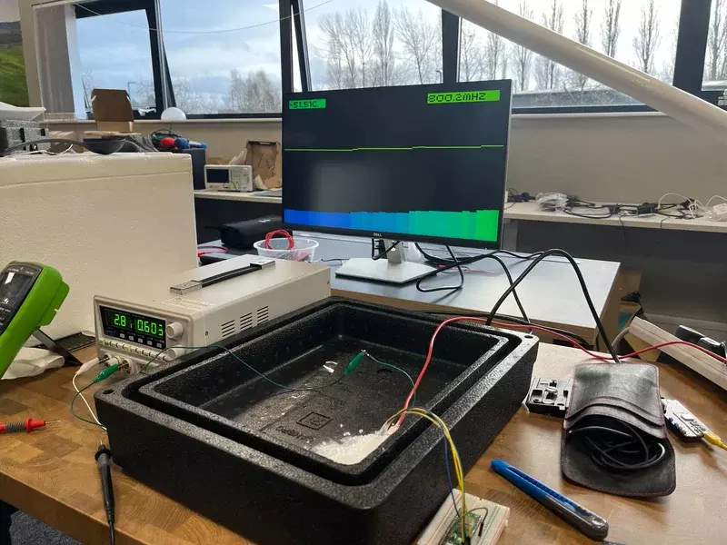
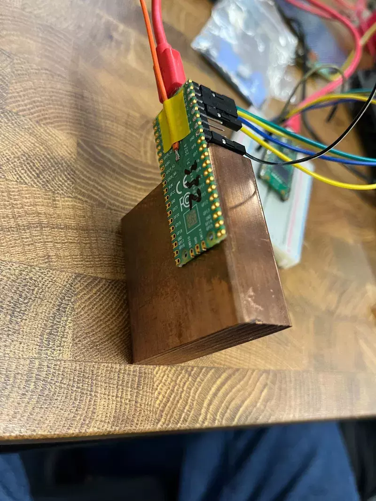
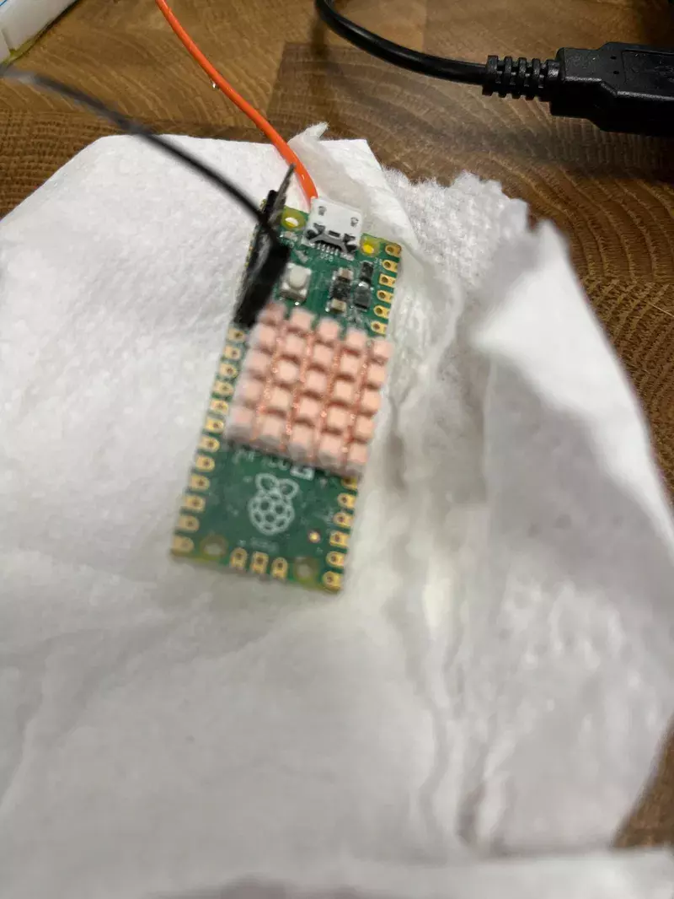
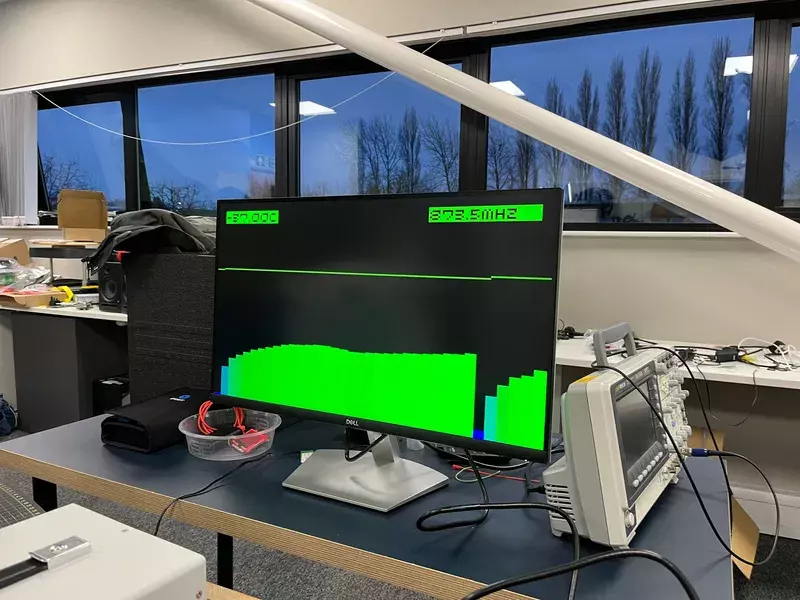

# 树莓派 Pico 2 超频指南

翻译自 pimoroni ： [https://learn.pimoroni.com/article/overclocking-the-pico-2](https://learn.pimoroni.com/article/overclocking-the-pico-2)

## 引言

RP2350 芯片的树莓派 Pico 2 究竟能跑多快？迈克在适量干冰的助力下，开启了他的圣诞节假期探索之旅，深入研究 Pico 2 的超频性能。

几年前，树莓派官方曾发文介绍将普通 Pico 超频到了一个惊人的程度 —— 实现了 1GHz 的超频，并且（在短时间内）让 Pico 的性能超越了初代树莓派。Pico 的超频性能非常出色，初代树莓派 Pico 在核心电压为 1.3V 时，通常能运行在 400MHz 以上。但对于 RP2040 芯片来说，这已经是轻松可达的极限了，因为板载电压调节器的最大输出电压被限制在 1.3V。

当我第一次拿到 RP2350 的数据手册时，很快就注意到一个关键信息：它的电压调节器可以解除电压限制，这样就能获得高于 1.3V的电压。在拿到 Pico 2 开发板后，我就特别好奇，想看看提高核心电压后它的性能表现如何，同时也担心电压过高会不会把芯片烧坏。

## 初步实验

通过这段 MicroPython 脚本，我可以控制电压调节器输出不同的电压。为了测试 RP2350 在不同电压下的时钟速度，我设计了一个简单的测试：计算 100 的阶乘并验证结果是否正确，然后逐步提高时钟速度，直到程序运行出错为止。

之后，我使用 MicroPython 性能基准测试进行了更严格的测试，以此判断系统运行是否稳定。总体来说，相较于简单的 100 的阶乘测试，为了让性能基准测试能够多次稳定运行，CPU 时钟速度通常需要降低 20MHz 左右。在测试过程中，我实时分享了实验进展，以及 RP2350 的一些详细信息。

初步测试得到的电压、最大稳定时钟速度和温度数据如下：

|     电压 |             最大时钟速度 |      温度 |
|:-------|:-------------------|:--------|
|   1.1V |             312MHz |  25.6°C |
|   1.3V |             420MHz |  33.6°C |
|   1.5V |             512MHz |  44.4°C |
|   1.7V |             570MHz |  53.7°C |

这是我首次真切感受到 RP2 系列芯片发热明显，此前运行在 400MHz 左右、1.3V 电压下的 RP2040 芯片只是微微发热。

## 增加散热措施

为了解决发热问题，我在 Pico 2 的 RP2350 芯片上安装了一个微型散热片，并设置了一个小型电脑风扇对着它吹，以确保良好的空气流通。在再次提高 RP2350 的电压和时钟速度的过程中，我同样实时分享了实验情况，相关数据如下：

|     电压 |             最大时钟速度 |      温度 |
|:-------|:-------------------|:--------|
|   1.7V |             576MHz |  35.0°C |
|   1.9V |             636MHz |  41.1°C |
|   2.0V |             654MHz |  44.8°C |
| 2.2V\* |             678MHz |  57.5°C |

说实话，当电压超过 2.0V 时我心里很忐忑。板载调节器在 2.0V 以内可以 0.05V 或 0.1V 为增量进行调节，但从 2.0V 往上一档就是 2.35V。这与标准的 1.1V 核心电压相比高出了很多，我担心烧坏 RP2350 芯片的风险在增加。

然而实际测试发现，从 2.0V 提升到 2.35V 带来的性能提升并没有预期那么大。经过进一步检查，我发现电压调节器实际提供的电压并没有达到 2.35V，实际上最高只能达到 2.2V 左右。原因是板载调节器无法提供足够的电流，来支持 RP2350 在这些高电压下运行。

## 测试点 7

那么，我是如何发现实际提供的电压低于请求电压的呢？原来，Pico 2 开发板背面有一个非常实用的测试点，通过它可以测量核心电压。用万用表探测这个测试点就很容易发现，实际输出电压与请求电压并不相符。

既然能在这里探测电压，那么从外部注入电压也并不复杂。这意味着我们可以使用台式电源，为 Pico 2 提供它所能承受的足够电压和电流。

## 深入探索

### 制定计划

在协助 Pimoroni 团队开发 Presto 固件及其他项目的过程中，我和他们分享了这些实验情况。Pimoroni 团队的尼科半开玩笑地提议，我们应该尝试用液氮进行超频测试。

我原本就计划在圣诞假期开始时去参观 Pimoroni 公司总部，所以我们就想看看能不能尝试一下这个液氮超频的想法。不过，液氮的处理有些棘手，获取也不太容易。我还担心在液氮的极寒环境下，Pico 2 的焊接点、印刷电路板（PCB）或连接部件可能会出现开裂的问题。

相比之下，固态二氧化碳（也就是干冰）获取起来相对容易，而且只需要采取一些基本的安全防护措施就行。干冰能将 Pico 2 的温度冷却到大约 -80°C，这似乎足以大幅提升其运行速度。尼科订购了一些干冰，计划就这样确定下来了。

⚠️ **注意（编者按）**：除非你清楚自己在做什么，充分考虑到二氧化碳升华以及物体被冷却到 -80°C 可能引发的问题，并采取了适当的安全防护措施，否则请勿使用固态二氧化碳（干冰）进行实验！

### 测试设置

我希望这次测试能够严谨一些。与之前使用 MicroPython 性能基准测试不同，这次我想让 Pico 2 的两个核心都全力运行。因此，我决定使用免费的 CoreMark 基准测试，这样不仅能将测试结果与其他 CPU 进行对比，还能检查运行是否正确，一旦出现问题就会报告错误。

我还希望能让 Pico 2 使用环形振荡器运行，就像文章开头链接的树莓派官方文章中描述的那样。另外，我们不太确定低温是否会改变晶体振荡器的频率。所以，为了精确测量时间，我向被测的 Pico 2 输入一个 1MHz 的时钟信号，并使用一个简单的 [PIO 程序](https://github.com/MichaelBell/CoreMark-RP2040/blob/main/src/counter.pio)对时钟周期进行计数。这样一来，无论使用环形振荡器还是晶体振荡器，都能借助已知稳定的时钟获取准确的基准测试结果。

我还对普罗蒂克・巴纳吉为 RP2040 开发的 [CoreMark 版本](https://github.com/MichaelBell/CoreMark-RP2040)进行了一些修改：
- 修改代码，使其能为 RP2350 芯片编译，并实现双核心运行；
- 采用复制到内存（RAM）的构建方式，以获得最佳性能，避免受闪存时钟分频器的影响；
- 使用 UART 输出替代 USB 控制台，这样能避免 USB 中断影响测试速度，而且在 RP2350 崩溃时更容易恢复测试；
- 每次运行测试后，打印 RP2350 板载温度传感器测量的温度；
- 将测试设置为循环多次运行，而不是只运行一次；
- 在测试开始前增加提示，以便设置电压（或禁用板载调节器）、设置频率或选择环形振荡器；
- 每次测试运行后检查控制台输入，这样无需按下 BOOTSEL 按钮，就能修改配置或将 Pico 2 重启进入 DFU 模式。这意味着，即使 Pico 2 被埋在干冰里难以按下按钮，也能方便地进行更新操作。

我在 Pico W 开发板上使用了阿尔瓦罗・费尔南德斯・罗哈斯开发的 [pico - uart - bridge 程序](https://github.com/MichaelBell/pico-uart-bridge/tree/oc-harness)，并进行了修改，让它既能提供 1MHz 的参考时钟，又能识别以 “Temp” 或 “CoreMark” 开头的行，并通过 WiFi 发送这些数据。

在 PicoVision 开发板上，我利用 MicroPython 编写了一段程序，基于修改后的温度显示示例，读取 Pico W 发送的温度和 CoreMark 测试数据，并在显示器上绘制成图表。这样在测试过程中，我们就能实时了解测试情况（这部分代码是我在前往 Pimoroni 公司总部的前一天晚上，在酒店房间里以传统的黑客风格编写的，当时还借助了酒店不太稳定的 WiFi 和房间里的电视进行测试）。

### 准备工作

首先，我们需要确保参与测试的三块 Pico 开发板以及相关硬件都能正常工作。一开始，WiFi 通信出现了一些问题，它的实现方式不是特别可靠，但经过初步调试后，问题似乎得到了解决。

我们先让测试用的 Pico 2 以 100MHz 的频率运行，以此建立一个基准数据。Pimoroni 的乔恩还指出，为了让数据更直观，最好用 MHz 为单位的频率数值来报告结果，而不是直接使用 CoreMark 分数。实现方法很简单，用 100MHz 频率下的 CoreMark 分数与当前测试的 CoreMark 分数作比就行。由于 CoreMark 测试是在内部 RAM 中运行的，所以分数应该与频率呈完全线性关系。

### 冷却 Pico 2！

接下来，我们把之前测试一直使用的、带着微型散热片的 Pico 2 用干冰覆盖起来。

我们先用板载电压调节器进行了一些初始测试，很轻松地就将其稳定运行在 700MHz(-64.15°C 700.84MHz)

### 挑战 Pico 2 的极限！

我们想进一步探索 Pico 2 的极限性能，于是将一个电源连接到测试点 7，禁用了板载电压调节器，然后小心翼翼地将电压提升到之前所能达到的 2.2V 以上。

随着电压不断升高，虽然频率提升的幅度越来越小，但芯片并没有损坏！

在 2.8V 电压下，我们成功将频率提升到了 800MHz：(-51.51°C 800.2MHz)

此时我们发现测试设置并不理想，因为核心电压的接地端是通过 Pico W 连接的。测量被干冰覆盖的 Pico 2 上的电压后发现，由于这条连接路径存在电阻，实际电压比供电电压低了约 200mV。考虑到这个因素，我们将电压提升到 3.3V 甚至更高，但频率提升并不明显。我们达到的最高频率是 840MHz，但这个频率下运行并不稳定，我们推测这是因为 RP2350 芯片在消耗约 1A 电流时发热严重。

尽管经历了这样的 “折腾”，Pico 2 依然能够正常工作！

### 环形振荡器实验

RP2350 的数据手册提到，可以使用环形振荡器实现“自动超频”。其原理是，环形振荡器的频率会随着芯片的核心电压和温度变化而变化，所以在各种条件下，相同的环形振荡器设置应该都能稳定运行。但实际情况似乎并非如此（至少在使用ARM 核心时是这样，后面会提到 RISC-V 核心的情况）。

我发现（在风冷条件下），将 Pico 2 设置为 “TOOHIGH” 并使用最大驱动强度时，芯片在 1.5V 左右还能正常运行，超过这个电压就会出错。在较低电压下，环形振荡器的实测频率低于晶体振荡器所能达到的最高频率，但随着电压升高，环形振荡器的频率会超过晶体振荡器的最高频率。我不太清楚其中的原因。将两个阶段之一的驱动强度降低一档后，在风冷条件下测试的最高电压范围内，芯片都能稳定运行，所以这成为了我们最初尝试的设置。

然而，当电压进一步升高到 2.6V 左右时，RP2350 使用环形振荡器运行时又会崩溃。我们尝试降低驱动强度，这虽然有一定效果，但最终还是很难找到一个在高电压下能稳定运行，同时频率又接近晶体振荡器的设置。这有点遗憾，因为在频率超过800MHz 后，晶体振荡器的频率只能以 12MHz 为增量进行调整。

### 寻找更适合超频的 Pico 2

我们之前使用的 Pico 2 只是我随手购买的，并没有特意挑选是否适合超频。Pimoroni 团队为我找来了 7 块 Pico 2 开发板进行测试，希望能找到一块超频性能最佳的。

我迅速使用文章开头附近链接的 MicroPython 频率搜索测试程序，对这 7 块开发板进行了测试，发现它们在 1.1V 电压下的最高频率在 316MHz 到 336MHz 之间。Pimoroni 的马克挑选出两块表现最好的开发板，并进行了焊接处理，以便进一步测试。这次我们多焊接了几个引脚，引出了另一个接地端，这样核心电压就不用通过 Pico W 传输了。

### 我们能将频率提升到多高？

尽管在 1.1V 电压下，我们测试的第一块 Pico 2 速度最快，但它的整体表现并没有比最初测试的那块好太多。在 3.05V 电压下，我们短暂地将其频率提升到了 850MHz（通过 CoreMark 分数换算得出，我们请求的频率是852MHz，但由于晶体受低温影响或高核心电压的其他效应，实际频率略低），但运行并不稳定。电压超过 3.05V 后，运行反而更不稳定了，所以这似乎就是它的极限了。在请求频率为 840MHz 时，它能运行几分钟，但 CoreMark 测试报告出现了错误，说明运行某些指令时出现了问题。

考虑到提升频率的主要障碍是芯片升温过快，我们尝试寻找一个更大的热沉，希望能让芯片在更长时间内保持低温。保罗找来了一大块铜，体积比 Pico 2 本身大很多，看起来很有希望。

我们尝试用几片导热垫将这块铜块与 Pico 2 连接起来，但结果却不尽人意，在低温环境下，这些导热垫的导热性能似乎不太好，使用铜块后的测试结果甚至比不使用散热片还要差。这有些可惜，或许我们应该直接让铜块与芯片顶部直接接触，但又担心会发生短路。

我们转而测试另一块 Pico 2，并为它安装了专为树莓派 5 的 BCM2712 芯片设计的散热片。这次取得了更好的效果 —— 显然，在室温 1.1V 电压下进行的简单测试并不能完全反映芯片的性能。这块 Pico 2 在请求频率为 864MHz 时（实际报告频率为 860.7MHz）能短暂运行，并且在 840MHz 频率下可以稳定运行一段时间，没有出现错误。这是目前为止最好的成绩！

### 测试 RISC-V 核心

RP2350 是一款很有意思的芯片，除了两个常见的 ARM 核心外，它还有两个 RISC-V 核心。马克提醒我应该测试一下 RISC-V 核心，以便进行对比。为 RISC-V 核心构建测试镜像非常简单，只需安装 RISC-V 版本的 gcc 编译器，并将 `PICO\_PLATFORM` 设置改为 `rp2350-riscv` 就行。

我发现，使用 RISC-V 核心时，CoreMark 测试中每 MHz 的性能表现略高一些，比 ARM 核心快了近 5%。所以，如果你的 RP2350 应用场景只涉及整数运算，那么使用 RISC-V 核心很可能会获得更好的性能！

在 PicoVision 显示器上调整显示方式，以展示每 MHz 的 CoreMark 分数，然后再次使用之前表现最好的那块 Pico 2 进行测试。

### 最高速度

再次使用环形振荡器，将其中一个阶段的驱动强度设置为比最大值低一档，然后逐步提高电压。这次我们发现，电压升高过程中芯片没有崩溃，直到电压达到3.0V 左右才出现问题。这意味着在 2.95V 电压下，使用环形振荡器可以稳定地将频率超频到 820 - 840MHz（频率会因温度波动）。

切换到晶体振荡器，在 3.05V 电压下，芯片能以 861.6MHz（请求频率为 864MHz）的频率稳定运行，甚至在 873.5MHz 频率下也能运行近一分钟才崩溃。我们尝试将请求频率设置为 888MHz，但未能成功运行。

所以，我们达到的最高速度是 873.5MHz。不过，当我们再次尝试时，Pico 2 在 3.05V 电压下无法启动，我想可能是高电压已经对芯片造成了一定程度的损坏。

最后一次测试，我们让芯片在 2.95V 电压下使用环形振荡器运行，它持续运行了大约 10 分钟，直到温度略有升高（达到 -20°C 左右）才停止测试。

## 结论

首先，RP2350 芯片和 Pico 2 开发板的稳定性非常出色。尽管经历了低温环境、冷却过程中因水汽导致的意外短路，以及极高的核心电压，但我们测试的 3 块 Pico 2 开发板都没有损坏。而且从外观上看，完全看不出它们经历过如此严苛的测试。

当频率超过 700MHz 后，继续提升电压所带来的性能提升越来越小。这可能是因为我们无法让芯片充分散热，仅仅用干冰包裹，很难将产生的热量完全散发出去。或许使用液氮进行实验，能进一步提升性能。

通过这些实验可知，使用电压调节器提供 1.6V 左右的电压时，无需额外散热措施，就可以轻松将 Pico 2 的频率超频到 500MHz 或更高一些，而且不太可能对 Pico 2 造成严重损坏。不妨让 Pico 2 在这样的设置下持续运行几天，观察是否会出现异常情况。

使用干冰进行实验非常有趣！如果有机会，我们还应该尝试对树莓派 5 进行超频测试，看看能否创造新的速度记录。不过，树莓派 5 的测试成本可能会高很多。使用 Pico 2 进行测试的一大优势在于，每块开发板价格不到 5 英镑，即使 “折腾”坏了也不心疼，毕竟它比一品脱啤酒还便宜！
