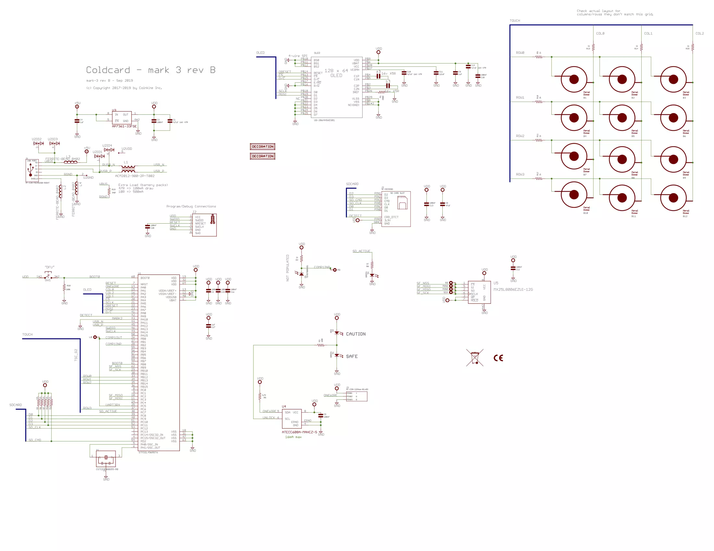

# 比特币钱包 COLDCARD 漏洞事件

加拿大硬件制造商 Coinkite 开发的比特币硬件钱包 COLDCARD，在 2026年爆出了严重的安全漏洞。起因是 COLDCARD 的固件意外停用了硬件随机数生成器而使用了伪随机数（PRNG），导致攻击者有可能推算出用户的私钥。受此影响，约有 5200 个受影响的地址被扫空，总计超过 1816 枚比特币被盗，损失金额超过 1 亿美元。   
   
硬件钱包 COLDCARD 在硬件上使用了 STM32L496RGT6/STM32L4S5VIT6 微控制器，并使用自定义的 micropython 固件。相关固件和参考硬件设计可以在 github 上下载：[https://github.com/Coldcard/firmware](https://github.com/Coldcard/firmware)    
   
COLDCARD MK3 原理图   
    
micropython 的创始人达米安对此事件也进行了技术分析（[https://github.com/orgs/micropython/discussions/19588](https://github.com/orgs/micropython/discussions/19588) ）：   
   
micropython的stm32移植版提供`rng_get()`函数，该函数可以是硬件支持的，也可以是PRNG（由RTC和芯片唯一id做种），可以根据 `MICROPY_HW_ENABLE_RNG`（设置为 1 使用硬件 RNG，设置为0 使用 PRNG）来选择。   

Coldcard固件有一个名为`libngu`的子模块。此库从外部引用（并期望链接到）`rng_get()`。相关代码在 [https://github.com/switck/libngu/blob/0371d6372eb7c1165f9c0410f6d6537e09882402/ngu/random.c](https://github.com/switck/libngu/blob/0371d6372eb7c1165f9c0410f6d6537e09882402/ngu/random.c):   

```c
#ifdef MICROPY_PY_STM
// ports/stm32/rng.c
extern uint32_t rng_get(void);
# define CHIP_TRNG_SETUP()
# define CHIP_TRNG_32()         rng_get()

# ifndef MICROPY_HW_ENABLE_RNG
# error "get a HW TRNG plz"
# endif
#endif
```

这里有一个宏检查，试图强制执行HW RNG，但它只是检查了`MICROPY_HW_ENABLE_RNG`是否已定义，而不是检查它是否已启用。

Coldcard固件在board文件夹中有一个自定义`rng.c`实现，该实现已正确包含在固件构建中。查看[https://github.com/Coldcard/firmware/blob/bcc2c382a324690a2fcf972c0bac3b79bf923f7b/stm32/COLDCARD\_MK4/rng.c](ttps://github.com/Coldcard/firmware/blob/bcc2c382a324690a2fcf972c0bac3b79bf923f7b/stm32/COLDCARD_MK4/rng.c)   
这个`rng.c`文件实现了`rng_get_or_fault()`，它使用stm32硬件rng源代码（如果硬件发生故障，则引发Python异常）。   
Coldcard 的 MicroPython固件构建和链接良好，没有重复或丢失的符号，因为它们定义了 `rng_get_or_fault()`，这与现有的stm32提供的`rng_get()`不冲突，因为`libngu`调用的`rng_get()`是由MicroPython stm32源代码提供的。   
现在，`libngu`不知道`rng_get_or_fault()`，但它应该调用它而不是stm32的代码。   
此时，您可以看到漏洞：`libngu`正在stm32中使用PRNG，因为`MICROPY_HW_ENABLE_RNG`设置为0。可以检查PRNG算法以创建漏洞。   
请注意，这都是在C级别，这里没有涉及Python代码（甚至没有Python-C绑定）。这是C级（错误）命名、构建系统、子模块和配置变量的融合。   

**漏洞利用后的修复**   
漏洞被利用后，Coldcard对固件进行了修复：[https://github.com/Coldcard/firmware/commit/ca72463709f4e3f8964952039d5caf955f566a87](https://github.com/Coldcard/firmware/commit/ca72463709f4e3f8964952039d5caf955f566a87)    
该修复程序“删除”了stm32的`rng.c`代码，并添加了一个包装器`int32_t rng_get(void) { return rng_get_or_fault(); }`函数，以便`libngu`获取硬件RNG（或者，可以将`libngu`的`CHIP_TRNG_32`宏更改为调用`rng_get_or_fault()`）。   
`libngu`也有一个修复程序来修复上面讨论的宏检查。请参阅[https://github.com/switck/libngu/commit/e9d5e8034c90edc1bce791a0fff43ac0877b925f](https://github.com/switck/libngu/commit/e9d5e8034c90edc1bce791a0fff43ac0877b925f) 。
 
COLDCARD的说明：   
[https://blog.coinkite.com/entropy-technical-backgrounder/](https://blog.coinkite.com/entropy-technical-backgrounder/)    
